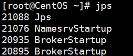

## 角色介绍

* Producer：消息的发送者；举例：发信者
* Consumer：消息接收者；举例：收信者
* Broker：暂存和传输消息；举例：邮局
* NameServer：管理Broker；举例：各个邮局的管理机构
* Topic：区分消息的种类；一个发送者可以发送消息给一个或者多个Topic；一个消息的接收者可以订阅一个或者多个Topic消息
* Message Queue：相当于是Topic的分区；用于并行发送和接收消息


## 集群特点

NameServer是一个几乎无状态节点，可集群部署，节点之间无任何信息同步。

Broker部署相对复杂，Broker分为Master与Slave，一个Master可以对应多个Slave，但是一个Slave只能对应一个Master，Master与Slave的对应关系通过指定相同的BrokerName，不同的BrokerId来定义，BrokerId为0表示Master，非0表示Slave。Master也可以部署多个。每个Broker与NameServer集群中的所有节点建立长连接，定时注册Topic信息到所有NameServer。

Producer与NameServer集群中的其中一个节点（随机选择）建立长连接，定期从NameServer取Topic路由信息，并向提供Topic服务的Master建立长连接，且定时向Master发送心跳。Producer完全无状态，可集群部署。

Consumer与NameServer集群中的其中一个节点（随机选择）建立长连接，定期从NameServer取Topic路由信息，并向提供Topic服务的Master、Slave建立长连接，且定时向Master、Slave发送心跳。Consumer既可以从Master订阅消息，也可以从Slave订阅消息，订阅规则由Broker配置决定。

## 集群模式

### 单Master模式

这种方式风险较大，一旦Broker重启或者宕机时，会导致整个服务不可用。不建议线上环境使用,可以用于本地测试。

### 多Master模式

一个集群无Slave，全是Master，例如2个Master或者3个Master，这种模式的优缺点如下：

- 优点：配置简单，单个Master宕机或重启维护对应用无影响，在磁盘配置为RAID10时，即使机器宕机不可恢复情况下，由于RAID10磁盘非常可靠，消息也不会丢（异步刷盘丢失少量消息，同步刷盘一条不丢），性能最高；
- 缺点：单台机器宕机期间，这台机器上未被消费的消息在机器恢复之前不可订阅，消息实时性会受到影响。

### 多Master多Slave模式（异步）

每个Master配置一个Slave，有多对Master-Slave，HA采用异步复制方式，主备有短暂消息延迟（毫秒级），这种模式的优缺点如下：

- 优点：即使磁盘损坏，消息丢失的非常少，且消息实时性不会受影响，同时Master宕机后，消费者仍然可以从Slave消费，而且此过程对应用透明，不需要人工干预，性能同多Master模式几乎一样；
- 缺点：Master宕机，磁盘损坏情况下会丢失少量消息。

### 多Master多Slave模式（同步）

每个Master配置一个Slave，有多对Master-Slave，HA采用同步双写方式，即只有主备都写成功，才向应用返回成功，这种模式的优缺点如下：

- 优点：数据与服务都无单点故障，Master宕机情况下，消息无延迟，服务可用性与数据可用性都非常高；
- 缺点：性能比异步复制模式略低（大约低10%左右），发送单个消息的RT会略高，且目前版本在主节点宕机后，备机不能自动切换为主机。

## 双主双从集群搭建

消息高可用采用2m-2s（同步双写）方式


### 服务器环境 {id="服务器环境"}

| **序号** | **IP**          | **角色**                  | **架构模式**       |
|--------|-----------------|-------------------------|----------------|
| 1      | 192.168.197.128 | nameserver、brokerserver | Master1、Slave2 |
| 2      | 192.168.197.130 | nameserver、brokerserver | Master2、Slave1 |

### Host添加信息

```bash
vim /etc/hosts
```

配置如下:

```bash
# nameserver
192.168.197.128 rocketmq-nameserver1
192.168.197.130 rocketmq-nameserver2
# broker
192.168.197.128 rocketmq-master1
192.168.197.130 rocketmq-slave2
192.168.197.128 rocketmq-master2
192.168.197.130 rocketmq-slave1
```

配置完成后, 重启网卡

```bash
systemctl restart network
```

### 防火墙配置

宿主机需要远程访问虚拟机的rocketmq服务和web服务，需要开放相关的端口号，简单粗暴的方式是直接关闭防火墙

```bash
# 关闭防火墙
systemctl stop firewalld.service 
# 查看防火墙的状态
firewall-cmd --state 
# 禁止firewall开机启动
systemctl disable firewalld.service
```

或者为了安全，只开放特定的端口号，RocketMQ默认使用3个端口：9876 、10911 、11011 。如果防火墙没有关闭的话，那么防火墙就必须开放这些端口：

* `nameserver` 默认使用 9876 端口
* `master` 默认使用 10911 端口
* `slave` 默认使用11011 端口

执行以下命令：

```bash
# 开放name server默认端口
firewall-cmd --remove-port=9876/tcp --permanent
# 开放master默认端口
firewall-cmd --remove-port=10911/tcp --permanent
# 开放slave默认端口 (当前集群模式可不开启)
firewall-cmd --remove-port=11011/tcp --permanent 
# 重启防火墙
firewall-cmd --reload
```

### 环境变量配置

```bash
vim /etc/profile
```

在profile文件的末尾加入如下命令

```bash
#set rocketmq
export ROCKETMQ_HOME=/usr/local/rocketmq/rocketmq-all-4.9.4-bin-release
export PATH=$PATH:$ROCKETMQ_HOME/bin
```

输入 `:wq!` 保存并退出， 并使得配置立刻生效：

```bash
source /etc/profile
```

### 创建消息存储路径

```bash
mkdir /usr/local/rocketmq/store1
mkdir /usr/local/rocketmq/store1/commitlog
mkdir /usr/local/rocketmq/store1/consumequeue
mkdir /usr/local/rocketmq/store1/index

mkdir /usr/local/rocketmq/store2
mkdir /usr/local/rocketmq/store2/commitlog
mkdir /usr/local/rocketmq/store2/consumequeue
mkdir /usr/local/rocketmq/store2/index
```

### broker配置文件

#### master1

服务器：192.168.197.128

```Shell
vim /usr/soft/rocketmq/conf/2m-2s-sync/broker-a.properties
```

修改配置如下：

```bash
#所属集群名字
brokerClusterName=rocketmq-cluster
#broker名字，注意此处不同的配置文件填写的不一样
brokerName=broker-a
#0 表示 Master，>0 表示 Slave
brokerId=0
#nameServer地址，分号分割
namesrvAddr=rocketmq-nameserver1:9876;rocketmq-nameserver2:9876
#在发送消息时，自动创建服务器不存在的topic，默认创建的队列数
defaultTopicQueueNums=4
#是否允许 Broker 自动创建Topic，建议线下开启，线上关闭
autoCreateTopicEnable=true
#是否允许 Broker 自动创建订阅组，建议线下开启，线上关闭
autoCreateSubscriptionGroup=true
#Broker 对外服务的监听端口
listenPort=10911
#删除文件时间点，默认凌晨 4点
deleteWhen=04
#文件保留时间，默认 48 小时
fileReservedTime=120
#commitLog每个文件的大小默认1G
mapedFileSizeCommitLog=1073741824
#ConsumeQueue每个文件默认存30W条，根据业务情况调整
mapedFileSizeConsumeQueue=300000
#destroyMapedFileIntervalForcibly=120000
#redeleteHangedFileInterval=120000
#检测物理文件磁盘空间
diskMaxUsedSpaceRatio=88
#存储路径
storePathRootDir=/usr/local/rocketmq/store1
#commitLog 存储路径
storePathCommitLog=/usr/local/rocketmq/store1/commitlog
#消费队列存储路径存储路径
storePathConsumeQueue=/usr/local/rocketmq/store1/consumequeue
#消息索引存储路径
storePathIndex=/usr/local/rocketmq/store1/index
#checkpoint 文件存储路径
storeCheckpoint=/usr/local/rocketmq/store1/checkpoint
#abort 文件存储路径
abortFile=/usr/local/rocketmq/store1/abort
#限制的消息大小
maxMessageSize=65536
#flushCommitLogLeastPages=4
#flushConsumeQueueLeastPages=2
#flushCommitLogThoroughInterval=10000
#flushConsumeQueueThoroughInterval=60000
#Broker 的角色
#- ASYNC_MASTER 异步复制Master
#- SYNC_MASTER 同步双写Master
#- SLAVE
brokerRole=SYNC_MASTER
#刷盘方式
#- ASYNC_FLUSH 异步刷盘
#- SYNC_FLUSH 同步刷盘
flushDiskType=SYNC_FLUSH
#checkTransactionMessageEnable=false
#发消息线程池数量
#sendMessageThreadPoolNums=128
#拉消息线程池数量
#pullMessageThreadPoolNums=128
```

#### slave2

服务器：192.168.197.128

```Shell
vim /usr/soft/rocketmq/conf/2m-2s-sync/broker-b-s.properties
```

修改配置如下：

```bash
#所属集群名字
brokerClusterName=rocketmq-cluster
#broker名字，注意此处不同的配置文件填写的不一样
brokerName=broker-b
#0 表示 Master，>0 表示 Slave
brokerId=1
#nameServer地址，分号分割
namesrvAddr=rocketmq-nameserver1:9876;rocketmq-nameserver2:9876
#在发送消息时，自动创建服务器不存在的topic，默认创建的队列数
defaultTopicQueueNums=4
#是否允许 Broker 自动创建Topic，建议线下开启，线上关闭
autoCreateTopicEnable=true
#是否允许 Broker 自动创建订阅组，建议线下开启，线上关闭
autoCreateSubscriptionGroup=true
#Broker 对外服务的监听端口
listenPort=11011
#删除文件时间点，默认凌晨 4点
deleteWhen=04
#文件保留时间，默认 48 小时
fileReservedTime=120
#commitLog每个文件的大小默认1G
mapedFileSizeCommitLog=1073741824
#ConsumeQueue每个文件默认存30W条，根据业务情况调整
mapedFileSizeConsumeQueue=300000
#destroyMapedFileIntervalForcibly=120000
#redeleteHangedFileInterval=120000
#检测物理文件磁盘空间
diskMaxUsedSpaceRatio=88
#存储路径
storePathRootDir=/usr/local/rocketmq/store
#commitLog 存储路径
storePathCommitLog=/usr/local/rocketmq/store/commitlog
#消费队列存储路径存储路径
storePathConsumeQueue=/usr/local/rocketmq/store/consumequeue
#消息索引存储路径
storePathIndex=/usr/local/rocketmq/store/index
#checkpoint 文件存储路径
storeCheckpoint=/usr/local/rocketmq/store/checkpoint
#abort 文件存储路径
abortFile=/usr/local/rocketmq/store/abort
#限制的消息大小
maxMessageSize=65536
#flushCommitLogLeastPages=4
#flushConsumeQueueLeastPages=2
#flushCommitLogThoroughInterval=10000
#flushConsumeQueueThoroughInterval=60000
#Broker 的角色
#- ASYNC_MASTER 异步复制Master
#- SYNC_MASTER 同步双写Master
#- SLAVE
brokerRole=SLAVE
#刷盘方式
#- ASYNC_FLUSH 异步刷盘
#- SYNC_FLUSH 同步刷盘
flushDiskType=ASYNC_FLUSH
#checkTransactionMessageEnable=false
#发消息线程池数量
#sendMessageThreadPoolNums=128
#拉消息线程池数量
#pullMessageThreadPoolNums=128
```

#### master2

服务器：192.168.197.130

```Shell
vim /usr/soft/rocketmq/conf/2m-2s-sync/broker-b.properties
```

修改配置如下：

```bash
#所属集群名字
brokerClusterName=rocketmq-cluster
#broker名字，注意此处不同的配置文件填写的不一样
brokerName=broker-b
#0 表示 Master，>0 表示 Slave
brokerId=0
#nameServer地址，分号分割
namesrvAddr=rocketmq-nameserver1:9876;rocketmq-nameserver2:9876
#在发送消息时，自动创建服务器不存在的topic，默认创建的队列数
defaultTopicQueueNums=4
#是否允许 Broker 自动创建Topic，建议线下开启，线上关闭
autoCreateTopicEnable=true
#是否允许 Broker 自动创建订阅组，建议线下开启，线上关闭
autoCreateSubscriptionGroup=true
#Broker 对外服务的监听端口
listenPort=10911
#删除文件时间点，默认凌晨 4点
deleteWhen=04
#文件保留时间，默认 48 小时
fileReservedTime=120
#commitLog每个文件的大小默认1G
mapedFileSizeCommitLog=1073741824
#ConsumeQueue每个文件默认存30W条，根据业务情况调整
mapedFileSizeConsumeQueue=300000
#destroyMapedFileIntervalForcibly=120000
#redeleteHangedFileInterval=120000
#检测物理文件磁盘空间
diskMaxUsedSpaceRatio=88
#存储路径
storePathRootDir=/usr/local/rocketmq/store
#commitLog 存储路径
storePathCommitLog=/usr/local/rocketmq/store/commitlog
#消费队列存储路径存储路径
storePathConsumeQueue=/usr/local/rocketmq/store/consumequeue
#消息索引存储路径
storePathIndex=/usr/local/rocketmq/store/index
#checkpoint 文件存储路径
storeCheckpoint=/usr/local/rocketmq/store/checkpoint
#abort 文件存储路径
abortFile=/usr/local/rocketmq/store/abort
#限制的消息大小
maxMessageSize=65536
#flushCommitLogLeastPages=4
#flushConsumeQueueLeastPages=2
#flushCommitLogThoroughInterval=10000
#flushConsumeQueueThoroughInterval=60000
#Broker 的角色
#- ASYNC_MASTER 异步复制Master
#- SYNC_MASTER 同步双写Master
#- SLAVE
brokerRole=SYNC_MASTER
#刷盘方式
#- ASYNC_FLUSH 异步刷盘
#- SYNC_FLUSH 同步刷盘
flushDiskType=SYNC_FLUSH
#checkTransactionMessageEnable=false
#发消息线程池数量
#sendMessageThreadPoolNums=128
#拉消息线程池数量
#pullMessageThreadPoolNums=128
```

#### slave1

服务器：192.168.197.10

```shell
vim /usr/soft/rocketmq/conf/2m-2s-sync/broker-a-s.properties
```

修改配置如下：

```bash
#所属集群名字
brokerClusterName=rocketmq-cluster
#broker名字，注意此处不同的配置文件填写的不一样
brokerName=broker-a
#0 表示 Master，>0 表示 Slave
brokerId=1
#nameServer地址，分号分割
namesrvAddr=rocketmq-nameserver1:9876;rocketmq-nameserver2:9876
#在发送消息时，自动创建服务器不存在的topic，默认创建的队列数
defaultTopicQueueNums=4
#是否允许 Broker 自动创建Topic，建议线下开启，线上关闭
autoCreateTopicEnable=true
#是否允许 Broker 自动创建订阅组，建议线下开启，线上关闭
autoCreateSubscriptionGroup=true
#Broker 对外服务的监听端口
listenPort=11011
#删除文件时间点，默认凌晨 4点
deleteWhen=04
#文件保留时间，默认 48 小时
fileReservedTime=120
#commitLog每个文件的大小默认1G
mapedFileSizeCommitLog=1073741824
#ConsumeQueue每个文件默认存30W条，根据业务情况调整
mapedFileSizeConsumeQueue=300000
#destroyMapedFileIntervalForcibly=120000
#redeleteHangedFileInterval=120000
#检测物理文件磁盘空间
diskMaxUsedSpaceRatio=88
#存储路径
storePathRootDir=/usr/local/rocketmq/store
#commitLog 存储路径
storePathCommitLog=/usr/local/rocketmq/store/commitlog
#消费队列存储路径存储路径
storePathConsumeQueue=/usr/local/rocketmq/store/consumequeue
#消息索引存储路径
storePathIndex=/usr/local/rocketmq/store/index
#checkpoint 文件存储路径
storeCheckpoint=/usr/local/rocketmq/store/checkpoint
#abort 文件存储路径
abortFile=/usr/local/rocketmq/store/abort
#限制的消息大小
maxMessageSize=65536
#flushCommitLogLeastPages=4
#flushConsumeQueueLeastPages=2
#flushCommitLogThoroughInterval=10000
#flushConsumeQueueThoroughInterval=60000
#Broker 的角色
#- ASYNC_MASTER 异步复制Master
#- SYNC_MASTER 同步双写Master
#- SLAVE
brokerRole=SLAVE
#刷盘方式
#- ASYNC_FLUSH 异步刷盘
#- SYNC_FLUSH 同步刷盘
flushDiskType=ASYNC_FLUSH
#checkTransactionMessageEnable=false
#发消息线程池数量
#sendMessageThreadPoolNums=128
#拉消息线程池数量
#pullMessageThreadPoolNums=128
```

### 修改启动脚本文件

#### runbroker.sh

```shell
vim /usr/local/rocketmq/bin/runbroker.sh
```

需要根据内存大小进行适当的对JVM参数进行调整：

```bash
#===================================================
# 开发环境配置 JVM Configuration
JAVA_OPT="${JAVA_OPT} -server -Xms256m -Xmx256m -Xmn128m"
JAVA_OPT="${JAVA_OPT} -XX:MaxDirectMemorySize=256m"
```

#### runserver.sh

```shell
vim /usr/local/rocketmq/bin/runserver.sh
```

```bash
JAVA_OPT="${JAVA_OPT} -server -Xms256m -Xmx256m -Xmn128m -XX:MetaspaceSize=128m -XX:MaxMetaspaceSize=320m"
```

### 服务启动

#### 启动NameServe集群

分别在192.168.197.128和192.168.197.130启动NameServer

```bash
cd /usr/local/rocketmq/bin
nohup sh mqnamesrv &
```

#### 启动Broker集群

* 在192.168.192.128上启动master1和slave2

master1：

```bash
cd /usr/local/rocketmq/bin
nohup sh mqbroker -c /usr/local/rocketmq/conf/2m-2s-syncbroker-a.properties &
```

slave2：

```shell
cd /usr/local/rocketmq/bin
nohup sh mqbroker -c /usr/local/rocketmq/conf/2m-2s-sync/broker-b-s.properties &
```

* 在192.168.192.130上启动master2和slave2

master2

```shell
cd /usr/local/rocketmq/bin
nohup sh mqbroker -c /usr/local/rocketmq/conf/2m-2s-sync/broker-b.properties &
```

slave1

```shell
cd /usr/local/rocketmq/bin
nohup sh mqbroker -c /usr/local/rocketmq/conf/2m-2s-sync/broker-a-s.properties &
```

### 查看进程状态

启动后通过JPS查看启动进程



### 查看日志

```shell
# 查看nameServer日志
tail -500f ~/logs/rocketmqlogs/namesrv.log
# 查看broker日志
tail -500f ~/logs/rocketmqlogs/broker.log
```


