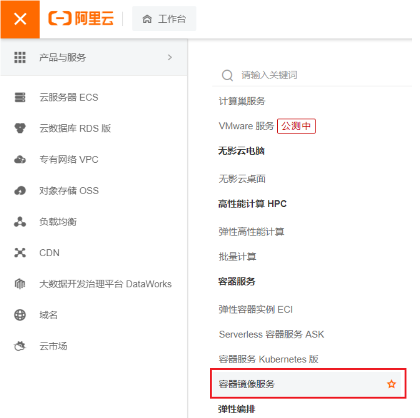
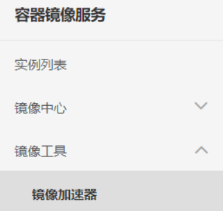

---
tags:
  - Docker
  - 软件安装
---


Docker是一个快速交付应用、运行应用的技术：

* 可以将程序及其依赖、运行环境一起打包为一个镜像，可以迁移到任意Linux操作系统
* 运行时利用沙箱机制形成隔离容器，各个应用互不干扰
* 启动、移除都可以通过一行命令完成，方便快捷


Docker如何解决不同系统环境的问题？

* Docker将用户程序与所需要调用的系统(比如Ubuntu)函数库一起打包
* Docker运行到不同操作系统时，直接基于打包的库函数，借助于操作系统的Linux内核来运行

Docker如何解决大型项目依赖关系复杂，不同组件依赖的兼容性问题？

* Docker允许开发中将应用、依赖、函数库、配置一起打包，形成可移植镜像
* Docker应用运行在容器中，使用沙箱机制，相互隔离

Docker如何解决开发、测试、生产环境有差异的问题

* Docker镜像中包含完整运行环境，包括系统函数库，仅依赖系统的Linux内核，因此可以在任意Linux操作系统上运行


## 卸载

如果之前安装过旧版本的Docker，可以使用下面命令卸载：

### CentOS

```bash
yum remove docker \
                  docker-client \
                  docker-client-latest \
                  docker-common \
                  docker-latest \
                  docker-latest-logrotate \
                  docker-logrotate \
                  docker-selinux \
                  docker-engine-selinux \
                  docker-engine \
                  docker-ce
```


### Ubuntu

```bash
sudo apt-get remove docker docker-engine docker.io containerd runc
```


## 安装

### CentOS

**第一步**

需要先安装yum-utils工具

```bash
yum install -y yum-utils \
           device-mapper-persistent-data \
           lvm2 --skip-broken
```


**第二步**

更新本地镜像源，将镜像源改为阿里云镜像

```bash
# 设置docker镜像源
yum-config-manager \
    --add-repo \
    https://mirrors.aliyun.com/docker-ce/linux/centos/docker-ce.repo
    
sed -i 's/download.docker.com/mirrors.aliyun.com\/docker-ce/g' /etc/yum.repos.d/docker-ce.repo
```

```bash
yum makecache fast
```


**第三步**

安装docker，`-y` 安装过程中如有询问，直接一路yes，`docker-ce`为社区免费版本。

```bash
yum install -y docker-ce
```


### Ubuntu

**第一步**

更新软件包

```bash
sudo apt update
sudo apt upgrade
```

**第二步**

安装Docker依赖

```bash
sudo apt-get install ca-certificates curl gnupg lsb-release
```

**第三步**

添加Docker软件源

```bash
sudo add-apt-repository "deb [arch=amd64] http://mirrors.aliyun.com/docker-ce/linux/ubuntu $(lsb_release -cs) stable"
```

**第四步**

安装Docker

```bash
apt-get install docker-ce docker-ce-cli containerd.io
```

> 配置用户组（可选）：
> 
> 默认情况下，只有root用户和docker组的用户才能运行Docker命令。可以将当前用户添加到docker组，以避免每次使用Docker时都需要使用sudo。命令如下：
> 
> ```bash
> sudo usermod -aG docker $USER
> ```
> 
> 重新登录使更改生效

**第五步**

安装工具

```bash
sudo apt-get -y install apt-transport-https ca-certificates curl software-properties-common
```


## 启动&停止

Docker中的应用需要用到各种端口，逐一去修改防火墙设置。

> 学习阶段可以关闭防火墙，开放所有端口。

```bash
# 关闭防火墙
systemctl stop firewalld
# 禁止开机启动防火墙
systemctl disable firewalld
# 查看防火墙状态
systemctl status firewalld
```


启动或停止docker

```bash
# 启动docker服务
systemctl start docker
# 停止docker服务
systemctl stop docker
# 重启docker服务
systemctl restart docker
# 查看docker状态
systemctl status docker
# 查看docker版本
docker -v
# 设置开机自启
sudo systemctl enable docker
```

> 如果是WSL系统，可以使用 `service docker start` 启动Docker，其他命令同理。


## 配置阿里云镜像

**第一步**

进入阿里云，点击**容器镜像服务**




**第二步**

点击镜像加速器




**第三步**

选择CentOS，执行下面的命令即可

> 这里CentOS与Ubuntu的命令是一样的


```bash
# 创建一个文件夹
sudo mkdir -p /etc/docker
# 将镜像地址写入到json文件中
sudo tee /etc/docker/daemon.json <<-'EOF'
{
  "registry-mirrors": ["https://xctue5uq.mirror.aliyuncs.com"]
}
EOF
# 重新加载命令
sudo systemctl daemon-reload
# 重启docker
sudo systemctl restart docker
```