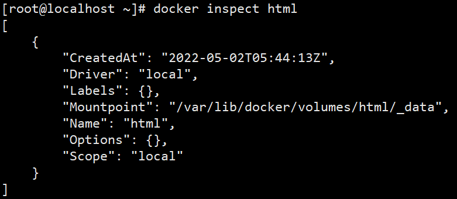

**容器与数据（容器内文件）耦合：**

* **不便于修改**：如果需要修改配置文件，需要进入容器的内部。
* **数据不可复用**：容器内的修改对外不可见，无法复用。
* **升级维护困难**：如果想要升级容器，需要先删除旧容器，数据也会被一起删除。


**数据卷（volume）** 是一个虚拟目录，指向宿主机文件系统中的某个目录。将容器与数据分离，解耦合，方便操作容器内数据，保证数据安全。


一旦完成数据卷挂载，对容器的一切操作都会作用在数据卷对应的宿主机目录了。

这样，操作宿主机的`/var/lib/docker/volumes/html`目录，就等于操作容器内的`/usr/share/nginx/html`目录了。


## 操作数据卷命令

```bash
docker volume [COMMAND]

# 创建数据卷
docker volume create
# 查看所有数据卷
docker volume ls
# 查看数据卷详细信息，包括关联的宿主机目录位置
docker volume inspect
# 删除指定数据卷
docker volume rm
# 删除所有未使用的数据卷
docker volume prune
```

`docker volume`命令是数据卷操作，根据命令后跟随的`command`来确定下一步的操作：

* `create`：创建一个volume
* `inspect`：显示一个或多个volume的信息
* `ls`：列出所有的volume
* `prune`：删除未使用的volume
* `rm`：删除一个或多个指定的volume


## **操作数据卷\[例\]**

### 创建数据卷

```bash
docker vilume html
```


### 查看数据卷

```bash
docker volume ls
```


### 查看数据卷的详细信息

```bash
docker volume inspect html
```


### 删除未使用的数据卷

```bash
docker volume prune
```


### 删除指定数据卷

```bash
docker volume rm html
```


## 挂载数据卷

在创建容器时，可以通过`-v`参数来挂载一个数据卷到某个容器内目录，命令格式如下：

举例：

```bash
docker run \
  --name mn \
  -v html:/root/html \
  -p 80:80
  nginx \
```

* `-v html:/root/htm`：把html数据卷挂载到容器内的/root/html这个目录中


### 挂载Nginx数据卷\[例\]

如果html数据卷不存在，会直接创建数据卷。

```bash
docker run \
    --name nginx    \
    -p 80:80    \
    -v html:/usr/share/nginx/html    \
    -d    \
    nginx    \
```


然后使用查看数据卷命令，可以看到数据卷的位置，可以在该位置修改相关文件。




## 直接挂载数据卷

容器不仅仅可以挂载数据卷，也可以直接挂载到宿主机目录上。关联关系如下：

* **带数据卷模式：** 宿主机目录 ---> 数据卷 ---> 容器内目录
* **直接挂载模式：** 宿主机目录 ---> 容器内目录


目录挂载与数据卷挂载的语法是类似的：

* `-v [宿主机目录]:[容器内目录]`
* `-v [宿主机文件]:[容器内文件]`


**数据卷挂载与目录直接挂载的区别**

* 数据卷挂载耦合度低，由docker来管理目录，但是目录较深，不好找
* 目录挂载耦合度高，需要我们自己管理目录，不过目录容易寻找查看


## 直接挂载MySQL数据卷\[例\]

### 拉取MySQL镜像

```Plain Text
docker pull mysql:8.0.29
```


### 创建MySQL的相关目录

```bash
/var/lib/mysql
```


### 启动并挂载MySQL

这里挂载三个目录，一个日志目录，一个数据目录，一个配置目录

```bash
docker run --name mysql    \
    -p 3306:3306    \
    -v /var/lib/mysql/log:/var/log/mysql    \
    -v /var/lib/mysql/data:/var/lib/mysql    \
    -v /var/lib/mysql/conf:/etc/mysql/conf.d    \
    -e MYSQL_ROOT_PASSWORD=root1019    \
    -d    \
    mysql:8.0.29    \
```


