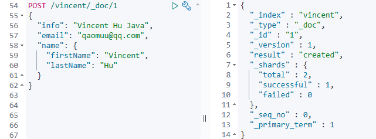
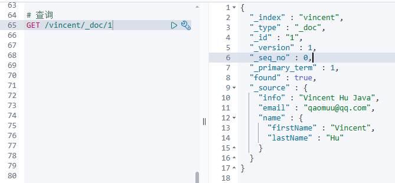
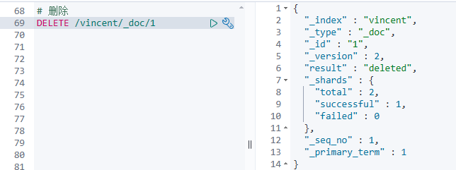
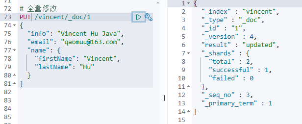
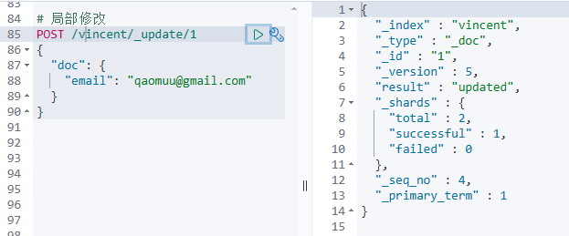

## 新增文档

**语法：**

```json
POST /索引库名/_doc/文档id
{
    "字段1": "值1",
    "字段2": "值2",
    "字段3": {
        "子属性1": "值3",
        "子属性2": "值4"
    },
    // ...
}
```

**示例：**



## 查询文档

根据rest风格，新增是post，查询应该是get，不过查询一般都需要条件，这里我们把文档id带上。

**语法：**

```json
GET /{索引库名称}/_doc/{id}
```

**通过kibana查看数据：**




## 删除文档

删除使用DELETE请求，同样，需要根据id进行删除：

**语法：**

```js
DELETE /{索引库名}/_doc/id值
```

**示例：**




## 修改文档

修改有两种方式：

- 全量修改：直接覆盖原来的文档
- 增量修改：修改文档中的部分字段


### 全量修改

全量修改是覆盖原来的文档，其本质是：

1. 根据指定的id删除文档
2. 新增一个相同id的文档

> **注意**：如果根据id删除时，id不存在，第二步的新增也会执行，也就从修改变成了新增操作了。


**语法：**

```json
PUT /{索引库名}/_doc/文档id
{
    "字段1": "值1",
    "字段2": "值2",
    // ... 略
}

```


**示例：**


### 增量修改

增量修改是只修改指定id匹配的文档中的部分字段。

**语法：**

```json
POST /{索引库名}/_update/文档id
{
    "doc": {
         "字段名": "新的值",
    }
}
```


**示例：**




