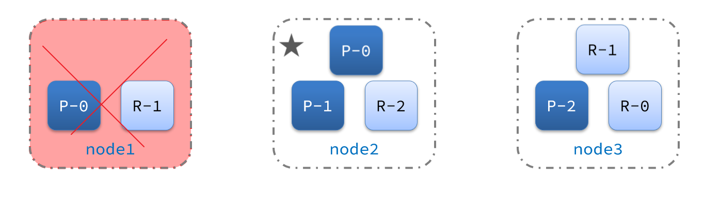

基于 Docker Compose 搭建 Elasticsearch 三节点集群：

## Compose文件结构

```yaml
version: '3.8'
services:
  es01:
    # 使用官方镜像
    image: docker.elastic.co/elasticsearch/elasticsearch:8.15.5
    container_name: es01
    environment:
      # 节点名称（唯一）
      - node.name=es01
      # 集群名称（所有节点一致）
      - cluster.name=es-docker-cluster
      # 节点发现地址（引导集群，多台机器需要用IP地址）
      - discovery.seed_hosts=es02,es03
      # 初始主节点列表（仅首次启动时有效）
      - cluster.initial_master_nodes=es01,es02,es03
      # 锁住内存，避免交换到磁盘，提升性能
      - bootstrap.memory_lock=true
      # 设置 JVM 堆内存大小
      - "ES_JAVA_OPTS=-Xms1g -Xmx1g"
      # 关闭安全模式（简单开发用）
      - xpack.security.enabled=false
      - xpack.security.transport.ssl.enabled=false
    ulimits:
      memlock:
        soft: -1
        hard: -1
    ports:
      # 对外暴露 REST 接口（仅 es01）
      - 9250:9200
    networks:
      - es-network

  es02:
    image: docker.elastic.co/elasticsearch/elasticsearch:8.15.5
    container_name: es02
    environment:
      - node.name=es02
      - cluster.name=es-docker-cluster
      - discovery.seed_hosts=es01,es03
      - cluster.initial_master_nodes=es01,es02,es03
      - bootstrap.memory_lock=true
      - "ES_JAVA_OPTS=-Xms1g -Xmx1g"
      - xpack.security.enabled=false
      - xpack.security.transport.ssl.enabled=false
    ulimits:
      memlock:
        soft: -1
        hard: -1
    ports:
      - 9260:9200
    networks:
      - es-network

  es03:
    image: docker.elastic.co/elasticsearch/elasticsearch:8.15.5
    container_name: es03
    environment:
      - node.name=es03
      - cluster.name=es-docker-cluster
      - discovery.seed_hosts=es01,es02
      - cluster.initial_master_nodes=es01,es02,es03
      - bootstrap.memory_lock=true
      - "ES_JAVA_OPTS=-Xms1g -Xmx1g"
      - xpack.security.enabled=false
      - xpack.security.transport.ssl.enabled=false
    ulimits:
      memlock:
        soft: -1
        hard: -1
    ports:
      - 9270:9200
    networks:
      - es-network

networks:
  es-network:
    driver: bridge
```


## 集群职责

• Elasticsearch 要求至少 3 个 master-eligible 节点才能选主（避免 split-brain）。
• 生产环境推荐使用更高的内存配置（如 2g 或以上），并关闭端口暴露（使用反向代理）。


  
默认情况下，集群中的任何一个节点都同时具备上述四种角色。

但是真实的集群一定要将集群职责分离：（因为不同职责对CPU要求不同）
- master节点：对CPU要求高，但是内存要求低
- data节点：对CPU和内存要求都高
- coordinating节点：对网络带宽、CPU要求高

职责分离可以让我们根据不同节点的需求分配不同的硬件去部署。而且避免业务之间的互相干扰。

一个典型的es集群职责划分如图：


## 脑裂问题

> ES 7.0后默认配置了 **( eligible节点数量 + 1 ）/ 2** 来解决脑裂问题

脑裂是因为集群中的节点失联导致的。例如一个集群中，主节点与其它节点失联：


此时，node2和node3认为node1宕机，就会重新选主：


当node3当选后，集群继续对外提供服务，node2和node3自成集群，node1自成集群，两个集群数据不同步，出现数据差异。

当网络恢复后，因为集群中有两个master节点，集群状态的不一致，出现脑裂的情况：


解决脑裂的方案是，要求选票超过 **( eligible节点数量 + 1 ）/ 2** 才能当选为主，因此eligible节点数量最好是奇数。对应配置项是`discovery.zen.minimum_master_nodes`，在es7.0以后，已经成为默认配置，因此一般不会发生脑裂问题。

例如：3个节点形成的集群，选票必须超过 （3 + 1） / 2 ，也就是2票。node3得到node2和node3的选票，当选为主。node1只有自己1票，没有当选。集群中依然只有1个主节点，没有出现脑裂。

## 分布式存储

> 当新增文档时，应该保存到不同分片，保证数据均衡，那么coordinating node如何确定数据该存储到哪个分片呢？

elasticsearch会通过hash算法来计算文档应该存储到哪个分片：


说明：
- `_routing` 默认是文档的id
- 算法与分片数量有关，因此索引库一旦创建，分片数量不能修改

新增文档的流程如下：


1. 新增一个id=1的文档
2. 对id做hash运算，假如得到的是2，则应该存储到shard-2
3. shard-2的主分片在node3节点，将数据路由到node3
4. 保存文档
5. 同步给shard-2的副本replica-2，在node2节点
6. 返回结果给coordinating-node节点

## 分布式查询

elasticsearch的查询分成两个阶段：
- scatter phase：分散阶段，coordinating node会把请求分发到每一个分片
- gather phase：聚集阶段，coordinating node汇总data node的搜索结果，并处理为最终结果集返回给用户


## 故障转移

> ES本身已经配置好了有集群故障转移，不需要再去配置

集群的master节点会监控集群中的节点状态，如果发现有节点宕机，会立即将宕机节点的分片数据迁移到其它节点，确保数据安全，这个叫做故障转移。

例如一个集群结构如图：


现在，node1是主节点，其它两个节点是从节点。

突然，node1发生了故障：


宕机后的第一件事，需要重新选主，例如选中了node2：


node2成为主节点后，会检测集群监控状态，发现：shard-1、shard-0没有副本节点。因此需要将node1上的数据迁移到node2、node3：




---

**📦 volumes（持久化数据）**

```
volumes:
  data01:
    driver: local
  data02:
    driver: local
  data03:
    driver: local
```

• 将每个节点的数据挂载到本地卷中，避免容器删除后数据丢失。

---
