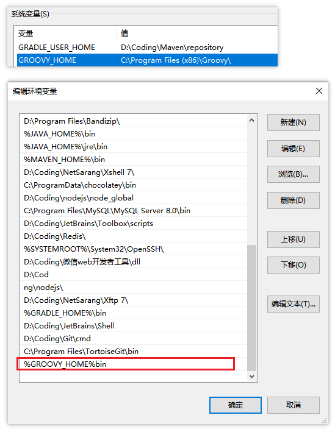
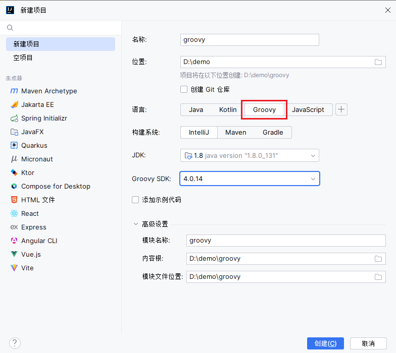
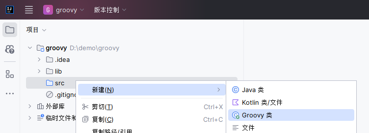

## Groovy 简介
Groovy 可以被视为Java 的一种脚本化改良版，Groovy 也是运行在 JVM 上，可以很好地与 Java 代码及其相关库进行交互操作。Groovy 是一种成熟的面向对象编程语言，既可以面向对象编程，又可以用作纯粹的脚本语言。大多数有效的 Java 代码也可以转换为有效的 Groovy 代码，完成同样的任务所需的Groovy 代码比 Java 代码更少。
- 功能强大，例如提供了动态类型转换、闭包和元编程（metaprogramming）支持
- 支持函数式编程，不需要 main 函数
- 默认导入常用的包
- 类不支持 default 作用域，且默认作用域为public
- Groovy 中基本类型也是对象，可以直接调用对象的方法
- 支持DSL（Domain Specific Languages 领域特定语言）和其它简洁的语法
- Groovy 是基于Java 语言的，所以完全兼容Java 语法，学习成本较低。

参考：[http://www.groovy-lang.org/documentation.html](http://www.groovy-lang.org/documentation.html)

## 下载&安装
下载地址：[https://groovy.apache.org/download.html](https://groovy.apache.org/download.html)

配置环境变量：


## 创建项目



## Groovy 语法

Groovy是基于Java语言的完全兼容Java语法，可以作为面向对象编程语言，也可以作为脚本类型语言。

- 在一个 groovy 文件中可以混合定义类和脚本，但不能再定义一个和文件名同名的类。
- 使用 `def` 定义变量、方法，不建议使用具体的数据类型。
- 注释：单行注释 `//`，多行注释 `/**/`。
- 行尾分号可以省略，使用换行作为结束。
- 默认类、方法、字段都是 `public` 修饰。
- 支持顺序结构、分支结构、循环结构语句。
- 支持各种运算符：算术、关系、位、赋值 等等。
- 基本类型也是对象，可以直接调用对象的方法。

数据类型：
- 变量、属性、方法、参数、返回值等类型都可有可无，在被赋值时确定类型。


对象属性的操作：
- 属性赋值：
	1. `对象.属性名=xxx`
	2. 对象的setter方法
	3. 具名构造器
- 属性读取：
	1. `对象.属性名`
	2. `对象[属性名]`
	3. 对象的getter方法

> 本质上是通过属性的Getter和Setter方法完成的

方法：
- 声明：参数类型、返回值类型 可以省略；return关键字（默认使用方法的最后一句的返回值作为方法的返回值）
- 调用：() 可以省略

字符串有三种：
- 单引号：作为字符串常量
- 双引号：可以引用变量，${}
- 三引号：模板字符串，支持换行

**类型转换：** 当需要时，类型之间会自动发生类型转换，字符串（String）、基本类型(如int) 、类型的包装类 (如Integer)。

**类说明：** 如果在一个groovy 文件中没有任何类定义，它将被当做 script 来处理，也就意味着这个文件将被透明的转换为一个 Script 类型的类，这个自动转换得到的类将使用原始的 groovy 文件名作为类的名字。groovy 文件的内容被打包进 run 方法，另外在新产生的类中被加入一个 main 方法以进行外部执行该脚本。

方法调用时，在不含有歧义的地方可以省略方法调用时的括号。这类似于使用`${变量名}`时，括号在不引起歧义的地方可以省略是一样的。

```groovy
// 同时存在脚本的话类名不可以与文件名相同
class Demo {
    def username
    static def sale() {
        def num1 = 1
        def num2 = 2
        // 双引号支持变量引用
        println "$num1 + $num2 = ${num1+num2}"
    }
}

// 单引号不支持引用
println('begin')
Demo.sale()
def obj = new Demo(username: 'account')
println(obj["username"])
```


Groovy 支持顺序结构从上向下依次解析、分支结构(if..else、if..else if ..else..、switch..case、for、while、do..while)
具体参考官网：[http://www.groovy-lang.org/semantics.html#_conditional_structures](http://www.groovy-lang.org/semantics.html#_conditional_structures)


### 类与方法
Groovy类型除了原生数据类型及包装类，还有普通类、内部类、抽象类、接口、注解，新增了 Trait 类型，可以看成是带有方法实现的接口。

权限修饰符：public、protected、private

**Groovy 类与 Java 类之间的主要区别是：**
1. 没有可见性修饰符的类或方法自动是公共的(可以使用一个特殊的注释来实现包的私有可见性)。
2. 没有可见性修饰符的字段将自动转换为属性，不需要显式的 getter 和 setter 方法。
3. 如果属性声明为 final，则不会生成 setter。
4. 一个源文件可能包含一个或多个类(但是如果一个文件不包含类定义的代码，则将其视为脚本)。脚本只是具有一些特殊约定的类，它们的名称与源文件相同(所以不要在脚本中包含与脚本源文件名相同的类定义)。

有 关 Groovy 中 各 种 各 样 的 数 据 类 型 和 权 限 修 饰 符 及 Goovy 与 Java 区 别 请 参 考 ：
[http://www.groovy-lang.org/objectorientation.html#_modifiers_on_a_property](http://www.groovy-lang.org/objectorientation.html#_modifiers_on_a_property)

### 集合
Groovy 支持List、Map 集合操作，并且拓展了 Java 中的API，具体参考如下方法：

List：
- `add()`：添加某个元素plus():添加某个list 集合
- `remove()`：删除指定下标的元素removeElement():删除某个指定的元素
- `removeAll()`：移除某个集合中的元素
- `pop()`：弹出list 集合中最后一个元素putAt():修改指定下标的元素
- `each()`：遍历
- `size()`：获取list 列表中元素的个数
- `contains()`：判断列表中是否包含指定的值，则返回 true 

Map:
- `put()`：向map 中添加元素
- `remove()`：根据某个键做移除，或者移除某个键值对
- +、-：支持 map 集合的加减操作
- `each()`：遍历map 集合

请参考官网：[http://www.groovy-lang.org/syntax.html#_number_type_suffixes](http://www.groovy-lang.org/syntax.html#_number_type_suffixes)

> 可以把不同的基本类型添加到同一集合中。

### 导包
Groovy 遵循 Java 允许 import 语句解析类引用的概念。Groovy 语言默认提供的导入：
```groovy
import java.lang.* 
import java.util.* 
import java.io.* 
import java.net.* 
import groovy.lang.* 
import groovy.util.*
import java.math.BigInteger
import java.math.BigDecimal
```
### 异常
Groovy 中的异常处理和 java 中的异常处理是一样的。
参考官网地址：[http://www.groovy-lang.org/semantics.html#_try_catch_finally](http://www.groovy-lang.org/semantics.html#_try_catch_finally)

### 闭包

闭包：Groovy 中的闭包是一个开放的、匿名的代码块，它可以接受参数、也可以有返回值。闭包可以引用其周围作用域中声明的变量。

语法：`{ [closureParameters -> ] statements }`

其中 `[ closureParameters-> ]` 是一个可选的逗号分隔的参数列表，参数后面是  Groovy 语句。参数类似于方法参数列表， 这些参数可以是类型化的，也可以是非类型化的。当指定参数列表时，需要使用 `->` 字符，用于将参数与闭包体分离。
参考：[http://www.groovy-lang.org/closures.html](http://www.groovy-lang.org/closures.html)

```groovy
//闭包体完成变量自增操作
{ item++ }
//闭包使用 空参数列表 明确规定这是无参的
{ -> item++ }
//闭包中有一个默认的参数[it]，写不写无所谓
{ println it }
{ it -> println it }
//如果不想使用默认的闭包参数it,那需要显示自定义参数的名称
{ name -> println name }
//闭包也可以接受多个参数
{ String x, int y ->
    println "hey ${x} the value is ${y}"
}
//闭包参数也可是一个对象
{ reader ->
    def line = reader.readLine() 
    line.trim()
}
```

闭包调用方式：闭包是 `groovy.lang.Closure` 的实例。它可以像任何其他变量一样分配给一个变量或字段。
闭包对象(参数)
闭包对象.call(参数)

```groovy
def isOdd = { int i -> i%2 != 0 } 
assert isOdd(3) == true
assert isOdd.call(2) == false

def isEven = { it%2 == 0 } 
assert isEven(3) == false 
assert isEven.call(2) == true
```

> 可以把闭包当作一个对象，作为参数传递给方法使用。
```groovy
//无参闭包
def run(Closure closure){ 
    println("run start...")
    closure() println("run end...")
}

run {
    println "running......"
}

//有参闭包
def caculate(Closure closure){
    def num1=1;
    def num2=3; 
    println("caculate start...")
    closure(num1,num2) 
    println("caculate end...")
}
caculate {x,y -> println "计算结果为：$x+$y=${x+y}"} //在build.gradle文件中见到的很多都是闭包格式的。
```