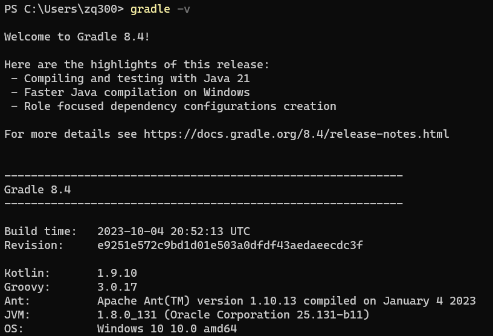
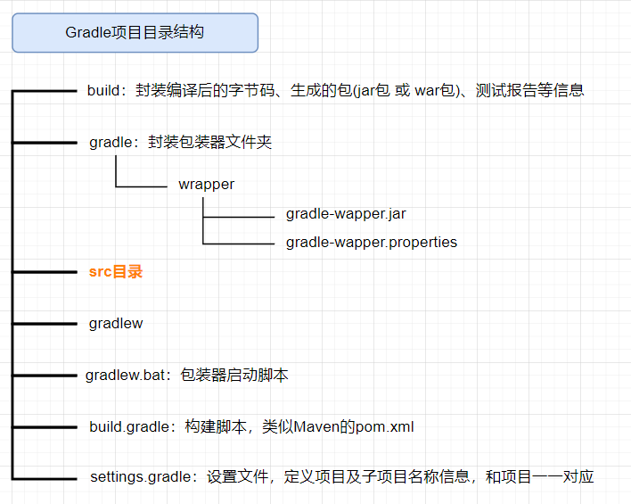

## 下载&安装

> Gradle官网：[https://gradle.org/](https://gradle.org/)
> Gradle下载地址：[https://gradle.org/releases/](https://gradle.org/releases/)

下载后解压，并配置环境变量：
1. 环境变量增加 `GRADLE_HOME`，值为gradle的路径
2. `Path` 变量增加 `%GRADLE_HOME%\bin`
3. 环境变量增加 `GRADLE_USER_HOME`，值为maven的仓库目录

> Gradle的仓库可以和Maven的仓库为同一个，环境变量中的名字必须为 `GRADLE_USER_HOME`，相当于配置Gradle 本地仓库位置和 Gradle Wrapper 缓存目录


检查是否安装成功：
`gradle -v` 或者 `gradle --version`



## Gradle项目目录结构
Gradle 项目默认目录结构和Maven 项目的目录结构一致，都是基于约定大于配置

> `gradlew` 与 `gradlew.bat` 执行的指定wrapper版本中的gradle指令，不是本地安装的gradle指令


## Gradle常用指令
- `gradle clean` ：清空build目录
- `gradle classes` ：编译业务代码和配置文件
- `gradle test` ：编译测试代码，生成测试报告
- `gradle build` ：构建项目
- `gradle build -x test` ：跳过测试构建项目

> Gradle 的指令在含有 `build.gradle` 的目录执行

## 修改maven下载源
在 Gradle 的 `init.d` 目录下创建以 `.gradle` 结尾的文件，以实现在 `build` 开始之前执行。
> You can add .gradle (e.g. test.gradle) init scripts to this directory. Each one is executed at the start of the build.

可以在这个文件配置一些预先加载的操作：

创建 `init.gradle` 文件，并保存下面脚本
```groovy
allprojects {
    repositories {
        mavenLocal()
        maven { name "Alibaba" ; url "https://maven.aliyun.com/repository/public" } 
        maven { name "Bstek" ; url "https://nexus.bsdn.org/content/groups/public/" } 
        mavenCentral()
    }
    
    buildscript {
        repositories {
            maven { name "Alibaba" ; url 'https://maven.aliyun.com/repository/public' } 
            maven { name "Bstek" ; url 'https://nexus.bsdn.org/content/groups/public/' } 
            maven { name "M2" ; url 'https://plugins.gradle.org/m2/' }
        }
    }
}
```

> - `mavenLocal()`：指定使用maven本地仓库，而本地仓库在配置maven时settings文件指定的仓库位置。如 `E:/repository`，gradle 查找jar包顺序如下：
`USER_HOME/.m2/settings.xml` > `M2_HOME/conf/settings.xml` >
`USER_HOME/.m2/repository`
> - `maven { url 地址}`，指定maven仓库，一般用私有仓库地址或其它的第三方库【比如阿里镜像仓库地址】。
> - `mavenCentral()`：这是Maven的中央仓库，无需配置，直接声明就可以使用。
> - `jcenter()`：JCenter中央仓库，实际也是是用的maven搭建的，但相比Maven仓库更友好，通过CDN分发，并且支持https访问，在新版本中已经废弃，替换为`mavenCentral()`。
> 

> Gradle可以通过指定仓库地址为本地maven仓库地址和远程仓库地址相结合的方式，避免每次都会去远程仓库下载依赖库。这种方式也有一定的问题，如果本地maven仓库有这个依赖，就会从直接加载本地依赖，如果本地仓库没有该依赖，那么还是会从远程下载。
> 但是下载的jar不是存储在本地maven仓库中，而是放在自己的缓存目录中，默认在 `USER_HOME/.gradle/caches` 目录，如果配置过 `GRADLE_USER_HOME` 环境变量，则会放在 `GRADLE_USER_HOME/caches` 目录。


启用 `init.gradle` 文件的方法有四种：
1. 在命令行指定文件，例如：`gradle --init-script yourdir/init.gradle -q taskName`。可以多次输入此命令来指定多个init文件
2. 把 `init.gradle` 文件放到 `USER_HOME/.gradle/` 目录下
3. 把以 `.gradle` 结尾的文件放到 `USER_HOME/.gradle/init.d/` 目录下
4. 把以 `.gradle` 结尾的文件放到 `GRADLE_HOME/init.d/` 目录下

如果存在上面的4种方式的2种以上，Gradle会按上面的1-4序号依次执行这些文件，如果给定目录下存在多个init脚本，会按拼音 `a-z` 顺序执行这些脚本，每个init脚本都存在一个对应的Gradle实例，在这个文件中调用的所有方法和属性，都会委托给这个Gradle实例，每个init脚本都实现了Script接口。

## Wrapper包装器
Gradle Wrapper 实际上是对 Gradle 的一层包装，用于解决实际开发中可能会遇到的不同的项目需要不同版本的 Gradle。

有了 Gradle Wrapper 之后，本地可以不配置 Gradle，下载Gradle 项目后，可以使用 Gradle 项目自带的 wrapper 操作。

项目中的 `gradlew`、`gradlew.cmd` 脚本用的就是 Wrapper 中规定的 Gradle 版本。

> gradle 指令 和 gradlew 指令 所使用的 gradle 版本有可能是不一样的

`gradlew`、`gradlew.cmd` 的使用方式与 Gradle 使用方式完全一致，只不过把 Gradle 指令换成了 Gradlew 指令。可在终端执行 gradlew 指令时，指定指定一些参数来控制 Wrapper 的生成，比如依赖的版本等，如下：
- `--gradle-version`：用于指定使用的 Gradle 版本
- `--gradle-distribution-url`：用于指定下载的 Gradle 发行版的url地址

```bash
# 升级wrapper版本号,只是修改gradle.properties中wrapper版本，未实际下载
gradle wrapper --gradle-version=4.4

# 关联源码用
gradle wrapper --gradle-version 5.2.1 --distribution-type all
```

---


GradleWrapper 的执行流程：
1. 当第一次执行 `./gradlew build` 命令的时候，gradlew 会读取 `gradle-wrapper.properties` 文件的配置信息
2. 准确的将指定版本的 gradle 下载并解压到指定的位置( `GRADLE_USER_HOME` 目录下的 `wrapper/dists` 目录中)
3. 并构建本地缓存( `GRADLE_USER_HOME` 目录下的 `caches` 目录中)，下载再使用相同版本的 gradle 就不用下载了
4. 之后执行的 `./gradlew` 所有命令都是使用指定的 gradle 版本。

---

`gradle-wrapper.properties` 文件解读：

- `distributionBase`：下载的 Gradle 压缩包解压后存储的主目录
- `distributionPath`：相对于 `distributionBase` 的解压后的 Gradle 压缩包的路径
- `distributionUrl`：Gradle 发行版压缩包的下载地址
- `zipStoreBase`：同 `distributionBase`，存放的是zip压缩包
- `zipStorePath`：同 `distributionPath`，存放的是zip压缩包


> 下载别人的项目或者使用操作以前自己写的不同版本的gradle项目时，用Gradle wrapper(gradlew)
> 新建一个项目时，使用gradle指令