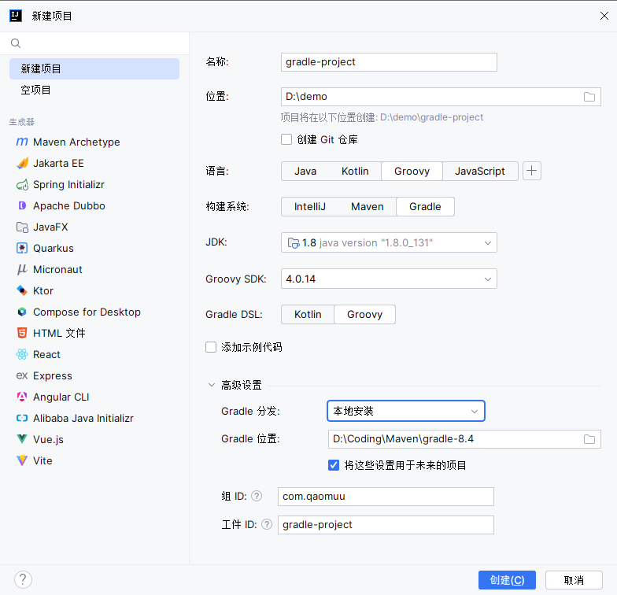
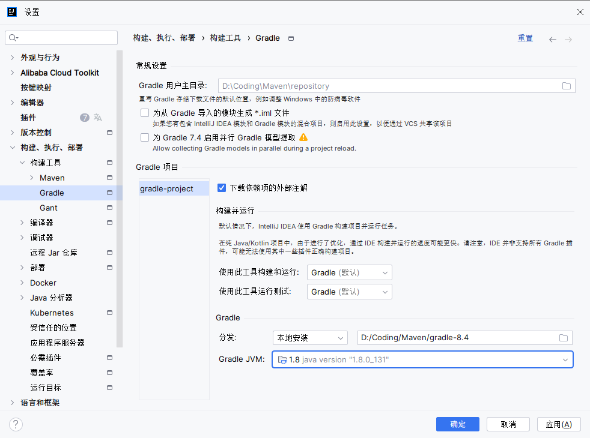
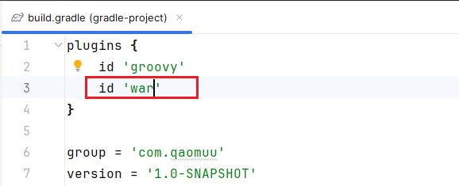
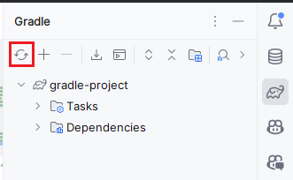

## 创建Java项目
创建 Gradle 项目


项目设置


## 创建SSM项目
与上方步骤一致

添加war插件

添加相关的依赖：
```groovy
plugins {
    id 'groovy'
    id 'war'
}

group = 'com.qaomuu'
version = '1.0-SNAPSHOT'

repositories {
    mavenCentral()
}

dependencies {
    implementation 'org.springframework:spring-beans:4.1.7.RELEASE'
    implementation 'org.springframework:spring-web:4.1.7.RELEASE'
    implementation 'org.springframework:spring-webmvc:4.1.7.RELEASE'
    implementation 'org.springframework:spring-tx:4.1.7.RELEASE'
    implementation 'org.springframework:spring-test:4.0.5.RELEASE'
    implementation 'org.springframework:spring-jdbc:4.1.7.RELEASE'

    implementation 'org.mybatis:mybatis-spring:1.2.3'
    implementation 'org.mybatis:mybatis:3.3.0'

    implementation 'mysql:mysql-connector-java:5.1.36'
    implementation 'com.alibaba:druid:1.0.15'

    implementation "com.fasterxml.jackson.core:jackson-databind:2.2.3"
    implementation "com.fasterxml.jackson.core:jackson-annotations:2.2.3"
    implementation "com.fasterxml.jackson.core:jackson-core:2.2.3"

    implementation 'org.aspectj:aspectjweaver:1.8.6'
    implementation 'log4j:log4j:1.2.17'
    implementation 'org.slf4j:slf4j-api:1.7.25'
    implementation 'jstl:jstl:1.2'
    compileOnly 'javax.servlet:servlet-api:2.5'
    testImplementation group: 'junit', name: 'junit', version: '4.12'
}

```


刷新项目，下载依赖：


其余和Maven配置SSM项目操作一致。


## 项目部署
Gretty 是一个功能丰富的 gradle 插件，用于在嵌入的 servlet 容器上运行 web 应用程序，让项目开发和部署更加简单。目前Gretty 插件已经作为 gradle 的核心库使用了，Gretty 其核心功能为：
1. 底层支持 jetty，tomcat 等Servlet 容器
2. 支持项目热部署、HTTPS、调试

Gretty 官网地址：[http://akhikhl.github.io/gretty-doc/index.html](http://akhikhl.github.io/gretty-doc/index.html)

第一步：引入 Gretty 插件
```groovy
plugins {
    id 'war'
    id 'org.gretty' version '2.2.0'
}
```

第二步：指定maven 仓库
```groovy
repositories {
    //指定jcenter仓库，一定要放在前面
    jcenter() 
    mavenCentral()
}
```
第三步：针对Gretty 插件的设置
```groovy
gretty {
    httpPort = 8888
    contextPath = "/web"
    debugPort = 5005	// default 
    debugSuspend = true // default 
    httpsEnabled = true
    managedClassReload=true // 修改了类之后重新加载
    //servletContainer = 'tomcat8' //如果不指定默认的servlet容器，支持tomcat7/8，默认是使用的是Jetty服务器
    httpsPort = 4431
}
```
第四步：执行Gretty 插件
```groovy
gradle appRun
```
官方文档
[http://akhikhl.github.io/gretty-doc/Gretty-configuration.html](http://akhikhl.github.io/gretty-doc/Gretty-configuration.html)