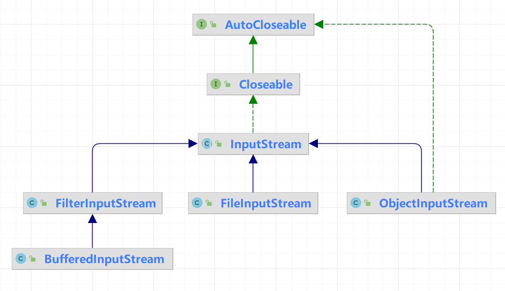

一切文件数据（文本、图片、视频等）在存储时，都是以二进制数字的形式保存，都一个一个的字节，传输时一样如此。字节流可以传输任意文件数据。在操作流的时候，无论使用什么样的流对象，底层传输的始终为二进制数据。

## 字节输入流

`java.io.InputStream`抽象类是表示字节输入流的所有类的超类，可以读取字节信息到内存中。它定义了字节输入流的基本共性功能方法。

常用的子类：

* `FileInputStream`：文件输入流
* `BufferedInputStream`：缓冲字节输入流
* `ObjectInputStream`：对象字节输入流




### 常用方法

* `public void close()`：关闭此输入流并释放与此流相关联的任何系统资源。
* `public abstract int read()`： 从输入流读取数据的下一个字节。
* `public int read(byte[] b)`： 从输入流中读取一些字节数，并将它们存储到字节数组b中。


> 1. 使用数组读取，每次读取多个字节，减少了系统间的IO操作次数，从而提高了读写的效率。
> 2. 当完成流的操作时，必须调用`close()`方法，释放系统资源。
> 3. 流的关闭原则：先开后关，后开先关。


### FileInputStream类

`java.io.FileInputStream`类是文件输入流，从文件中读取字节。

#### 构造方法

* `FileInputStream(File file)`： 通过打开与实际文件的连接来创建一个`FileInputStream` ，该文件由文件系统中的 File对象 file命名。
* `FileInputStream(String name)`： 通过打开与实际文件的连接来创建一个`FileInputStream` ，该文件由文件系统中的路径名 name命名。

> 创建一个流对象时，必须传入一个文件路径。该路径下，如果没有该文件，会抛出`FileNotFoundException`异常。


```java
public static void main(String[] args) {
    // 使用File对象创建流对象
    File file = new File("a.txt");
    FileInputStream fos = new FileInputStream(file);
    // 使用文件名称创建流对象
    FileInputStream fos = new FileInputStream("b.txt");
}
```


#### 读取字节数据

1. 读取一个字节，使用`read()`方法，每次可以读取一个字节的数据，提升为int类型，读取到文件末尾，返回-1。

```java
public void fileInputStreamTest() {
    FileInputStream inputStream = null;
    int data;
    try {
        inputStream = new FileInputStream("D:\\hello.txt");
        while ((data = inputStream.read()) != -1) {
            System.out.print((char) data);
        }
    } catch (IOException e) {
        e.printStackTrace();
    } finally {
        if (inputStream != null) {
            try {
                inputStream.close();
            } catch (IOException e) {
                e.printStackTrace();
            }
        }
    }
}
```


2. 使用字节数组读取：`read(byte[] b)`，每次读取b的长度个字节到数组中，返回读取到的有效字节个数，读取到末尾时，返回-1 。

```java
public void fileInputStreamTest() {
    FileInputStream inputStream = null;
    int len;
    byte[] buf = new byte[8];   // 一次读取8个字节
    try {
        inputStream = new FileInputStream("D:\\hello.txt");
        while ((len = inputStream.read(buf)) != -1) {
            // 每次读取后,把数组的有效字节部分，变成字符串打印
            // len 每次读取的有效字节个数
            System.out.print(new String(buf, 0, len));
        }
    } catch (IOException e) {
        e.printStackTrace();
    } finally {
        if (inputStream != null) {
            try {
                inputStream.close();
            } catch (IOException e) {
                e.printStackTrace();
            }
        }
    }
}
```


## 字节输出流

`java.io.OutputStream`抽象类是表示字节输出流的所有类的超类，将指定的字节信息写出到目的地。它定义了字节输出流的基本共性功能方法。


### 常用方法

* `public void close()`：关闭此输出流并释放与此流相关联的任何系统资源。
* `public void flush()`：刷新此输出流并强制任何缓冲的输出字节被写出。
* `public void write(byte[] b)`：将 b.length字节从指定的字节数组写入此输出流。
* `public void write(byte[] b, int off, int len)`：从指定的字节数组写入 len字节，从偏移量 off开始输出到此输出流。
* `public abstract void write(int b)`：将指定的字节输出流。


> 1. 当完成流的操作时，必须调用`close()`方法，释放系统资源。
> 2. 流的关闭原则：先开后关，后开先关。


### FileOutputStream类

`java.io.FileOutputStream`类是`OutputStream`的一个子类，是一个文件输出流，用于将数据写出到文件。


#### 构造方法

> 当创建一个流对象时，必须传入一个文件路径。该路径下，如果没有这个文件，会创建该文件。如果有这个文件，会根据构造传入的`append`值 判断是清空该文件的数据重新写 还是继续追加数据。


数据覆盖输出，清空这个文件的数据，从头开始添加数据：

* `public FileOutputStream(File file)`：创建文件输出流以写入由指定的 File对象表示的文件。
* `public FileOutputStream(String name)`： 创建文件输出流以指定的名称写入文件。


数据追加续写，保留目标文件中数据，继续添加新数据：


* `public FileOutputStream(File file, boolean append)`：创建文件输出流以写入由指定的 File对象表示的文件。
* `public FileOutputStream(String name, boolean append)`： 创建文件输出流以指定的名称写入文件。

> 这两个构造方法，参数中都需要传入一个boolean类型的值，`true`表示追加数据，`false`表示清空原有数据。这样创建的输出流对象，就可以指定是否追加续写了。


```java
public static void main(String[] args) {
    // 使用File对象创建流对象
    File file = new File("a.txt");
    FileOutputStream fos = new FileOutputStream(file);
    // 使用文件名称创建流对象
    FileOutputStream fos2 = new FileOutputStream("b.txt");

    // 追加数据流对象
    FileOutputStream fos3 = new FileOutputStream("fos.txt"，true); 
}
```


#### 写出字节数据

1. 写出字节：`write(int b)`方法，每次可以写出一个字节数据

```java
public void fileInputStreamTest() {
    FileOutputStream outputStream = null;
    try {
        outputStream = new FileOutputStream("D:\\a.txt");
        // 虽然参数为int类型四个字节，但是只会保留一个字节的信息写出。
        outputStream.write(97);
    } catch (IOException e) {
        e.printStackTrace();
    } finally {
        if (outputStream != null) {
            try {
                outputStream.close();
            } catch (IOException e) {
                e.printStackTrace();
            }
        }
    }
}
```


2. 写出字节数组：`write(byte[] b)`，每次可以写出数组中的数据。

```java
public void fileInputStreamTest() {
    FileOutputStream outputStream = null;
    try {
        outputStream = new FileOutputStream("D:\\a.txt");
        String str = "hello~~~";
        byte[] bytes = str.getBytes();
        outputStream.write(bytes);
        
    } catch (IOException e) {
        e.printStackTrace();
    } finally {
        if (outputStream != null) {
            try {
                outputStream.close();
            } catch (IOException e) {
                e.printStackTrace();
            }
        }
    }
}
```


3. 写出指定长度字节数组：`write(byte[] b, int off, int len)` ，每次写出从off索引开始，len个字节。

```java
public void fileInputStreamTest() {
    FileOutputStream outputStream = null;
    try {
        outputStream = new FileOutputStream("D:\\a.txt");
        String str = "hello~~~";
        byte[] bytes = str.getBytes();

        // 写出从索引0开始，5个字节，也就是hello
        outputStream.write(bytes, 0, 5);

    } catch (IOException e) {
        e.printStackTrace();
    } finally {
        if (outputStream != null) {
            try {
                outputStream.close();
            } catch (IOException e) {
                e.printStackTrace();
            }
        }
    }
}
```


#### 写出换行

系统中的换行：

* **Windows系统**里，每行结尾是 回车+换行 ，即`\r\n`；
  * 回车符(回到一行的开头-return)`\r`和换行符(下一行-newline)`\n` 。
* **Unix系统**里，每行结尾只有 换行，即`\n`；
* **Mac系统**里，每行结尾是 回车，即`\r`。从 Mac OS X开始与Linux统一。

```java
public void fileInputStreamTest() {
    FileOutputStream outputStream = null;
    try {
        outputStream = new FileOutputStream("D:\\a.txt");
        String str = "hello\r\n乔木先生";
        byte[] bytes = str.getBytes();
        outputStream.write(bytes);
    } catch (IOException e) {
        e.printStackTrace();
    } finally {
        if (outputStream != null) {
            try {
                outputStream.close();
            } catch (IOException e) {
                e.printStackTrace();
            }
        }
    }
}
```