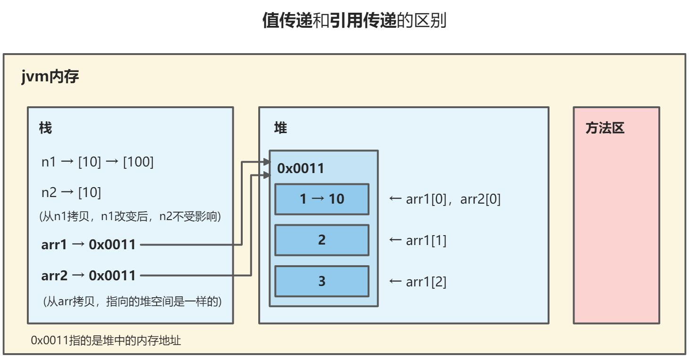

数组可以存放多个同一类型的数据。数组也是一种数据类型，**是引用类型**。 即：数(数据)组(一组)就是一组数据。

数组是一种数据结构， 用来存储同一类型值的集合。通过一个整型下标可以访问数组中的每一个值。

## 数组的定义

在声明数组变量时， 需要指出数组类型（数据元素类型紧跟 \[\]) 和数组变量的名字。在 Java 中，允许数组长度为 0。数组的下表从0开始。

方式一：

```java
数组存储的数据类型[] 数组名字 = new 数组存储的数据类型[长度];

int[] arr = new int[3];
```


方式二：

```java
数据类型[] 数组名 = new 数据类型[]{元素1,元素2,元素3...};

int[] arr = new int[]{1,2,3,4,5};
```


方式三：

```java
数据类型[] 数组名 = {元素1,元素2,元素3...};

int[] arr = {1,2,3,4,5};
new int[] { 17, 19, 23, 29, 31, 37 }; // 匿名数组
```


**数组定义格式详解**：

* **数组存储的数据类型：** 创建的数组容器可以存储什么数据类型
* **\[\]** : 表示数组
* **数组名**：为定义的数组起个变量名，满足标识符规范，可以使用名字操作数组
* **new**：关键字，创建数组使用的关键字
* **数组存储的数据类型**： 创建的数组容器可以存储什么数据类型
* **\[长度\]**：数组的长度，表示数组容器中可以存储多少个元素，长度一旦指定，不可更改

创建一个数字数组时， 所有元素都初始化为 0。boolean 数组的元素会初始化为 false。 对象数组的元素则初始化为一个特殊值 null，这表示这些元素（还）未存放任何对象。


## 数组的赋值机制

基本数据类型赋值，这个值就是具体的数据，而且相互不影响。

```java
int n1 = 80;
int n2 = n1;
n1 = 100;
System.out.println(n1); // 100
System.out.println(n2); // 80
```


数组在默认情况下是引用传递，赋的值是地址。

```java
int[] arr1 = {1, 2, 3};
int[] arr2 = arr1;
arr2[0] = 10;
for (int i = 0; i < arr1.length; i++) {
    System.out.print(arr1[i] + "\t");   // 10  2  3
}
```





## 数组的常见操作

### 访问数组

* **索引：** 每一个存储到数组的元素，都会自动的拥有一个编号，从0开始，这个自动编号称为**数组索引(index)**，可以通过数组的索引访问到数组中的元素。
* **数组的长度属性：** 每个数组都具有长度，而且是固定的，Java中赋予了数组的一个属性，可以获取到数组的长度，语句为： **数组名.length** ，属性length的执行结果是数组的长度，int类型结果。由次可以推断出，数组的最大索引值为 **数组名.length-1** 。

**索引访问数组中的元素：**

* **数组名\[索引\] = 数值**，为数组中的元素赋值
* **变量 = 数组名\[索引\]**，获取出数组中的元素

```java
public static void main(String[] args) { 
    //定义存储int类型数组，赋值元素1，2，3，4，5 
    int[] arr = {1,2,3,4,5}; 
    //为0索引元素赋值为6 
    arr[0] = 6; 
    //获取数组0索引上的元素 
    int i = arr[0]; 
    System.out.println(i); 
    //直接输出数组0索引元素 
    System.out.println(arr[0]); 
}
```


### forEach循环

foreach 循环语句的循环变量将会遍历数组中的每个元素， 而不需要使用下标值。

```java
for (变量 : collection) {
    循环体
}
```

collection 表达式必须是一个数组或者是一个实现了 Iterable 接口的类对象。


### 数组越界异常

创建数组，赋值3个元素，数组的索引就是0，1，2，没有3索引，因此我们不能访问数组中不存在的索引，程序运行后，将会抛出 `ArrayIndexOutOfBoundsException` 数组越界异常。

```java
public static void main(String[] args) { 
    int[] arr = {1,2,3}; 
    System.out.println(arr[3]); 
}
```


### 数组获取最大值元素

从数组的所有元素中找出最大值。

```java
public static void main(String[] args) {
    int[] arr = { 5, 15, 2000, 10000, 100, 4000 };
    //定义变量，保存数组中0索引的元素
    int max = arr[0];
    //遍历数组，取出每个元素
    for (int i = 0; i < arr.length; i++) {
        //遍历到的元素和变量max比较
        //如果数组元素大于max
        if (arr[i] > max) {
            //max记录住大值
            max = arr[i];
        }
    }
    System.out.println("数组最大值是： " + max);
}
```


### 数组反转

数组中的元素颠倒顺序，例如原始数组为1,2,3,4,5，反转后的数组为5,4,3,2,1。

```java
public static void main(String[] args) {
    int[] arr = { 1, 2, 3, 4, 5 };
    /*
    规律：
    第一步：将arr[0]和arr[4]交换 得到{5, 2, 3, 4, 1}
    第二步：将arr[1]和arr[3]交换 得到{5, 4, 3, 2, 1}
    由此可得：
    循环中定义变量min=0最小索引
    max=arr.length‐1最大索引
    min++,max‐‐
    */
    for (int min = 0, max = arr.length ‐ 1; min <= max; min++, max‐‐) {
        //利用第三方变量完成数组中的元素交换
        int temp = arr[min];
        arr[min] = arr[max];
        arr[max] = temp;
    }
    // 反转后，遍历数组
    for (int i = 0; i < arr.length; i++) {
        System.out.println(arr[i]);
    }
}
```


### 数组拷贝

如果希望将一个数组的所有值拷贝到一个新的数组中，要使用 Arrays 类的 copyOf 方法：

```java
// 第 2 个参数是新数组的长度。
// 可以更改大小，如果长度小于原始数组的长度，则只拷贝最前面的数据元素。
// 如果大于原始数组长度，则为默认值。
int[] copiedLuckyNumbers = Arrays.copyOf(luckyNumbers, luckyNumbers.length);
```


### 命令行参数

每一个 Java 应用程序都有一个带 `String arg[]` 参数的 main 方法。这个参数表明 main 方法将接收一个字符串数组，也就是命令行参数。

```java
public class Message{
    public static void main(String[] args) {
        if (args.length == 0 || args[0].equals("_h"))
            System.out.print("Hello,");
        else if (args[0].equa1s("-g"))
            System.out.print("Goodbye ,"); 
        for (int i = 1; i < args.length; i++)
            System.out.print(" " + args[i]);
        System.out.println("!");
    }
}
```


### 数组排序

可以使用 Arrays 类中的 sort 方法对数值型数组进行排序：

```java
int[] a = new int[10000];
...
Arrays.sort(a);
```

这个方法使用了优化的快速排序算法。快速排序算法对于大多数数据集合来说都是效率比较高的。


## 二维数组

一维数组的每个元素是一维数组，就构成二维数组。多维数组将使用多个下标访问数组元素， 它适用于表示表格或更加复杂的排列形式。

### 声明方式

```java
int[][] y
int[] y[]
int y[][]
```


```java
double[][] balances;
balances = new double[NYEARS] [NRATES]:
int[][] arr = {
    {0, 0, 0, 0, 0, 0}, 
    {0, 0, 1, 0, 0, 0}, 
    {0, 2, 0, 3, 0, 0}, 
    {0, 0, 0, 0, 0, 0}
};
// 遍历
for (int i = 0; i < arr.length; i++) {
    for (int j = 0; j < arr[i].length; j++) {
        System.out.print(arr[i][j] + " ");
    }
    System.out.println();
}
```


数组被初始化后，就可以利用两个方括号访问每个元素，`balances[i][j]`。


### 动态初始化

**方式一**

```java
类型[][] 数组名 = new 类型[大小][大小];

比如：int arr[][]=new int[2][3];
```


**方式二**

```java
类型 数组名[][];数组名 = new 类型[大小][大小];
```


**方式三**

```java
类型[][] 数组名 = new 类型[大小][];

数组名[索引] = new 类型[大小];
```


**方式四**

```java
类型 数组名[][] = {{值1, 值2...}, {值1, 值2...}, {值1, 值2...}};
```


## 多维数组

```java
int[][][][][][] aaa = new int[5][8][3][10][6][2];
```

