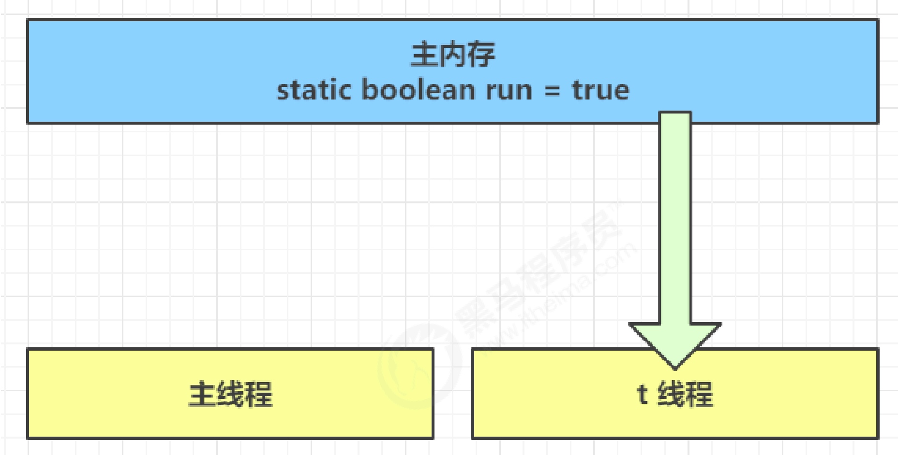
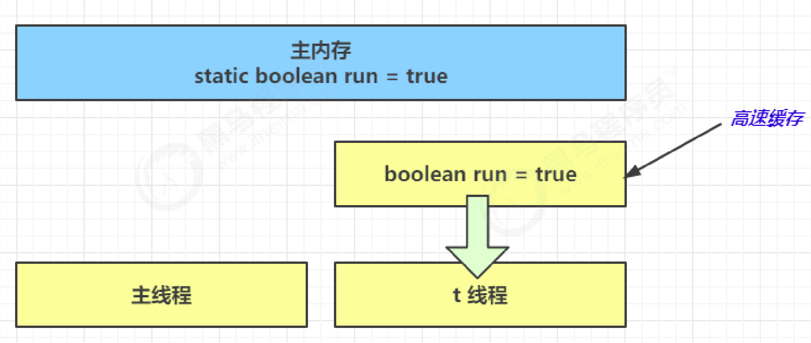
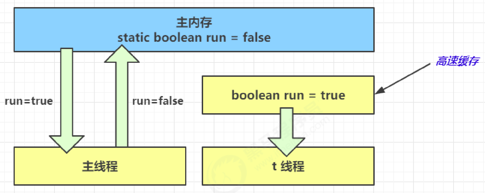

JMM 即 Java Memory Model，它定义了主存、工作内存抽象概念，底层对应着 CPU 寄存器、缓存、硬件内存、CPU 指令优化等。

JMM 体现在以下几个方面
- 原子性 - 保证指令不会受到线程上下文切换的影响
- 可见性 - 保证指令不会受 cpu 缓存的影响
- 有序性 - 保证指令不会受 cpu 指令并行优化的影响

## 原子性

即上下文切换时可以继续运行之前的代码。

## 可见性

例如：main 线程对 run 变量的修改对于 t 线程不可见，导致了 t 线程无法停止。

```java
static boolean run = true;

public static void main(String[] args) throws InterruptedException {
	Thread t = new Thread(()->{
		while(run){
			// ....
		}
	});
	
	t.start();
	sleep(1);
	run = false; // 线程t不会如预想的停下来
}
```

1. 初始状态， t 线程刚开始从主内存读取了 run 的值到工作内存。


2. 因为 t 线程要频繁从主内存中读取 run 的值，JIT 编译器会将 run 的值缓存至自己工作内存中的高速缓存中，减少对主存中 run 的访问，提高效率。


3. 1 秒之后，main 线程修改了 run 的值，并同步至主存，而 t 是从自己工作内存中的高速缓存中读取这个变量的值，结果永远是旧值。



**解决方法：** volatile（易变关键字）

> 它可以用来**修饰成员变量和静态成员变量**，他可以避免线程从自己的工作缓存中查找变量的值，必须到主存中获取它的值，线程操作 volatile 变量都是直接操作主存。

```java
volatile static boolean run = true;

// ...
```

可见性保证的是在多个线程之间，**一个线程对 volatile 变量的修改对另一个线程可见**， 不能保证原子性，仅用在一个写线程，多个读线程的情况。 

上例从字节码理解是这样的：

```java
getstatic    run    // 线程 t 获取 run true
getstatic    run    // 线程 t 获取 run true
getstatic    run    // 线程 t 获取 run true
getstatic    run    // 线程 t 获取 run true
putstatic    run    // 线程 main 修改 run 为 false， 仅此一次
getstatic    run    // 线程 t 获取 run false
```


volatile 只能保证看到最新值，不能解决指令交错。

两个线程一个 `i++` 一个 `i--`：

```java
// 假设i的初始值为0

getstatic i    // 线程2-获取静态变量i的值 线程内i=0

getstatic i    // 线程1-获取静态变量i的值 线程内i=0
iconst_1       // 线程1-准备常量1
iadd           // 线程1-自增 线程内i=1
putstatic i    // 线程1-将修改后的值存入静态变量i 静态变量i=1

iconst_1       // 线程2-准备常量1
isub           // 线程2-自减 线程内i=-1
putstatic i    // 线程2-将修改后的值存入静态变量i 静态变量i=-1
```


 synchronized 语句块既保证代码块的原子性，也保证代码块内变量的可见性。但缺点是 synchronized 是属于重量级操作，性能相对更低。


