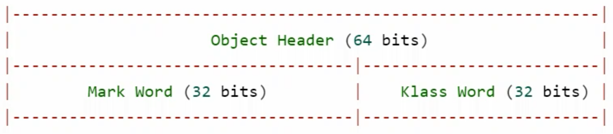
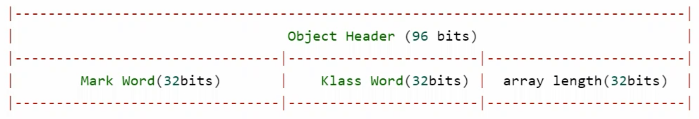
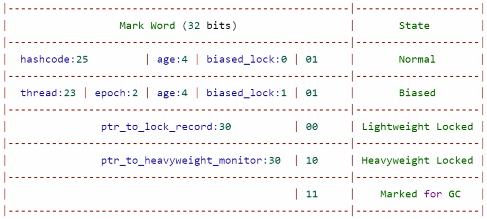
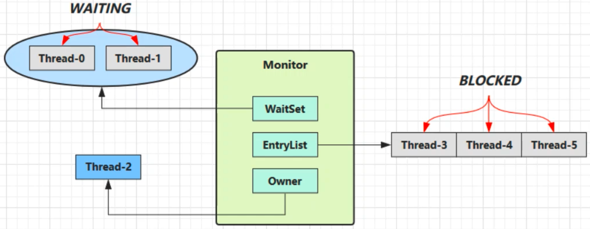

## Java对象头

以32位虚拟机为例：

### 普通对象

对象头是64位，也就是8个字节，其中4字节为 Mark Word (包含很多信息)，另外4字节为 Klass Word (指向对象的Class)

### 数组对象

### Mark Word

64位虚拟机和32位的虚拟机结构不一样

参考资料：[https://stackoverflow.com/questions/26357186/what-is-in-java-object-header](https://stackoverflow.com/questions/26357186/what-is-in-java-object-header)

## Monitor(锁)

Monitor 被翻译为 **监视器** 或 **管程**

每个Java对象都可以关联一个Monitor对象(系统底层的对象)，如果使用 `synchronized` 给对象上锁(重量级)之后，该对象头的 Mark Word 中就被设置指向 Monitor 对象的指针。

Monitor结构如下：

1. 当执行到 `synchronized`  时，会将上锁的对象关联到 Monitor对象，这时的Mark Word状态会变成重量级(上上图的倒数第二行的状态)
2. 刚开始的 Monitor 中的 Owner 为 null
3. 当 Thread-2 执行到 `synchronized(obj)`  时，会将 Monitor的所有者 Owner 置为 Thread-2，一个 Monitor 中只有一个 Owner
4. 在上锁的过程中，如果 Thread-3、Thread-4、Thread-5 也来执行 `synchronized(obj)`  ，就会进入 EntryList (链表结构) 进行阻塞(BLOCKED)
5. Thread-2 执行完同步代码块中的内容后，EntryList 中等待的线程会被唤醒竞争锁(竞争是非公平的)
6. WaitSet 中的 Thread-0、Thread-1 是之前获得过锁，但条件不满足进入 WAITING 状态的线程(跟wait、notify有关)

> synchronized 必须是进入同一个对象的 Monitor 才有上述效果，不加 synchronized 的对象不会关联监视器，不遵从以上规则

