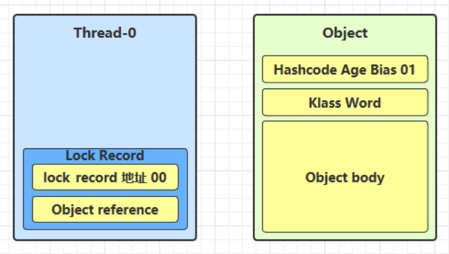
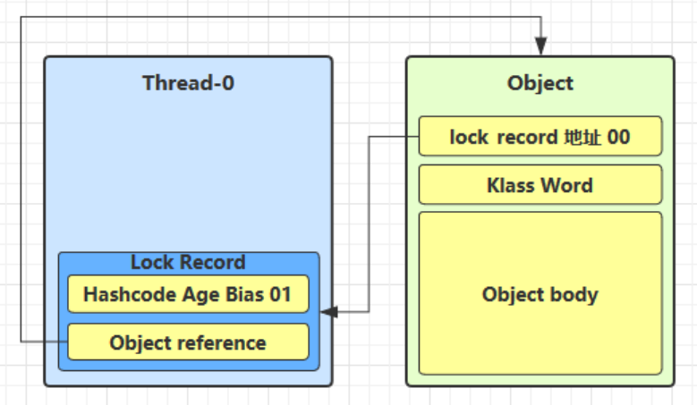
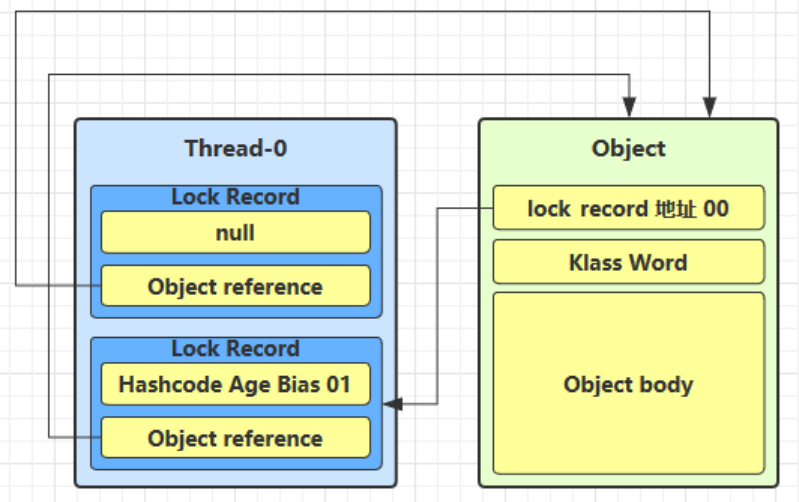
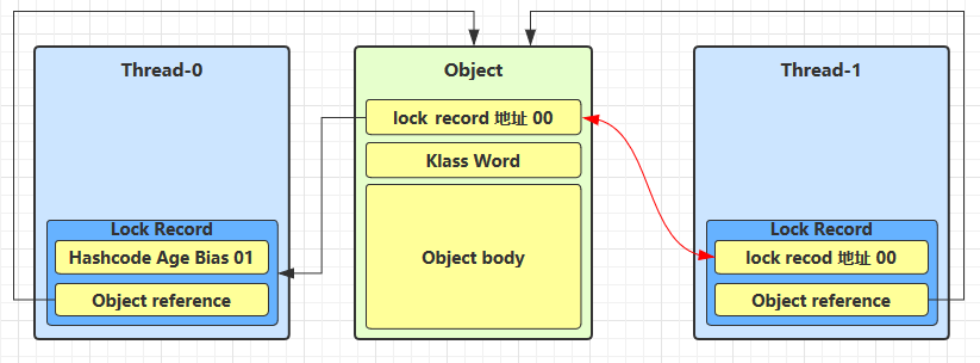
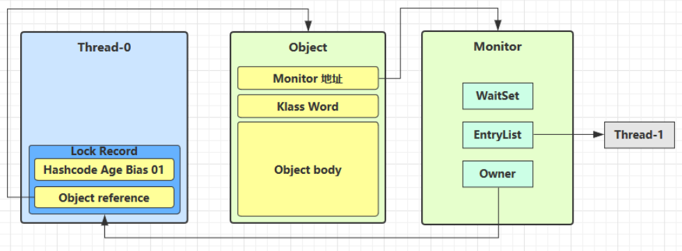
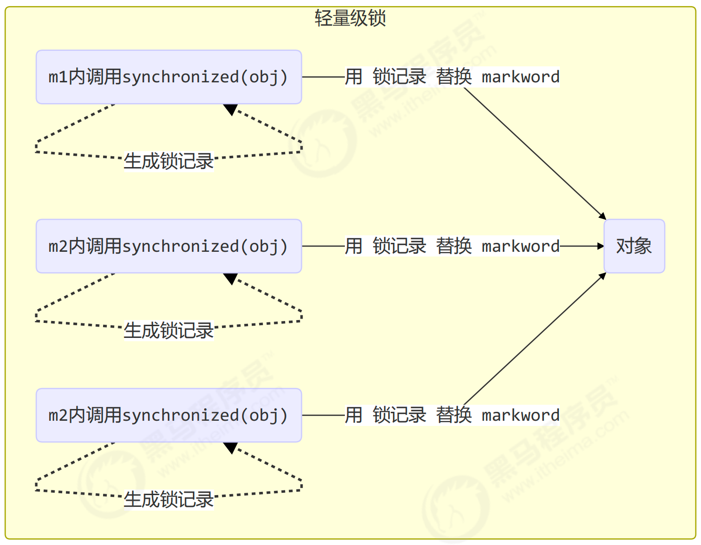
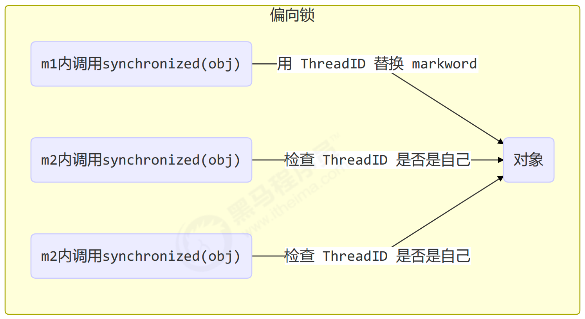

以下面代码为例，分析字节码：

```java
static final Object lock = new Object();
static int counter = 0;
public static void main(String[] args) {
    synchronized (lock) {
        counter++;
    }
}
```


字节码分析：

```java
  public static void main(java.lang.String[]);
    descriptor: ([Ljava/lang/String;)V
    flags: ACC_PUBLIC, ACC_STATIC
    Code:
      stack=2, locals=3, args_size=1
         0: getstatic     #2                  // lock对象引用(synchronized开始)
         3: dup                               // 复制一份用于释放
         4: astore_1                          // lock引用 -> slot1 (把lock的引用指向释放时的对象)
         5: monitorenter                      // 将lock对象MarkWord置为Monitor指针
         6: getstatic     #3                  // 获取i
         9: iconst_1                          // 准备常数 1
        10: iadd                              // +1
        11: putstatic     #3                  // 赋值给i
        14: aload_1                           // 拿到lock的引用
        15: monitorexit                       // 将lock对象MarkWord重置(恢复成原来的样子)，唤醒EntryList
        16: goto          24                  // 如果没异常的话执行第24条命令，return
        19: astore_2                          // 如果出了异常，将异常赋值给slot2
        20: aload_1                           // 拿到lock的引用
        21: monitorexit                       // 将lock对象MarkWord重置(恢复成原来的样子)，唤醒EntryList
        22: aload_2                           // 拿到异常的引用
        23: athrow                            // 将异常抛出
        24: return
      Exception table:
         from    to  target type
             6    16    19   any               // 第6-16行指令发生异常，就执行第19行指令
            19    22    19   any               // 第19-22行指令发生异常，就执行第19行指令
      LineNumberTable:
        line 9: 0
        line 10: 6
        line 11: 14
        line 12: 24
      LocalVariableTable:
        Start  Length  Slot  Name   Signature
            0      25     0  args   [Ljava/lang/String;
      StackMapTable: number_of_entries = 2
        frame_type = 255 /* full_frame */
          offset_delta = 19
          locals = [ class "[Ljava/lang/String;", class java/lang/Object ]
          stack = [ class java/lang/Throwable ]
        frame_type = 250 /* chop */
          offset_delta = 4
```


## 轻量级锁

轻量级锁的使用场景：如果一个对象虽然有多线程访问，但多线程访问的时间是错开的(没有竞争)，那么可以使用轻量级锁来优化。

轻量级锁对使用者是透明的，即语法仍然是 `synchronize`  

假设有两个方法同步块，利用同一个对象加锁：

```java
static final Object obj = new Object();
public static void method1() {
    synchronized(obj) {
        // 同步块A
        method2();
    }
}

public static void method2() {
    synchronized(obj) {
        // 同步块B
    }
}
```


1. 创建锁记录(Lock Record)对象，每个线程的栈帧都会包含一个锁记录的结构，内部可以存储锁定对象的Mark Word



2. 让锁记录中 Object reference 指向锁对象，并尝试用 cas 替换 Object 的 Mark Word，将 Mark Word 的值存入锁记录


3. 如果 cas 替换成功，对象头存储了 **锁记录地址和状态 00**， 表示由该线程给对象加锁

> 白话理解就是：当要锁一个对象时，线程中的一个标记会和锁对象的对象头中的 Mark Word 标记互换，如果换成功了，就能标记出这个对象被哪个线程使用，而 Mark Word 此时的状态是 00， [Mark Word](Java原理Monitor.md###Mark%20Word) 图中的倒数第三行的状态。




4. 如果 cas 替换失败，有两种情况
   1. 如果其他线程已经持有了该 Object 的轻量级锁，说明有锁的竞争，进入锁膨胀阶段
   2. 如果是自己执行了 synchronized 锁重入(就是本节示例代码的method2方法中的锁)，那么会再添加一条 Lock Record 作为重入的计数

> 这里第一种情况先不考虑，锁膨胀的介绍在下面
> 第二种情况的锁重入的情况，不会发生 cas 替换，因为会发现锁对象已经在自己的线程中了，所以值为 null



5. 当退出 synchronized 代码块(解锁时)，如果锁记录的值不为 null，这时使用 cas 将 Mark Word 的值恢复给对象头
   1. 成功：则解锁成功
   2. 失败：说明轻量级锁进行了锁膨胀或已经升级为重量级锁，进入重量级锁的解锁流程

> 如果锁记录的值为 null，就是在 method2 方法释放锁时，不会真的释放锁，因为他的值为 null，没办法发生交换，当 method1 释放锁时，他不是 null ，就通过 cas 替换，将锁对象的对象头恢复成原来的状态。


## 锁膨胀

如果在尝试加轻量级锁的过程中， CAS 操作无法成功，说明已经有其他线程对锁对象加上了轻量级锁(有竞争)，这时需要进行锁膨胀，将轻量级锁变为重量级锁。

```java
static Object obj = new Object();
public static void method1() {
    synchronized(obj) {
        // 同步块
    }
}
```


1. 当 Thread-1 进行轻量级加锁时，Thread-0 已经对该锁对象加了轻量级锁



2. 这时 Thread-1 加轻量级锁失败，进入锁膨胀流程
   1. 为 Object 对象申请 Monitor 锁，让 Object 指向重量级锁地址
   2. 然后自己进入 Monitor 的 EntryList 中 BLOCKED

> 可以看作，线程1拿不到轻量级锁，就找JVM申请 Monitor 锁(系统级的)，锁对象的地址和 Monitor 对象的地址再“互换“，然后线程1进入阻塞状态，等待锁被释放




3. 当 Thread-0 退出同步块解锁时，使用 cas 将 Mark Word 的值恢复给对象头失败。这时会进入重量级解锁流程，即按照 Monitor 地址找到 Monitor 对象，设置 Owner 为 null，唤醒 EntryList 中 BLOCKED 线程

> 线程0解锁时，要把对象头互换回来，发现锁对象的对象头不是原来的对象头，就会进入重量级锁的解锁流程。
> 因为锁对象的对象头已经被替换成 Monitor 对象的对象地址，通过这个地址找到 Monitor 对象，将 Owner 设置为null，再把阻塞状态的线程给唤醒


## 自旋优化

重量级锁竞争的时候，还可以使用自旋来进行优化，如果当前线程自旋成功（即这时候持锁线程已经退出了同步块，释放了锁），这时当前线程就可以避免阻塞。

* 自旋会占用 CPU 时间，单核 CPU 自旋就是浪费，多核 CPU 自旋才能发挥优势。
* 在 Java 6 之后自旋锁是自适应的，比如对象刚刚的一次自旋操作成功过，那么认为这次自旋成功的可能性会高，就多自旋几次；反之，就少自旋甚至不自旋，总之，比较智能。
* Java 7 之后不能控制是否开启自旋功能。

自旋重试成功的情况：

| 线程 1 （core 1 上）  | 对象 Mark      | 线程 2 （core 2 上）  |
| ---------------- | ------------ | ---------------- |
| \-               | 10（重量锁）      | \-               |
| 访问同步块，获取 monitor | 10（重量锁）重量锁指针 | \-               |
| 成功（加锁）           | 10（重量锁）重量锁指针 | \-               |
| 执行同步块            | 10（重量锁）重量锁指针 | \-               |
| 执行同步块            | 10（重量锁）重量锁指针 | 访问同步块，获取 monitor |
| 执行同步块            | 10（重量锁）重量锁指针 | 自旋重试             |
| 执行完毕             | 10（重量锁）重量锁指针 | 自旋重试             |
| 成功（解锁）           | 01（无锁）       | 自旋重试             |
| \-               | 10（重量锁）重量锁指针 | 成功（加锁）           |
| \-               | 10（重量锁）重量锁指针 | 执行同步块            |
| \-               | ...          | ...              |


自旋重试失败的情况：

|线程 1 （core 1 上）|对象 Mark|线程 2 （core 2 上）|
| ----- | ----- | ----- |
|\-|10（重量锁）|\-|
|访问同步块，获取 monitor|10（重量锁）重量锁指针|\-|
|成功（加锁）|10（重量锁）重量锁指针|\-|
|执行同步块|10（重量锁）重量锁指针|\-|
|执行同步块|10（重量锁）重量锁指针|访问同步块，获取 monitor|
|执行同步块|10（重量锁）重量锁指针|自旋重试|
|执行完毕|10（重量锁）重量锁指针|自旋重试|
|成功（解锁）|10（重量锁）重量锁指针|自旋重试|
|\-|10（重量锁）重量锁指针|阻塞|
|\-|...|...|


## 偏向锁

轻量级锁在没有竞争时（就自己这个线程），每次重入仍然需要执行 CAS 操作。

Java 6 中引入了偏向锁来做进一步优化：只有第一次使用 CAS 将线程 ID 设置到对象的 Mark Word 头，之后发现这个线程 ID 是自己的就表示没有竞争，不用重新 CAS。以后只要不发生竞争，这个对象就归该线程所有。

例如：

```java
static final Object obj = new Object();
public static void m1() {
    synchronized( obj ) {
        // 同步块 A
        m2();
    }
}

public static void m2() {
    synchronized( obj ) {
        // 同步块 B
        m3();
    }
}

public static void m3() {
    synchronized( obj ) {
        // 同步块 C
    }
}
```





### 偏向状态

回忆一下对象头格式

```ruby
|--------------------------------------------------------------------|--------------------|
|                          Mark Word (64 bits)                       |       State        |
|--------------------------------------------------------------------|--------------------|
| unused:25  | hashcode:31  | unused:1  | age:4 | biased_lock:0 | 01 |     Normal         |
|--------------------------------------------------------------------|--------------------|
| thread:54  | epoch:2      | unused:1  | age:4 | biased_lock:1 | 01 |     Biased         |
|--------------------------------------------------------------------|--------------------|
|                      ptr_to_lock_record:62                    | 00 | Lightweight Locked |
|--------------------------------------------------------------------|--------------------|
|                  ptr_to_heavyweight_monitor:62                | 10 | Heavyweight Locked |
|--------------------------------------------------------------------|--------------------|
|                                                               | 11 |    Marked for GC   |
|--------------------------------------------------------------------|--------------------|
```

一个对象创建时：

* 如果开启了偏向锁（默认开启），那么对象创建后，markword 值为 0x05 即最后 3 位为 101，这时它的thread、epoch、age 都为 0
* 偏向锁是默认是延迟的，不会在程序启动时立即生效，如果想避免延迟，可以加 VM 参数 `-XX:BiasedLockingStartupDelay=0` 来禁用延迟
* 如果没有开启偏向锁，那么对象创建后，markword 值为 0x01 即最后 3 位为 001，这时它的 hashcode、age 都为 0，第一次用到 hashcode 时才会赋值

代码运行时在添加 VM 参数 `-XX:-UseBiasedLocking` 禁用偏向锁。

### 测试延迟特性

```java
class Dog {}
```

利用 jol 第三方工具来查看对象头信息（注意这里我扩展了 jol 让它输出更为简洁）

```java
// 添加虚拟机参数 -XX:BiasedLockingStartupDelay=0 
public static void main(String[] args) throws IOException {
    Dog d = new Dog();
    ClassLayout classLayout = ClassLayout.parseInstance(d);

    new Thread(() -> {
        log.debug("synchronized 前");
        System.out.println(classLayout.toPrintableSimple(true));
        synchronized (d) {
            log.debug("synchronized 中");
            System.out.println(classLayout.toPrintableSimple(true));
        }

        log.debug("synchronized 后");
        System.out.println(classLayout.toPrintableSimple(true));

    }, "t1").start();
}
```

输出：

```java
11:08:58.117 c.TestBiased [t1] - synchronized 前
// 此时线程id没有存入对象头，但该对象是是处于偏向状态 101
00000000 00000000 00000000 00000000 00000000 00000000 00000000 00000101 

11:08:58.121 c.TestBiased [t1] - synchronized 中
// 当使用了锁对象，就会与线程绑定，对象头中存储线程id，但还是偏向锁的状态
00000000 00000000 00000000 00000000 00011111 11101011 11010000 00000101 

11:08:58.121 c.TestBiased [t1] - synchronized 后
// 释放锁后，对象没有变化，还是偏向t1线程的偏向锁
00000000 00000000 00000000 00000000 00011111 11101011 11010000 00000101
```

> 处于偏向锁的对象解锁后，线程 id 仍存储于对象头中

### 测试禁用

在上面测试代码运行时在添加 VM 参数 `-XX:-UseBiasedLocking` 禁用偏向锁

输出：

```java
11:13:10.018 c.TestBiased [t1] - synchronized 前
// 无锁状态
00000000 00000000 00000000 00000000 00000000 00000000 00000000 00000001 

11:13:10.021 c.TestBiased [t1] - synchronized 中
// 轻量级锁
00000000 00000000 00000000 00000000 00100000 00010100 11110011 10001000 

11:13:10.021 c.TestBiased [t1] - synchronized 后
// 无锁状态
00000000 00000000 00000000 00000000 00000000 00000000 00000000 00000001
```


### 测试 hashCode

正常状态对象一开始是没有 hashCode 的，第一次调用才生成。


## 偏向锁撤销
### 调用对象 hashCode

调用了对象的 hashCode，但偏向锁的对象 MarkWord 中存储的是线程 id，如果调用 hashCode 会导致偏向锁被撤销

轻量级锁会在锁记录中记录 hashCode，重量级锁会在 Monitor 中记录 hashCode

在调用 hashCode 后使用偏向锁，记得去掉 `-XX:-UseBiasedLocking`

输出：

```java
11:22:10.386 c.TestBiased [main] - 调用 hashCode:1778535015 

11:22:10.391 c.TestBiased [t1] - synchronized 前
// 最开始是偏向锁，因为调用了hashcode，变成了无锁状态
00000000 00000000 00000000 01101010 00000010 01001010 01100111 00000001 

11:22:10.393 c.TestBiased [t1] - synchronized 中
// 轻量级锁
00000000 00000000 00000000 00000000 00100000 11000011 11110011 01101000 

11:22:10.393 c.TestBiased [t1] - synchronized 后
// 无锁状态
00000000 00000000 00000000 01101010 00000010 01001010 01100111 00000001
```


### 其它线程使用对象

当有其它线程使用偏向锁对象时，会将偏向锁升级为轻量级锁

```java
private static void test2() throws InterruptedException {
    Dog d = new Dog();
    Thread t1 = new Thread(() -> {
        synchronized (d) {
            log.debug(ClassLayout.parseInstance(d).toPrintableSimple(true));
        }

        synchronized (TestBiased.class) {
            TestBiased.class.notify();
        }
    }, "t1");
    t1.start();

    Thread t2 = new Thread(() -> {
        // t2线程进入等待状态，等待t1线程执行完后唤醒
        synchronized (TestBiased.class) {
            try {
                TestBiased.class.wait();
            } catch (InterruptedException e) {
                e.printStackTrace();
            }
        }

        log.debug(ClassLayout.parseInstance(d).toPrintableSimple(true));
        synchronized (d) {
            log.debug(ClassLayout.parseInstance(d).toPrintableSimple(true));
        }
        log.debug(ClassLayout.parseInstance(d).toPrintableSimple(true));
    }, "t2");
    t2.start();
}
```

输出：

```java
// 偏向锁，偏向t1线程
[t1] - 00000000 00000000 00000000 00000000 00011111 01000001 00010000 00000101 

// 此时还没有使用锁对象，还是偏向t1线程的偏向锁
[t2] - 00000000 00000000 00000000 00000000 00011111 01000001 00010000 00000101 
// 发现不是t2线程的轻量级锁，晋升为轻量级锁
[t2] - 00000000 00000000 00000000 00000000 00011111 10110101 11110000 01000000 
// 用完之后回归无锁状态，因为存在线程竞争
[t2] - 00000000 00000000 00000000 00000000 00000000 00000000 00000000 00000001
```


### 调用 wait/notify

```java
public static void main(String[] args) throws InterruptedException {
    Dog d = new Dog();
    Thread t1 = new Thread(() -> {
        log.debug(ClassLayout.parseInstance(d).toPrintableSimple(true));
        synchronized (d) {
            log.debug(ClassLayout.parseInstance(d).toPrintableSimple(true));
            try {
                d.wait();
            } catch (InterruptedException e) {
                e.printStackTrace();
            }
           log.debug(ClassLayout.parseInstance(d).toPrintableSimple(true));
        }
    }, "t1");
    t1.start();

    new Thread(() -> {
        try {
            Thread.sleep(6000);
        } catch (InterruptedException e) {
            e.printStackTrace();
        }
        synchronized (d) {
            log.debug("notify");
            d.notify();
        }
    }, "t2").start();
}
```

输出：

```java
// 默认偏向锁
[t1] - 00000000 00000000 00000000 00000000 00000000 00000000 00000000 00000101 
// 带线程id的偏向锁
[t1] - 00000000 00000000 00000000 00000000 00011111 10110011 11111000 00000101 
[t2] - notify 
// 发生了竞争，升级重量级锁
[t1] - 00000000 00000000 00000000 00000000 00011100 11010100 00001101 11001010
```


### 批量重偏向

如果对象虽然被多个线程访问，但没有竞争，这时偏向了线程 T1 的对象仍有机会重新偏向 T2，重偏向会重置对象的 Thread ID

当撤销偏向锁阈值超过 20 次后，jvm 会这样觉得，我是不是偏向错了呢，于是会在给这些对象加锁时重新偏向至加锁线程

```java
private static void test3() throws InterruptedException {
    Vector<Dog> list = new Vector<>();
    Thread t1 = new Thread(() -> {
        for (int i = 0; i < 30; i++) {
            Dog d = new Dog();
            list.add(d);
            synchronized (d) {
                log.debug(i + "\t" + ClassLayout.parseInstance(d).toPrintableSimple(true));
            }
        }
        
        // t1执行完解锁t2
        synchronized (list) {
            list.notify();
        } 
    }, "t1");
    t1.start();
 
    Thread t2 = new Thread(() -> {
        synchronized (list) {
            try {
                list.wait();
            } catch (InterruptedException e) {
                e.printStackTrace();
            }
        }
        log.debug("===============> ");

        for (int i = 0; i < 30; i++) {
            Dog d = list.get(i);
            log.debug(i + "\t" + ClassLayout.parseInstance(d).toPrintableSimple(true));
            synchronized (d) {
                log.debug(i + "\t" + ClassLayout.parseInstance(d).toPrintableSimple(true));
            }
            log.debug(i + "\t" + ClassLayout.parseInstance(d).toPrintableSimple(true));
        }
    }, "t2");
    t2.start();
}
```
输出：

```java
[t1] - 0 00000000 00000000 00000000 00000000 00011111 11110011 11100000 00000101 
[t1] - 1 00000000 00000000 00000000 00000000 00011111 11110011 11100000 00000101 
[t1] - 2 00000000 00000000 00000000 00000000 00011111 11110011 11100000 00000101 
[t1] - 3 00000000 00000000 00000000 00000000 00011111 11110011 11100000 00000101 
// 篇幅太长，省略...
[t1] - 16 00000000 00000000 00000000 00000000 00011111 11110011 11100000 00000101 
[t1] - 17 00000000 00000000 00000000 00000000 00011111 11110011 11100000 00000101 
[t1] - 18 00000000 00000000 00000000 00000000 00011111 11110011 11100000 00000101 

// t1的所有锁对象都是偏向锁，并且偏向t1线程

[t1] - 19 00000000 00000000 00000000 00000000 00011111 11110011 11100000 00000101 
[t1] - 20 00000000 00000000 00000000 00000000 00011111 11110011 11100000 00000101 
// 篇幅太长，省略...
[t2] - ===============> 

// t2线程未使用锁时，还是偏向t1线程
[t2] - 0 00000000 00000000 00000000 00000000 00011111 11110011 11100000 00000101
// 使用锁对象时，变成轻量级锁
[t2] - 0 00000000 00000000 00000000 00000000 00100000 01011000 11110111 00000000 
// 使用后，变成无锁状态
[t2] - 0 00000000 00000000 00000000 00000000 00000000 00000000 00000000 00000001 
[t2] - 1 00000000 00000000 00000000 00000000 00011111 11110011 11100000 00000101 
[t2] - 1 00000000 00000000 00000000 00000000 00100000 01011000 11110111 00000000 
[t2] - 1 00000000 00000000 00000000 00000000 00000000 00000000 00000000 00000001 
[t2] - 2 00000000 00000000 00000000 00000000 00011111 11110011 11100000 00000101 
[t2] - 2 00000000 00000000 00000000 00000000 00100000 01011000 11110111 00000000 
[t2] - 2 00000000 00000000 00000000 00000000 00000000 00000000 00000000 00000001 
[t2] - 3 00000000 00000000 00000000 00000000 00011111 11110011 11100000 00000101 
[t2] - 3 00000000 00000000 00000000 00000000 00100000 01011000 11110111 00000000 
[t2] - 3 00000000 00000000 00000000 00000000 00000000 00000000 00000000 00000001 
// 篇幅太长，省略...
[t2] - 16 00000000 00000000 00000000 00000000 00011111 11110011 11100000 00000101 
[t2] - 16 00000000 00000000 00000000 00000000 00100000 01011000 11110111 00000000 
[t2] - 16 00000000 00000000 00000000 00000000 00000000 00000000 00000000 00000001 
[t2] - 17 00000000 00000000 00000000 00000000 00011111 11110011 11100000 00000101 
[t2] - 17 00000000 00000000 00000000 00000000 00100000 01011000 11110111 00000000 
[t2] - 17 00000000 00000000 00000000 00000000 00000000 00000000 00000000 00000001 
[t2] - 18 00000000 00000000 00000000 00000000 00011111 11110011 11100000 00000101 
[t2] - 18 00000000 00000000 00000000 00000000 00100000 01011000 11110111 00000000 
[t2] - 18 00000000 00000000 00000000 00000000 00000000 00000000 00000000 00000001 
// 执行了19次，执行第20次时，未使用锁对象时，还是偏向t1线程
[t2] - 19 00000000 00000000 00000000 00000000 00011111 11110011 11100000 00000101 
// 使用锁对象时，直接偏向t2线程，并且把剩余锁对象批量重新偏向t2线程
[t2] - 19 00000000 00000000 00000000 00000000 00011111 11110011 11110001 00000101 
[t2] - 19 00000000 00000000 00000000 00000000 00011111 11110011 11110001 00000101 
[t2] - 20 00000000 00000000 00000000 00000000 00011111 11110011 11100000 00000101 
[t2] - 20 00000000 00000000 00000000 00000000 00011111 11110011 11110001 00000101 
[t2] - 20 00000000 00000000 00000000 00000000 00011111 11110011 11110001 00000101 
[t2] - 21 00000000 00000000 00000000 00000000 00011111 11110011 11100000 00000101 
[t2] - 21 00000000 00000000 00000000 00000000 00011111 11110011 11110001 00000101 
[t2] - 21 00000000 00000000 00000000 00000000 00011111 11110011 11110001 00000101 
[t2] - 22 00000000 00000000 00000000 00000000 00011111 11110011 11100000 00000101 
[t2] - 22 00000000 00000000 00000000 00000000 00011111 11110011 11110001 00000101 
[t2] - 22 00000000 00000000 00000000 00000000 00011111 11110011 11110001 00000101 
// 篇幅太长，省略...
```


### 批量撤销

当撤销偏向锁阈值超过 40 次后，jvm 会这样觉得，自己确实偏向错了，根本就不该偏向。于是整个类的所有对象都会变为不可偏向的，新建的对象也是不可偏向的

```java
static Thread t1,t2,t3;
private static void test4() throws InterruptedException {
    Vector<Dog> list = new Vector<>();
    int loopNumber = 39;
    t1 = new Thread(() -> {
        for (int i = 0; i < loopNumber; i++) {
            Dog d = new Dog();
            list.add(d);
            synchronized (d) {
                log.debug(i + "\t" + ClassLayout.parseInstance(d).toPrintableSimple(true));
            }
        }
        LockSupport.unpark(t2);
    }, "t1");
    t1.start();

    t2 = new Thread(() -> {
        LockSupport.park();
        log.debug("===============> ");
        for (int i = 0; i < loopNumber; i++) {
            Dog d = list.get(i);
            log.debug(i + "\t" + ClassLayout.parseInstance(d).toPrintableSimple(true));
            synchronized (d) {
                log.debug(i + "\t" + ClassLayout.parseInstance(d).toPrintableSimple(true));
            }
            log.debug(i + "\t" + ClassLayout.parseInstance(d).toPrintableSimple(true));
        }
        LockSupport.unpark(t3);
    }, "t2");
    t2.start();

    t3 = new Thread(() -> {
        LockSupport.park();
        log.debug("===============> ");
        for (int i = 0; i < loopNumber; i++) {
            Dog d = list.get(i);
            log.debug(i + "\t" + ClassLayout.parseInstance(d).toPrintableSimple(true));
            synchronized (d) {
                log.debug(i + "\t" + ClassLayout.parseInstance(d).toPrintableSimple(true));
            }
            log.debug(i + "\t" + ClassLayout.parseInstance(d).toPrintableSimple(true));
        }
    }, "t3");
    t3.start();
    t3.join();
    log.debug(ClassLayout.parseInstance(new Dog()).toPrintableSimple(true));
}
```

结论：
1. t1线程执行后，所有的锁对象都会偏向t1线程
2. 开始执行t2线程，当执行到第20个对象时，会批量重偏向为t2线程(此时和上面一个案例一样)
3. 开始执行t3线程，因为前面19个对象在执行t2线程后，已经被置为了无锁状态(001不可偏向)，t3线程使用前面19个锁对象时，锁对象的状态为：无锁 -> 轻量级锁 -> 无锁，第20个及之后，锁对象的状态为：偏向锁t2 -> 轻量级锁 -> 无锁(不可偏向)，此时所有的锁都变为了不可偏向的无锁状态
4. 主线程，第40个Dog类对象创建时，该对象的状态为001无锁不可偏向状态，以后该类的所有实例对象都不可偏向


参考资料：

[https://github.com/farmerjohngit/myblog/issues/12](https://github.com/farmerjohngit/myblog/issues/12)

[https://www.cnblogs.com/LemonFive/p/11246086.html](https://www.cnblogs.com/LemonFive/p/11246086.html)

[https://www.cnblogs.com/LemonFive/p/11248248.html](https://www.cnblogs.com/LemonFive/p/11248248.html)

偏向锁论文：[https://www.oracle.com/technetwork/java/biasedlocking-oopsla2006-wp-149958.pdf](https://www.oracle.com/technetwork/java/biasedlocking-oopsla2006-wp-149958.pdf)


## 锁消除

```java
@Fork(1)
@BenchmarkMode(Mode.AverageTime)
@Warmup(iterations=3)
@Measurement(iterations=5)
@OutputTimeUnit(TimeUnit.NANOSECONDS)
public class MyBenchmark {
    static int x = 0;
    @Benchmark
    public void a() throws Exception {
        x++;
    }
    @Benchmark
    public void b() throws Exception {
        Object o = new Object();
        synchronized (o) {
            x++;
        }
    }
}
```

打成jar包，运行 `java -jar benchmarks.jar`  ，结果：

```java
Benchmark             Mode     Samples     Score     Score error     Units 
c.i.MyBenchmark.a     avgt     5           1.542     0.056           ns/op 
c.i.MyBenchmark.b     avgt     5           1.518     0.091           ns/op
```

可以看到两个方法消耗的时间差距并不是很大，几乎没有，这是因为做了锁消除优化，o对象不可能被其他线程竞争阻塞，JIT即时编译器在编译时将同步代码块直接去掉，所以两个方法都只是进行了x++的操作，没有进行锁的操作。

使用jvm参数运行jar包，不使用锁消除，`java -XX:-EliminateLocks -jar benchmarks.jar` ，结果：

```java
Benchmark             Mode     Samples     Score     Score error     Units 
c.i.MyBenchmark.a     avgt     5           1.507     0.108           ns/op 
c.i.MyBenchmark.b     avgt     5           16.976    1.572           ns/op
```
b方法的运行速度变慢了很多，没有锁消除，就会进行锁的操作，比较耗时。

## 锁粗化

对相同对象多次加锁，导致线程发生多次重入，可以使用锁粗化方式来优化，这不同于之前讲的细分锁的粒度。