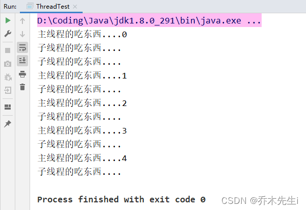

**用户线程：** 也叫工作线程，当线程的任务执行完或通知方式结束

**守护线程：** 一般为工作线程服务的，当所有的用户线程结束，守护线程自动结束。
> 常见的守护线程：垃圾回收机制

> 在java中，每次程序运行至少启动2个线程。一个是main线程，一个是垃圾收集线程。因为每当使用java命令执行一个类的时候，实际上都会启动一个JVM，每一个JVM其实在就是在操作系统中启动了一个进程。

场景：
设置守护线程。

```java
public class ThreadTest {
    public static void main(String[] args) throws InterruptedException {

        T t = new T();
        Thread thread = new Thread(t);

        // 设置为守护线程，这样，主线程结束后，守护线程也就结束了
        thread.setDaemon(true);

        // 开启线程，先设置，后开启
        thread.start();

        for (int i = 0; i < 5; i++) {
            System.out.println("主线程的吃东西...." + i);
            Thread.sleep(1000);
        }
    }
}

class T implements Runnable {
    @Override
    public void run() {
        // 死循环，如果不设置为守护线程，该循环不会停下
        for (; ; ) {
            System.out.println("子线程的吃东西....");
            try {
                Thread.sleep(1000);
            } catch (InterruptedException e) {
                e.printStackTrace();
            }
        }
    }
}
```

可以看到，主线程结束后，子线程哪怕是死循环，也会结束

