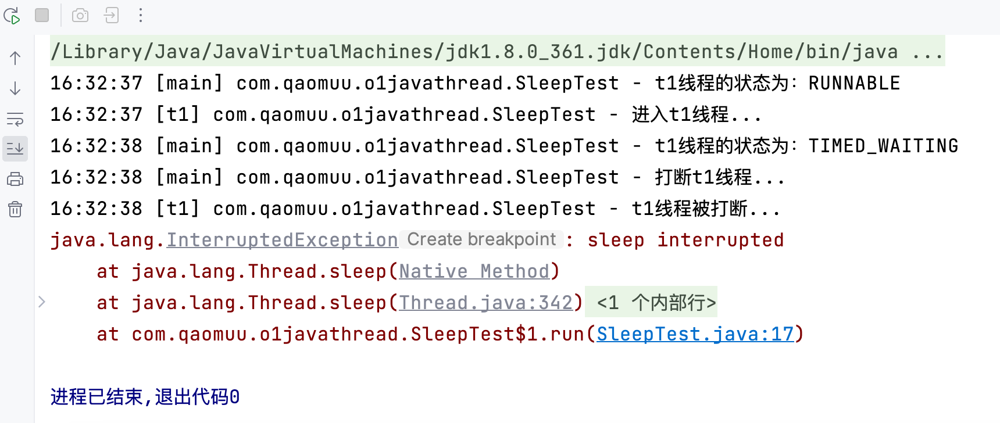
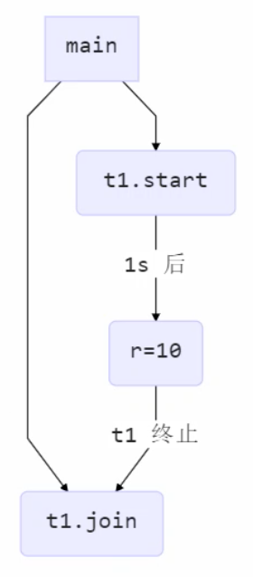

---
tags:
  - Java/并发编程
---

## Thread类常用方法

### 构造方法

`Thread()`：创建一个线程对象
`Thread(String name)`：创建一个指定名字的线程对象

`Thread(Runnable target)`：创建基于Runnable接口实现类的一个带有指定目标线程对象
`Thread(Runnable target,String name)`：创建基于Runnable接口实现类的一个带有指定目标线程对象并指定名字

### 常用方法

`long getId()`：获取线程长整型的 id，id唯一

`String getName()`：获取当前线程名称
`void setName(String)`：修改线程名

`void start()`：启动线程，Java虚拟机调用此线程的run方法，一个线程对象同时只能启动一次，start 方法只是让线程进入就绪，里面代码不一定立刻运行（CPU 的时间片还没分给它）。每个线程对象的start方法只能调用一次，如果调用了多次会出现 `IllegalThreadStateException` 

`void run()`：新线程启动后会调用的方法，如果在构造 Thread 对象时传递了 Runnable 参数，则线程启动后会调用 Runnable 中的 run 方法，否则默认不执行任何操作。但可以创建 Thread 的子类对象，来覆盖默认行为

`void join()`：线程插队，一旦插队成功，优先执行调用join()方法的线程，执行结束后才执行其他线程。
`void join(long millis)`：为优先执行调用join()方法的线程，等待该线程终止的最长时间millis毫秒

`static void sleep(long millis)`：让当前执行的线程休眠n毫秒，休眠时让出 cpu的时间片给其它线程
`static Thread currentThread()`：获取当前正在执行的线程

`void interrupt()`：打断线程|如果被打断线程正在 sleep，wait，join 会导致被打断的线程抛出 `InterruptedException`，并清除 打断标记；如果打断的正在运行的线程，则会设置 打断标记；park 的线程被打断，也会设置 打断标记
`isInterrupted()`：判断是否被打断，不会清除打断标记
`static void interrupted()`：**判断当前线程是否被打断，会清除打断标记**

`static void yield()`：线程的礼让，让出cpu，让其他线程执行，但礼让的时间不确定，所以也不一定礼让成功。

`getState()`：获取线程状态，Java 中线程状态是用 6 个 enum 表示，分别为：NEW，RUNNABLE， BLOCKED，WAITING，TIMED_WAITING， TERMINATED

`isAlive()`：线程是否存活（还没有运行完毕）


`int getPriority()`：获取线程优先级
`void setPriority(int newPriority)`：设置线程优先级，java中规定线程优先级是1~10 的整数，较大的优先级能提高该线程被 CPU 调度的机率


## start与run

```java
public static void main(String[] args) {
    Thread t1 = new Thread("t1") {
        @Override
        public void run() {
            log.debug("running...");
        }
    };
    t1.run();
    t1.start();
}
```
调用上面的方法：


* 直接调用 run 是在主线程中执行了 run，没有启动新的线程
* 使用 start 是启动新的线程，通过新的线程间接执行 run 中的代码


## sleep 与 yield

### sleep

1. 调用 sleep 会让当前线程从 Running 进入 Timed Waiting 状态（阻塞）
2. 其它线程可以使用 `interrupt` 方法打断正在睡眠的线程，这时 sleep 方法会抛出 InterruptedException
3. 睡眠结束后的线程未必会立刻得到执行
4. 建议用 `TimeUnit` 的 sleep 代替 Thread 的 sleep 来获得更好的可读性

```java
public static void main(String[] args) {
    Thread t1 = new Thread("t1") {
        @Override
        public void run() {
            log.info("进入t1线程...");
            try {
                TimeUnit.SECONDS.sleep(2);
            } catch (InterruptedException e) {
                log.info("t1线程被打断...");
                e.printStackTrace();
            }
        }
    };
    t1.start();
    log.info("t1线程的状态为：{}", t1.getState());
    try {
        Thread.sleep(1000);
    } catch (InterruptedException e) {
        throw new RuntimeException(e);
    }
    log.info("t1线程的状态为：{}", t1.getState());
    log.info("打断t1线程...");
    t1.interrupt();
}
```




在没有利用CPU计算时，不要使用`while(true)`空转浪费CPU，可以使用`yield`或`sleep`让出CPU的使用权给其他程序：

```java
while (true) {  
    try {  
        Thread.sleep(50);  
    } catch (InterruptedException e) {  
        throw new RuntimeException(e);  
    }  
}
```

- 使用`wait`或条件变量可以达到类似的效果，但是需要加锁，并需要对应的唤醒操作，一般适用于同步的场景
- `sleep`适用于无需锁同步的场景
### yield

1. 调用 yield 会让当前线程从 Running 进入 Runnable 就绪状态，然后调度执行其它线程
2. 具体的实现依赖于操作系统的任务调度器


### 线程优先级

线程优先级会提示（hint）调度器优先调度该线程，但它**仅仅是一个提示，调度器可以忽略它。**

如果 cpu 比较忙，那么优先级高的线程会获得更多的时间片，但 cpu 闲时，优先级几乎没作用。

优先级常量：   `java.lang.thread`
- `MAX_PRIORITY`：线程的最高优先级10
- `MIN_PRIORITY`：线程的最低优先级1
- `NORM_PRIORITY`：线程的默认优先级5

```java
public static void main(String[] args) {
    Runnable task1 = () -> {
        int count = 0;
        for (;;) {
            System.out.println("---->1 " + count++);
        }
    };
    Runnable task2 = () -> {
        int count = 0;
        for (;;) {
            // Thread.yield();
            System.out.println("---->2 " + count++);
        }
    };
    Thread t1 = new Thread(task1, "t1");
    Thread t2 = new Thread(task2, "t2");
    // t1.setPriority(Thread.MIN_PRIORITY);
    // t2.setPriority(Thread.MAX_PRIORITY);
    t1.start();
    t2.start();
}
```

* 正常情况下，两个线程同时打印数字，到程序停止时，count的值应该差不多大
* 在使用 `yield`  方法的情况下，线程2的count会比线程1的count小不少
* 在设置线程优先级后(不使用 `yield` 方法)，线程1的优先级设置为最低，线程2的优先级设置为最高，程序停止时，线程2的count明显比线程1的count大很多


## join方法

和`wait`方法底层一致

```java
static int r = 0;
public static void main(String[] args) {
    log.debug("开始");
    Thread t1 = new Thread(() -> {
        log.debug("开始");
        try {
            TimeUnit.SECONDS.sleep(1);
        } catch (InterruptedException e) {
            throw new RuntimeException(e);
        }
        log.debug("结束");
        r = 10;
    },"t1");
    t1.start();
    // t1.join();
    log.debug("结果为:{}", r);
    log.debug("结束");
}
```
因为主线程和线程 t1 是并行执行的，t1 线程需要 1 秒之后才能算出 r=10，而主线程一开始就要打印 r 的结果，所以只能打印出 r=0。


使用join方法，加在t1.start()之后即可，在使用join方法之后，main线程将会等待t1线程运行完毕后继续执行：





### 有时效的join

为优先执行调用join()方法的线程，等待该线程终止的最长时间millis毫秒 

```java
static int r1 = 0;
public static void main(String[] args) throws InterruptedException {
    Thread t1 = new Thread(() -> {
        try {
            TimeUnit.SECONDS.sleep(2);
        } catch (InterruptedException e) {
            throw new RuntimeException(e);
        }
        r1 = 10;
    });
    long start = System.currentTimeMillis();
    t1.start();
    // 线程执行结束会导致 join 结束
    log.debug("join begin");
    t1.join(3000);
    long end = System.currentTimeMillis();
    log.debug("r1: {} cost: {}", r1, end - start);
}
```


而如果将 `t1.join(3000)`  改为 `t1.join(1500)`  ，可以看到main线程只等了1.5秒，并没有等待t1线程之行结束：


## interrupt方法

### 打断阻塞的线程

`sleep`，`wait`，`join`这几个方法都会让线程进入阻塞状态。
打断 sleep 的线程，会清空打断状态，`isInterrupted`结果为`false`。

以 sleep 为例：

```java
public static void main(String[] args) throws InterruptedException {
    Thread t1 = new Thread(() -> {
        log.debug("sleep...");
        try {
            Thread.sleep(3000); // wait, join
        } catch (InterruptedException e) {
            e.printStackTrace();
        }
    }, "t1");
    t1.start();
    Thread.sleep(1500);
    log.debug("interrupt");
    t1.interrupt();
    Thread.sleep(1500);
    log.debug("打断标记:{}", t1.isInterrupted());
}
```


### 打断正常运行的线程

打断正常运行的线程，不会清空打断状态，可以根据打断状态来做一些操作：

```java
public static void main(String[] args) throws InterruptedException {
    Thread t1 = new Thread(() -> {
        while (true) {
            boolean interrupted = Thread.currentThread().isInterrupted();
            if (interrupted) {
                log.debug("被打断了, 退出循环");
                break;
            }
        }
    }, "t1");
    t1.start();
    Thread.sleep(1000);
    log.debug("interrupt");
    t1.interrupt();
}
```


### 打断park线程

打断 park 线程，不会清空打断状态

```java
public static void main(String[] args) throws InterruptedException {
    Thread t1 = new Thread(() -> {
        log.debug("park...");
        LockSupport.park();
        log.debug("unpark...");
        log.debug("打断状态：{}", Thread.currentThread().isInterrupted());
    }, "t1");
    t1.start();;
    Thread.sleep(1000);
    t1.interrupt();
}
```


如果打断标记已经是 true，再使用 park 方法会失效，可以使用 `Thread.interrupted()` 清除打断状态


## 不推荐使用的方法

还有一些不推荐使用的方法，这些方法已过时，容易破坏同步代码块，造成线程死锁

| 方法名     | 功能说明       |
| ------- | ---------- |
| stop    | 停止线程运行     |
| suspend | 挂起（暂停）线程运行 |
| resume  | 恢复线程运行     |


