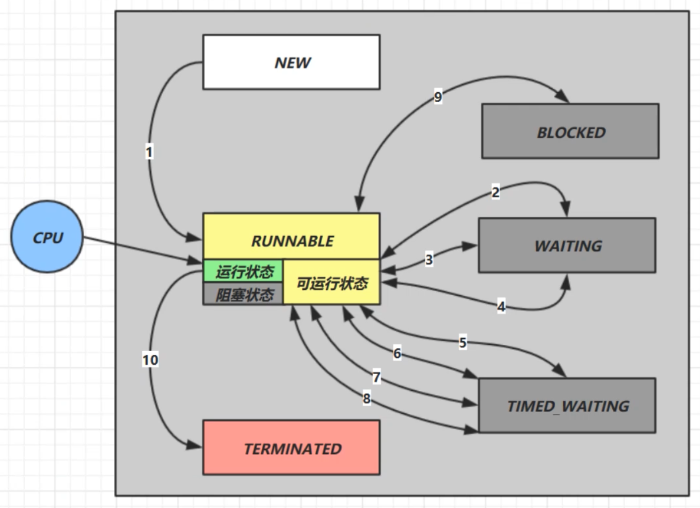

## 五种状态

这是从 操作系统 层面来描述的

* 【初始状态】仅是在语言层面创建了线程对象，还未与操作系统线程关联
* 【可运行状态】（就绪状态）指该线程已经被创建（与操作系统线程关联），可以由 CPU 调度执行
* 【运行状态】指获取了 CPU 时间片运行中的状态
   * 当 CPU 时间片用完，会从【运行状态】转换至【可运行状态】，会导致线程的上下文切换
* 【阻塞状态】
   * 如果调用了阻塞 API，如 BIO 读写文件，这时该线程实际不会用到 CPU，会导致线程上下文切换，进入【阻塞状态】
   * 等 BIO 操作完毕，会由操作系统唤醒阻塞的线程，转换至【可运行状态】
* 与【可运行状态】的区别是，对【阻塞状态】的线程来说只要它们一直不唤醒，调度器就一直不会考虑调度它们
* 【终止状态】表示线程已经执行完毕，生命周期已经结束，不会再转换为其它状态

## 六种状态

这是从 Java API 层面来描述的

在API中 `java.lang.Thread.State` 这个枚举中给出了六种线程状态：

| 线程状态 | 导致状态发生条件 |
|:----|:----|
| NEW（新建）| 线程刚被创建，但是并未启动。还没调用start方法。 |
| Runnable（可运行） | 线程可以在java虚拟机中运行的状态，可能正在运行自己代码，也可能没有，这取决于操作系统处理器。   **而在该状态，可以在内核中分为`Ready`(就绪)和`Running`(运行)状态** |
| Blocked（锁阻塞） | 当一个线程试图获取一个对象锁，而该对象锁被其他的线程持有，则该线程进入Blocked状态；当该线程持有锁时，该线程将变成Runnable状态。 |
| Waiting（无限等待） | 一个线程在等待另一个线程执行一个（唤醒）动作时，该线程进入Waiting状态。进入这个状态后是不能自动唤醒的，必须等待另一个线程调用notify或者notifyAll方法才能够唤醒。 |
| TimedWaiting（计时等待） | 同waiting状态，有几个方法有超时参数，调用他们将进入Timed Waiting状态。这一状态将一直保持到超时期满或者接收到唤醒通知。带有超时参数的常用方法有Thread.sleep 、Object.wait。 |
| Teminated（被终止） | 因为run方法正常退出而死亡，或者因为没有捕获的异常终止了run方法而死亡。 |

* NEW 线程刚被创建，但是还没有调用 start() 方法
* RUNNABLE 当调用了 start() 方法之后，注意，Java API 层面的 RUNNABLE 状态涵盖了 操作系统 层面的【可运行状态】、【运行状态】和【阻塞状态】（由于 BIO 导致的线程阻塞，在 Java 里无法区分，仍然认为是可运行）
* BLOCKED ， WAITING ， TIMED_WAITING 都是 Java API 层面对【阻塞状态】的细分
* TERMINATED 当线程代码运行结束

### 阻塞(Blocaked)

#### 计时等待 TimedWaiting

`Timed Waiting`在API中的描述为：**一个正在限时等待另一个线程执行一个（唤醒）动作的线程处于这一状态。**

- `static void sleep(long millis)`：使当前正在执行的线程以指定的毫秒值休眠（暂时停止执行）

在run方法中添加了sleep语句，这样就强制当前正在执行的线程休眠（暂停执行），以“减慢线程”。当调用sleep方法之后，当前执行的线程就进入到“休眠状态”，就是Timed Waiting（计时等待）。

 

> ① 进入 `TIMED_WAITING` 状态的一种常见情形是调用的 sleep 方法，单独的线程也可以调用，不一定非要有协作关系。
> ② 为了让其他线程有机会执行，可以将 `Thread.sleep()` 的调用放线程 `run() `之内。这样才能保证该线程执行过程中会睡眠。
> ③ **sleep与锁无关，线程睡眠到期自动苏醒，并返回到Runnable（可运行）状态**。
> ④ sleep()中指定的时间是线程不会运行的最短时间。sleep()方法不能保证该线程睡眠到期后就开始立刻执行。

 

### 锁阻塞 BLOCKED

`Blocked`状态在API中的介绍为：**一个正在阻塞等待一个监视器锁（锁对象）的线程处于这一状态**。

比如，线程A与线程B代码中使用同一锁，如果线程A获取到锁，线程A进入到Runnable状态，那么线程B就进入到Blocked锁阻塞状态。这是由Runnable状态进入Blocked状态。

#### 无限等待 Waiting

`Wating`状态在API中介绍为：**一个正在无限期等待另一个线程执行一个特别的（唤醒）动作的线程处于这一状态。**

一个调用了某个对象的`Object.wait()`方法的线程会等待另一个线程调用此对象的`Object.notify()`方法或`Object.notifyAll()`方法。

waiting状态不是一个线程的操作，它体现的是多个线程间的通信，可以理解为多个线程之间的协作关系，多个线程会争取锁，同时相互之间又存在协作关系。

当多个线程协作时，比如A，B线程，如果A线程在**Runnable（可运行）** 状态中调用了` wait() `方法那么A线程就进入了 **Waiting（无限等待）状态**，同时失去了同步锁。假如这个时候B线程获取到了同步锁，在运行状态中调用了 `notify()` 方法，那么就会将无限等待的A线程唤醒。注意是唤醒，如果获取到锁对象，那么A线程唤醒后就进入**Runnable（可运行）** 状态；如果没有获取锁对象，那么就进入到 **Blocked（锁阻塞状态）**。

 

#### 线程的等待唤醒机制

在翻阅API的时候发现 **Timed Waiting（计时等待）** 与 **Waiting（无限等待）** 状态联系是很紧密的。
>比如，Waiting（无限等待）状态中wait方法是空参的，而timed waiting（计时等待）中wait方法是带参的。这种带参的方法，其实是一种倒计时操作，相当于生活中的小闹钟，设定好时间，到时通知，可是如果提前得到（唤醒）通知，那么设定好时间在通知也就显得多此一举了。如果没有得到（唤醒）通知，线程就处于Timed Waiting状态，直到倒计时完毕自动醒来；如果在倒计时期间得到（唤醒）通知，线程从Timed Waiting状态立刻唤醒。

