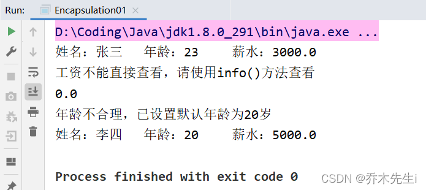

---
tags:
- Java
---

面向对象编程语言是对客观世界的模拟，客观世界里成员变量都是隐藏在对象内部的，外界无法直接操作和修改。封装可以被认为是一个保护屏障，防止该类的代码和数据被其他类随意访问。要访问该类的数据，必须通过指定的方式。适当的封装可以让代码更容易理解与维护，也加强了代码的安全性。

**原则：** 将属性隐藏起来，若需要访问某个属性，提供公共方法对其访问。
**简单的说，就是不用管方法是怎么实现的，直接调用即可。**

**封装实现的步骤：**
将属性进行私有化(其他类不能直接修改属性)
提供一个公共的set方法，用于对属性判断并赋值

```java
public void setXxx(类型 参数名) {
	// 逻辑代码，可以判断传入的参数是否符合要求
  属性 = 参数名;
}
```

提供一个公共的get方法，用于获取属性的值

```java
public XX getXxx() {
	// 逻辑代码，可以对属性增强后返回，比如返回用户想要的东西
  return xx;
}
```


**案例：**

```java
package object02.encap;

public class Encapsulation01 {
    public static void main(String[] args) {
        Person zhangsan = new Person();
        zhangsan.setName("张三");
        zhangsan.setAge(23);
//        zhangsan.setAge(23333); // 会根据set方法中的逻辑给出默认值
        zhangsan.setSalary(3000);
        System.out.println(zhangsan.info());
        System.out.println(zhangsan.getSalary());   // 会输出提示信息，这一行并输出0

        Person lisi = new Person("李四", 2000, 5000);
        System.out.println(lisi.info());
    }

}


class Person {
    // 姓名
    public String name;
    // 年龄
    private int age;
    // 工资
    private double salary;

    public Person() {
    }

    // 定义一个三个属性的构造器
    public Person(String name, int age, double salary) {
        // 构造器通过set方法可以进行数据的校验
        setName(name);
        setAge(age);
        setSalary(salary);
    }

    // 以下是封装的get和set方法

    public String getName() {
        return name;
    }

    public void setName(String name) {
        this.name = name;
    }

    public int getAge() {
        return age;
    }

    public void setAge(int age) {
        // 如果传入的年龄不合理，则给出默认值
        if (age < 0 || age > 120) {
            System.out.println("年龄不合理，已设置默认年龄为20岁");
            age = 20;
        }
        this.age = age;
    }

    public double getSalary() {
        System.out.println("工资不能直接查看，请使用info()方法查看");
        return 0;
    }

    public void setSalary(double salary) {
        this.salary = salary;
    }

    public String info(){
        return "姓名：" + name + "\t年龄：" + age + "\t薪水：" + salary;
    }
}
```

输出结果：



## 标准JavaBean代码

`JavaBean` 是 Java语言编写类的一种标准规范。符合 `JavaBean` 的类，要求类必须是具体的和公共的，并且具有无参数的构造方法，提供用来操作成员变量的 set 和 get 方法。

```java
public class ClassName{
   //成员变量
   //构造方法
   //无参构造方法【必须】
   //有参构造方法【建议】
   //成员方法
   //getXxx()
   //setXxx()
}
```

举例：

```java
public class Student {
	//成员变量
	private String name;
    private int age;
   
	//构造方法
	public Student() {}
   
	public Student(String name,int age) {
		this.name = name;
		this.age = age;
	}
   
	//成员方法
	publicvoid setName(String name) {
		this.name = name;
	}
   
	public String getName() {
		return name;
	}
   
	publicvoid setAge(int age) {
		this.age = age;
  	}
   
	publicint getAge() {
		return age;
	}
}
```
