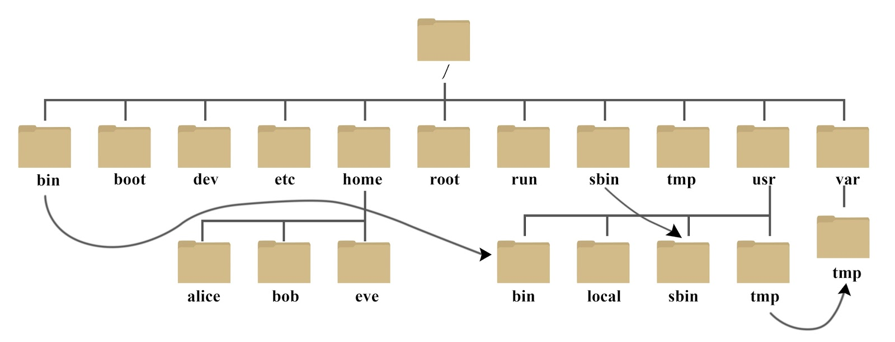
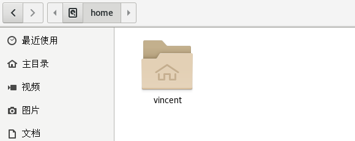

Linux目录相关的三个概念：
- Linux的文件系统是采用级层式的树状目录结构，“`/`”是所有目录的顶点，称为"根目录"，在此目录下创建其他目录 
- 不同目录下的数据可分布在不同磁盘，所有目录按规则组织与命名
- Linux也区分绝对路径与相对路径

## bin目录 [常用]
**bin：Binaries**，存放二进制可执行文件，也就是常用的命令，例如：ls、cp、mkdir...
bin目录也有两个分支：`/usr/bin`、`/usr/local/bin`，这两个文件夹中也存放着多个命令

## sbin目录
**sbin：super user binaries**，存放二进制可执行文件，只有root用户才能访问(**就是超级管理员才能访问的命令的目录**)
sbin目录也有两个分支：`/usr/sbin`、`/usr/local/bin`

## home目录 [常用]
**home：** 存放普通用户的主目录，在Linux中，每一个用户都有一个自己的目录，一般该目录是以用户的账号命名
之前我在安装虚拟机的时候创建了一个`vincent`的用户，所以现在的`home`文件夹下会有一个`vincent`的子文件夹

## root目录 [常用]
**root：** Linux的超级用户目录，是root用户的主目录，类似于Windows系统的`administrator`文件夹

## lib目录
**lib：library**，存放启动系统与运行命令所需的共享库文件与内核模块目录，系统开机所需要最基本的动态连接共享库，类似于Windows中的DLL文件，几乎所有的应用程序都需要用到这些共享库

## lost+found目录
**lost+found：** 这个目录一般是空的，当系统非法关机后，就会将一些文件存放至此，可以在终端看到此目录

## etc目录  [常用]
**etc：etcetera**，存放系统配置文件和一些子目录，`yum`、`rpm`方式安装应用程序的默认配置文件路径就是这里

## usr目录 [常用]
**usr：unix shared resources**，存放用户安装的应用程序的目录，类似于Windows中的`program files`文件夹

### /usr/local目录
usr目录中包含了两个重要的子目录：
- `/usr/local`：编译方式安装程序的默认目录
- `/usr/src`：程序源码目录

## boot目录
**boot：** Linux内核与系统引导程序目录，包括一些链接文件以及镜像文件，**没事不要去动它**

## proc目录
**proc：** 是一个虚拟目录，是系统内存的映射，系统运行时进程信息和内核信息存放在此目录，访问这个目录来获取系统信息，**没事不要去动它**

## srv目录
**srv：service**，该目录存放一些服务启动后需要提取的数据，**没事不要去动它**

## sys目录
**sys：** 这是Linux2.6内核的一个大变化，该目录下安装了2.6内核中新出现的一个文件系统`sysfs`，**没事不要去动它**

## tmp目录
**tmp：temporary**，用于存放一些临时文件

## dev目录
**dev：devices**，用于存放设备文件，比如声卡、磁盘、光驱等等，把所有的硬件用文件的形式存储，类似于Windows系统的设备管理器

## media目录 [常用]
**media：** Linux系统会自动识别一些设备，比如U盘、光驱等等，识别后Linux会把识别到的设备挂载到这个目录下

## mnt目录 [常用]
**mnt：mount**，系统提供该目录是为了让用户临时挂在别的文件系统的，可以将外部的存储挂载到`/mnt/`中，进入该目录就能看到挂载的内容了，使用方法可以进入专栏看 VMtools 的使用的文章

## opt目录
**opt：** 给主机额外安装软件所摆放的目录，如安装Oracle数据库可以存放到该目录下，该目录默认为空

## var目录 [常用]
**var：variable**，用于存放运行时需要改变数据的文件，一般是系统和软件的运行日志

## selinux目录
**selinux：security-enhanced linux**，SELinux是一种安全子系统，同能控制程序只能访问特定文件夹，有三种工作模式，可以自行设置，启用后可以看到该文件夹