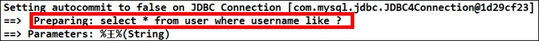
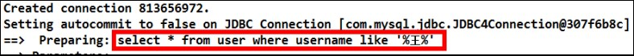
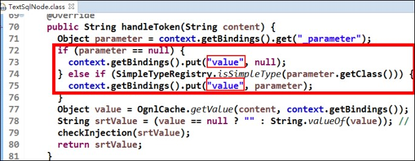
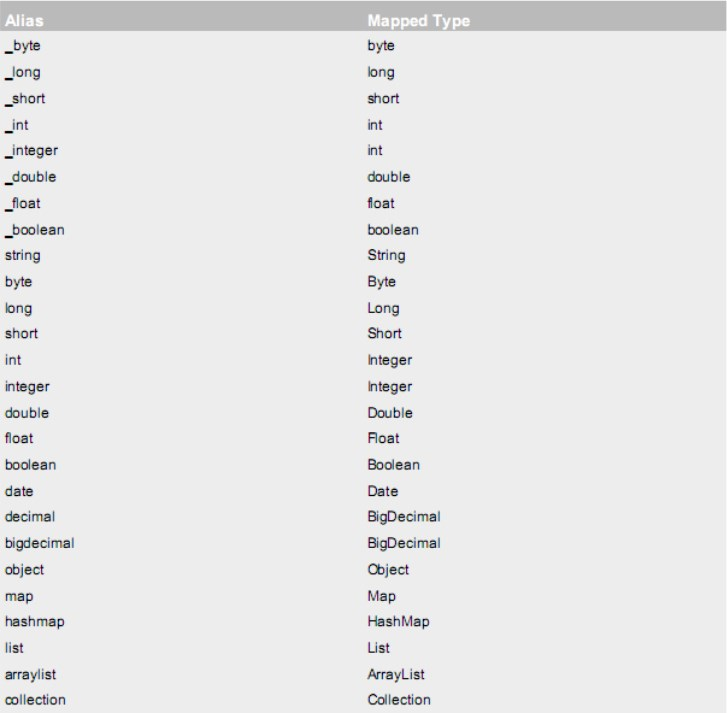

## 增删改查

- 持久层接口和持久层接口的映射配置必须在相同的包下
- 持久层映射配置中 mapper 标签的 namespace 属性取值必须是持久层接口的全限定类名
- SQL 语句的配置标签`<select>`,`<insert>`,`<delete>`,`<update>`的 id 属性必须和持久层接口的方法名相同。

```xml
<!-- 根据 id 查询 -->
<select id="findById" resultType="com.arbor.domain.User" parameterType="int">
	select * from user where id = #{uid}
</select>

<!-- 保存用户-->
<insert id="saveUser" parameterType="com.arbor.domain.User">
	insert into user(username,birthday,sex,address) 
    	values(#{username},#{birthday},#{sex},#{address})
</insert>

<!-- 新增用户后，同时还要返回当前新增用户的 id 值，因为 id 是由数据库的自动增长来实现的，所以就相当于我们要在新增后将自动增长 auto_increment 的值返回 -->
<insert id="saveUser" parameterType="USER">
	<!-- 配置保存时获取插入的 id -->
    <selectKey keyColumn="id" keyProperty="id" resultType="int">
		select last_insert_id();
	</selectKey>
	insert into user(username,birthday,sex,address) 
		values(#{username},#{birthday},#{sex},#{address})
</insert>

<!-- 更新用户 -->
<update id="updateUser" parameterType="com.arbor.domain.User">
	update user set username=#{username},birthday=#{birthday},sex=#{sex},
		address=#{address} where id=#{id}
</update>

<!-- 删除用户 -->
<delete id="deleteUser" parameterType="java.lang.Integer">
	delete from user where id = #{uid}
</delete>
```


### 常用属性

- `resultType`：用于指定结果集的类型，如果要传入的是一个类的对象，类型就写类的全名称。
- `parameterType`：用于指定传入参数的类型，如果要传入的是一个类的对象，类型就写类的全名称。

### 常用字符

- `#{对象}`：占位符，相当于jdbc中的 `?` ，用于执行语句时替换实际的数据，具体的数据由里面的内容决定的，由于数据类型是基本类型，所以内容可以随意写

>  apache 提供的一种表达式语言，全称是：Object Graphic Navigation Language 对象图导航语言，它是按照一定的语法格式来获取数据的。
>  
>  语法格式就是使用 `#{对象.对象}` 的方式
>  
>  `#{user.username}`它会先去找 `user` 对象，然后在 `user` 对象中找到 `username` 属性，并调用 `getUsername()` 方法把值取出来。如果在 `parameterType` 属性上指定了实体类名称，所以可以省略  `user.` 而直接写 `username`。


## 模糊查询

### 方式一

```xml
<!-- 根据名称模糊查询 -->
<select id="findByName" resultType="com.arbor.domain.User" parameterType="String">
 select * from user where username like #{username}
</select>
```

测试方法：

```java
@Test
public void testFindByName(){
	//5.执行查询一个方法
	List<User> users = userDao.findByName("%王%");
	for(User user : users){
		System.out.println(user);
	}
}
```




> 在配置文件中没有加入 `%` 来作为模糊查询的条件，所以在传入字符串实参时，就需要给定模糊查询的标识 `%`。配置文件中的 `#{username}` 也只是一个占位符，所以 SQL 语句显示为 “？”。


### 方式二

```xml
<!-- 根据名称模糊查询 -->
<select id="findByName" parameterType="string" resultType="com.arbor.domain.User">
	select * from user where username like '%${value}%'
</select>
```

将原来的 `#{}` 占位符，改成了 `${value}`。如果模糊查询用的这种写法，`${value}`的写法就是固定的，不能写成其它名字。

测试方法：
```java
@Test
public void testFindByName(){
	//5.执行查询一个方法
	List<User> users = userDao.findByName("王");
	for(User user : users){
		System.out.println(user);
	}
}
```
  


两种方式的实现效果是一样的，但执行的语句是不一样的。

## `#{}` 与 `${}` 的区别

**#{}表示一个占位符号：**

通过#{}可以实现 preparedStatement 向占位符中设置值，自动进行 java 类型和 jdbc 类型转换，#{}可以有效防止 sql 注入。 #{}可以接收简单类型值或 pojo 属性值。 如果 parameterType 传输单个简单类型值，#{}括号中可以是 value 或其它名称。

**${}表示拼接 sql 串：**

通过 `${}` 可以将 `parameterType` 传入的内容拼接在 sql 中且不进行 jdbc 类型转换， `${}`可以接收简单类型值或 pojo 属性值，如果 `parameterType` 传输单个简单类型值，**`${}`括号中只能是 `value`**。




## 聚合函数

```xml
<!-- 查询总记录条数 -->
<select id="findTotal" resultType="int">
	select count(*) from user;
</select>
```


## parameterType

该属性的取值可以是基本类型，引用类型（例如：String 类型），还可以是实体类类型（POJO 类）。同时也可以使用实体类的包装类。

基本类型和 String 可以直接写类型名称，也可以使用`包名.类名`的方式，例如：`java.lang.String`。




这些都是支持的默认别名。
可以参考 `TypeAliasRegistery.class` 的源码，看它们分别都是如何定义出来的。

传递 pojo 包装对象，直接写对象的全限定类名即可。

```xml
<!-- 根据用户名称模糊查询，参数变成一个 QueryVo 对象了 -->
<select id="findByVo" resultType="com.arbor.domain.User"
	parameterType="com.arbor.domain.QueryVo">
	select * from user where username like #{user.username};
</select>
```

## resultType

resultType 属性可以指定结果集的类型，它支持基本类型和实体类类型。
实体类中的属性名称必须和查询语句中的列名保持一致，否则无法实现封装。

```xml
<!-- 配置查询所有操作 -->
<select id="findAll" resultType="com.arbor.domain.User">
	select * from user
</select>

<!--使用别名查询，若不使用别名查询则查询不到结果-->
<!-- 配置查询所有操作 -->
<select id="findAll" resultType="com.arbor.domain.User">
	select id as userId,username as userName,birthday as userBirthday,
	sex as userSex,address as userAddress from user
</select>
```

## resultMap

resultMap 标签可以建立查询的列名和实体类的属性名称不一致时建立对应关系。从而实现封装。

在 select 标签中使用 resultMap 属性指定引用即可。同时 resultMap 可以实现将查询结果映射为复杂类型的 pojo，比如在查询结果映射对象中包括 pojo 和 list 实现一对一查询和一对多查询。

**常用属性**
- `type`：指定实体类的全限定类名
- `id`：给定一个唯一标识，是给查询 select 标签引用用的

**常用标签&属性**
- `<id>`：用于指定主键字段
- `<result>`：用于指定非主键字段
- `column`：用于指定数据库列名
- `property`：用于指定实体类属性名称

