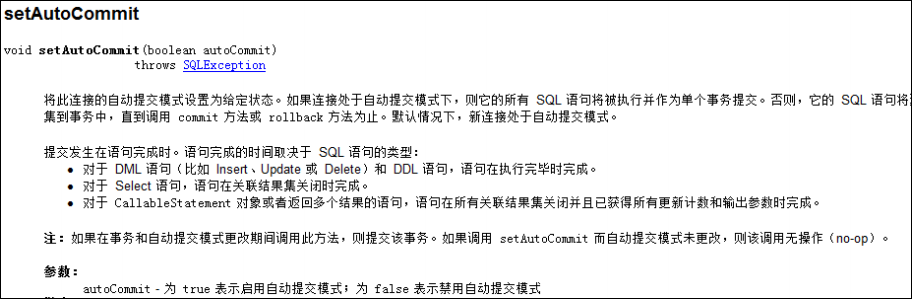

在 JDBC 中可以通过手动方式将事务的提交改为手动方式，通过 setAutoCommit()方法就可以调整。



Mybatis 框架因为是对 JDBC 的封装，所以 Mybatis 框架的事务控制方式，本身也是用 JDBC 的setAutoCommit()方法来设置事务提交方式的。


## 事务提交方式

Mybatis 中事务的提交方式，本质上就是调用 JDBC 的 setAutoCommit()来实现事务控制。

```java
@Test
public void testSaveUser() throws Exception {
	User user = new User();
	user.setUsername("mybatis user09");
	//6.执行操作
	int res = userDao.saveUser(user);
	System.out.println(res);
	System.out.println(user.getId());
}

@Before	//在测试方法执行之前执行
public void init()throws Exception {
	//1.读取配置文件
	in = Resources.getResourceAsStream("SqlMapConfig.xml");
	//2.创建构建者对象
	SqlSessionFactoryBuilder builder = new SqlSessionFactoryBuilder();
	//3.创建 SqlSession 工厂对象
	factory = builder.build(in);
	//4.创建 SqlSession 对象
	session = factory.openSession();
	//5.创建 Dao 的代理对象
	userDao = session.getMapper(IUserDao.class);
}

@After	//在测试方法执行完成之后执行
public void destroy() throws Exception{
	//7.提交事务
	session.commit();
	//8.释放资源
	session.close();
	in.close();
}
```


这是 Connection 的整个变化过程，都要手动进行事务的提交，原因是 `setAutoCommit()` 方法，在执行时它的值被设置为 false 了，所以在 CUD 操作中，必须通过 `sqlSession.commit()` 方法来执行提交操作。

## 自动提交事务

CUD 过程中必须使用 `sqlSession.commit()` 提交事务，主要原因就是在连接池中取出的连接，都会将调用 `connection.setAutoCommit(false)`方法，这样就必须使用 `sqlSession.commit()`方法，相当于使用了 JDBC 中的 `connection.commit()`方法实现事务提交。

```java
@Before	//在测试方法执行之前执行
public void init()throws Exception {
	//1.读取配置文件
	in = Resources.getResourceAsStream("SqlMapConfig.xml");
	//2.创建构建者对象
	SqlSessionFactoryBuilder builder = new SqlSessionFactoryBuilder();
	//3.创建 SqlSession 工厂对象
	factory = builder.build(in);
	//4.创建 SqlSession 对象
	session = factory.openSession(true);
	//5.创建 Dao 的代理对象
	userDao = session.getMapper(IUserDao.class);
}

@After	//在测试方法执行完成之后执行
public void destroy() throws Exception{
	//7.释放资源
    session.close();
	in.close();
}
```


对应的 DefaultSqlSessionFactory 类的源代码：


运行结果：


此时事务就设置为自动提交了，同样可以实现CUD操作时记录的保存。虽然这也是一种方式，但就编程而言，设置为自动提交方式为 false 再根据情况决定是否进行提交，这种方式可以根据业务情况来决定提交是否进行提交。