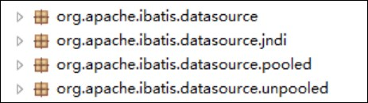
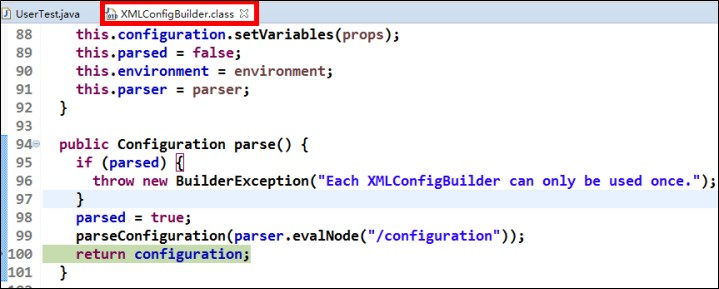
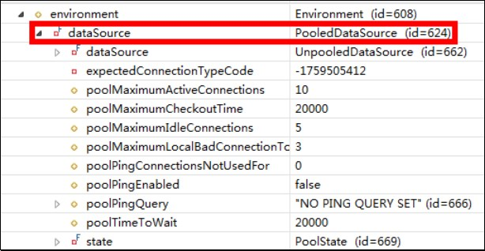
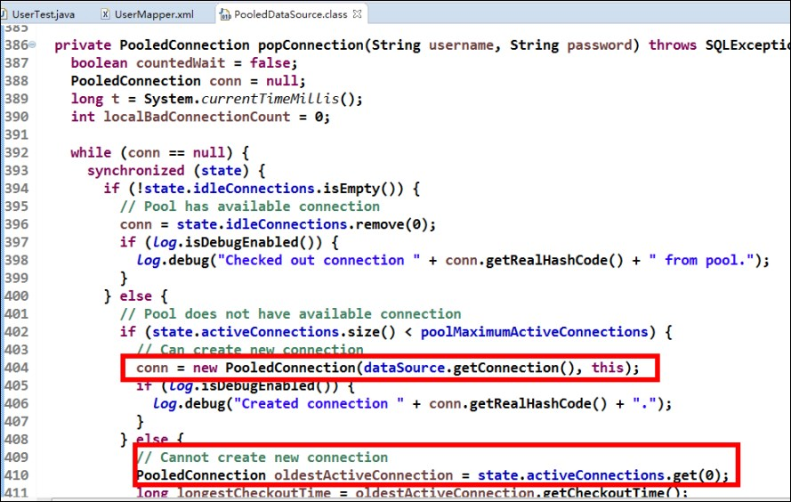
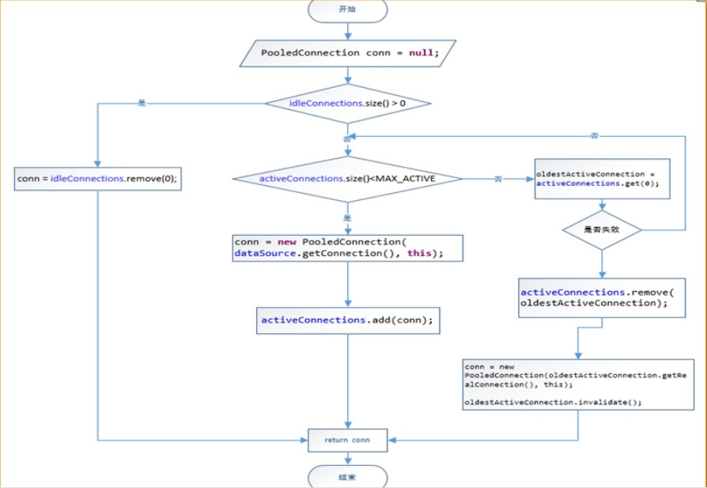
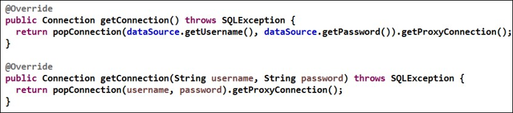

MyBatis 中采用的是自己的连接池技术。在 Mybatis 的 SqlMapConfig.xml 配置文件中，通过`<dataSource type="pooled">` 来实现 Mybatis 中连接池的配置。

在 Mybatis 中它的数据源 dataSource 分为以下几类：



Mybatis 将它自己的数据源分为三类：

- **UNPOOLED**：不使用连接池的数据源
- **POOLED**：使用连接池的数据源
- **JNDI**：使用 JNDI 实现的数据源

MyBatis 内部分别定义了实现了 java.sql.DataSource 接口的 `UnpooledDataSource`，`PooledDataSource` 类来表示 `UNPOOLED`、`POOLED` 类型的数据源。

数据源配置就是在 SqlMapConfig.xml 文件中，具体配置如下：

```xml
<!-- 配置数据源（连接池）信息 -->
<dataSource type="POOLED">
    <property name="driver" value="${jdbc.driver}"/>
	<property name="url" value="${jdbc.url}"/>
	<property name="username" value="${jdbc.username}"/>
	<property name="password" value="${jdbc.password}"/>
</dataSource>
```

MyBatis 在初始化时，根据 `<dataSource>` 的 type 属性来创建相应类型的的数据源 DataSource，即：

- **type="POOLED"**：MyBatis 会创建 PooledDataSource 实例
- **type="UNPOOLED"** ： MyBatis 会创建 UnpooledDataSource 实例
- **type="JNDI"**：MyBatis 会从 JNDI 服务上查找 DataSource 实例，然后返回使用


## DataSource 的存取

MyBatis是通过工厂模式来创建数据源DataSource对象的， MyBatis定义了抽象的工厂接口：`org.apache.ibatis.datasource.DataSourceFactory`，通过其 `getDataSource()`方法返回数据源DataSource。

DataSourceFactory 源码：

```java
package org.apache.ibatis.datasource;
import java.util.Properties;
import javax.sql.DataSource;
/**
* @author Clinton Begin
*/
public interface DataSourceFactory {
	void setProperties(Properties props);
	DataSource getDataSource();
}
```

MyBatis 创建了 DataSource 实例后，会将其放到 Configuration 对象内的 Environment 对象中， 供以后使用。

具体分析过程如下：

- 先进入 XMLConfigBuilder 类中，可以找到如下代码：




- 分析 configuration 对象的 environment 属性，结果如下：




## 连接的获取过程

当需要创建 SqlSession 对象并需要执行 SQL 语句时，这时候 MyBatis 才会去调用dataSource 对象来创建java.sql.Connection对象。也就是说，java.sql.Connection对象的创建一直延迟到执行SQL语句的时候。

```java
@Test
public void testSql() throws Exception {
	InputStream in = Resources.getResourceAsStream("SqlMapConfig.xml");
	SqlSessionFactory factory = new SqlSessionFactoryBuilder().build(in);
	SqlSession sqlSession = factory.openSession();
	List<User> list = sqlSession.selectList("findUserById",41);
	System.out.println(list.size());
}
```

只有当第 4 句 `sqlSession.selectList("findUserById")`，才会触发 MyBatis 在底层执行下面这个方法来创建 java.sql.Connection 对象。

证明它的加载过程可以通过断点调试，在 PooledDataSource 中找到如下 popConnection()方法，如下所示：




 分析源代码，得出 PooledDataSource 工作原理如下：
 



下面是连接获取的源代码：



可以发现，真正连接打开的时间点，只是在执行SQL语句时，才会进行。数据库连接是最为宝贵的资源，只有在要用到的时候，才去获取并打开连接，当用完了就再立即将数据库连接归还到连接池中。