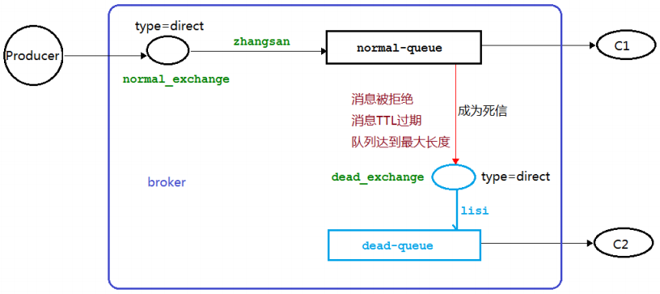
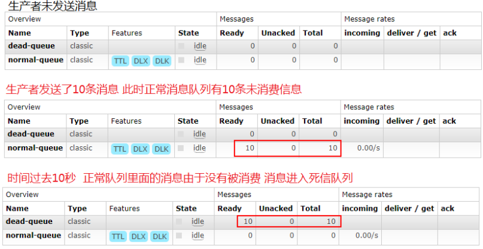
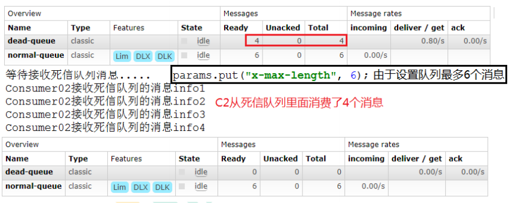
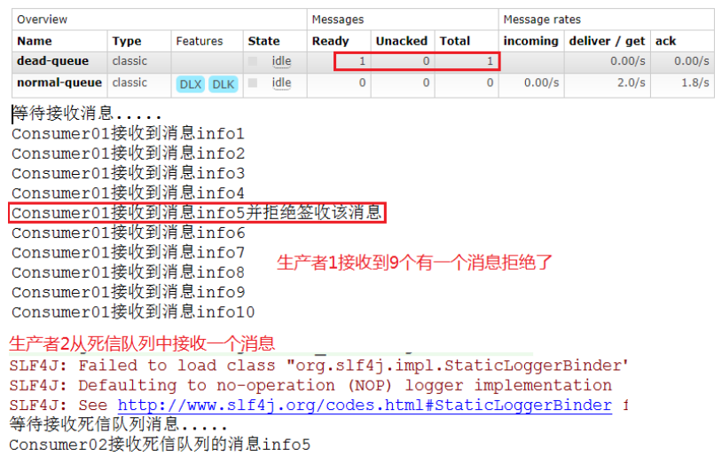

死信，就是无法被消费的消息，一般来说，producer 将消息投递到 broker 或者直接到queue 里了，consumer 从 queue 取出消息进行消费，但某些时候由于特定的原因导致 queue 中的某些消息无法被消费，这样的消息如果没有后续的处理，就变成了死信，有死信自然就有了死信队列。

应用场景：为了保证订单业务的消息数据不丢失，需要使用到 RabbitMQ 的死信队列机制，当消息消费发生异常时，将消息投入死信队列中。还有比如说：用户在商城下单成功并点击去支付后在指定时间未支付时自动失效。


## 死信的来源

* 消息 TTL 过期
* 队列达到最大长度(队列满了，无法再添加数据到 mq 中)
* 消息被拒绝(basic.reject 或 basic.nack)并且 requeue=false.




## 消息TTL过期

消息发送者：

```java
public class Task0901 {
    private static final String NORMAL_EXCHANGE = "normal_exchange";

    public static void main(String[] args) throws Exception {
        Channel channel = RabbitMqUtil.getChannel();
        // 创建一个交换机
        channel.exchangeDeclare(NORMAL_EXCHANGE, BuiltinExchangeType.DIRECT);
        //设置消息的 TTL 时间  毫秒值
        AMQP.BasicProperties properties = new AMQP.BasicProperties().builder().expiration("10000").build();

        for (int i = 1; i <= 10; i++) {
            String message = "info:" + i;
            channel.basicPublish(NORMAL_EXCHANGE, "aaa", properties, message.getBytes(StandardCharsets.UTF_8));
            System.out.println("生产者发出消息:" + message);
        }
    }
}
```


死信队列：

```java
public class Worker0902 {

    private static final String DEAD_EXCHANGE = "dead_exchange";

    public static void main(String[] args) throws Exception {
        Channel channel = RabbitMqUtil.getChannel();

        // ------------创建死信队列------------
        // 创建一个死信交换机
        channel.exchangeDeclare(DEAD_EXCHANGE, BuiltinExchangeType.DIRECT);
        // 声明一个死信队列
        String deadQueue = "dead_queue";
        channel.queueDeclare(deadQueue, false, false, false, null);
        // 将交换机和队列绑定
        channel.queueBind(deadQueue, DEAD_EXCHANGE, "bbb");

        // ------------接收并处理消息------------
        System.out.println("死信队列等待接收消息....");
        // 接收到消息后的处理逻辑：
        DeliverCallback deliverCallback = (consumerTag, delivery) -> {
            String message = new String(delivery.getBody(), StandardCharsets.UTF_8);
            System.out.println("死信队列收到并处理消息：" + message);
        };
        // 取消消息时的回调：
        CancelCallback cancelCallback = (consumerTag) -> System.out.println("消息消费被中断");

        // 消费消息
        channel.basicConsume(deadQueue, true, deliverCallback, cancelCallback);
    }
}
```


消息接收者：启动之后关闭该消费者，模拟其接收不到消息

```java
public class Worker0901 {

    private static final String NORMAL_EXCHANGE = "normal_exchange";
    private static final String DEAD_EXCHANGE = "dead_exchange";

    public static void main(String[] args) throws Exception {
        Channel channel = RabbitMqUtil.getChannel();

        // ------------创建死信队列与普通队列的绑定信息------------
        // 正常队列绑定死信队列信息
        Map<String, Object> params = new HashMap<>();
        // 正常队列设置死信交换机 参数 key 是固定值
        params.put("x-dead-letter-exchange", DEAD_EXCHANGE);
        // 正常队列设置死信 routing-key 参数 key 是固定值
        params.put("x-dead-letter-routing-key", "bbb");

        // ------------创建普通队列------------
        // 创建一个普通交换机
        channel.exchangeDeclare(NORMAL_EXCHANGE, BuiltinExchangeType.DIRECT);
        // 声明一个普通队列
        String normalQueue = "normal_queue";
        channel.queueDeclare(normalQueue, false, false, false, params);
        // 将交换机和队列绑定
        channel.queueBind(normalQueue, NORMAL_EXCHANGE, "aaa");

        // ------------接收并处理消息------------
        System.out.println("等待接收消息....");
        // 接收到消息后的处理逻辑：
        DeliverCallback deliverCallback = (consumerTag, delivery) -> {
            String message = new String(delivery.getBody(), StandardCharsets.UTF_8);
            System.out.println("消费者收到并处理消息：" + message);
        };
        // 取消消息时的回调：
        CancelCallback cancelCallback = (consumerTag) -> System.out.println("消息消费被中断");

        // 消费消息
        channel.basicConsume(normalQueue, true, deliverCallback, cancelCallback);
    }
}
```





## 队列达到最大长度

> 最新的消息会顶出之前发送的消息。

消息发送者：

```java
public class Task0902 {
    private static final String NORMAL_EXCHANGE = "normal_exchange";

    public static void main(String[] args) throws Exception {
        Channel channel = RabbitMqUtil.getChannel();
        // 创建一个交换机
        channel.exchangeDeclare(NORMAL_EXCHANGE, BuiltinExchangeType.DIRECT);

        for (int i = 1; i <= 10; i++) {
            String message = "info:" + i;
            channel.basicPublish(NORMAL_EXCHANGE, "aaa", null, message.getBytes(StandardCharsets.UTF_8));
            System.out.println("生产者发出消息:" + message);
        }
    }
}
```


死信队列：保持不变，和上面的一样


消费者（设置队列的最大长度）：需要先删除原先的队列，在启动并停止该队列，因为参数变了

```java
public class Worker0903 {

    private static final String NORMAL_EXCHANGE = "normal_exchange";
    private static final String DEAD_EXCHANGE = "dead_exchange";

    public static void main(String[] args) throws Exception {
        Channel channel = RabbitMqUtil.getChannel();

        // ------------创建死信队列与普通队列的绑定信息------------
        // 正常队列绑定死信队列信息
        Map<String, Object> params = new HashMap<>();
        // 正常队列设置死信交换机 参数 key 是固定值
        params.put("x-dead-letter-exchange", DEAD_EXCHANGE);
        // 正常队列设置死信 routing-key 参数 key 是固定值
        params.put("x-dead-letter-routing-key", "bbb");
        // 设置队列的最大长度
        params.put("x-max-length", 6);

        // ------------创建普通队列------------
        // 创建一个普通交换机
        channel.exchangeDeclare(NORMAL_EXCHANGE, BuiltinExchangeType.DIRECT);
        // 声明一个普通队列
        String normalQueue = "normal_queue";
        channel.queueDeclare(normalQueue, false, false, false, params);
        // 将交换机和队列绑定
        channel.queueBind(normalQueue, NORMAL_EXCHANGE, "aaa");

        // ------------接收并处理消息------------
        System.out.println("等待接收消息....");
        // 接收到消息后的处理逻辑：
        DeliverCallback deliverCallback = (consumerTag, delivery) -> {
            String message = new String(delivery.getBody(), StandardCharsets.UTF_8);
            System.out.println("消费者收到并处理消息：" + message);
        };
        // 取消消息时的回调：
        CancelCallback cancelCallback = (consumerTag) -> System.out.println("消息消费被中断");

        // 消费消息
        channel.basicConsume(normalQueue, true, deliverCallback, cancelCallback);
    }
}
```





## 消息被拒

消息发送者：和上面代码一样

死信队列：和上面代码一样

消费者（设置拒绝第五条消息）：先删掉之前的队列，启动之后关闭该消费者，模拟其接收不到消息

```java
public class Worker0904 {

    private static final String NORMAL_EXCHANGE = "normal_exchange";
    private static final String DEAD_EXCHANGE = "dead_exchange";

    public static void main(String[] args) throws Exception {
        Channel channel = RabbitMqUtil.getChannel();

        // ------------创建普通队列------------
        // 创建一个普通交换机
        channel.exchangeDeclare(NORMAL_EXCHANGE, BuiltinExchangeType.DIRECT);
        // 声明一个普通队列
        String normalQueue = "normal_queue";
        channel.queueDeclare(normalQueue, false, false, false, params);
        // 将交换机和队列绑定
        channel.queueBind(normalQueue, NORMAL_EXCHANGE, "aaa");

        // ------------接收并处理消息------------
        System.out.println("等待接收消息....");
        // 接收到消息后的处理逻辑：
        DeliverCallback deliverCallback = (consumerTag, delivery) -> {
            String message = new String(delivery.getBody(), StandardCharsets.UTF_8);
            if (message.equals("info:5")) {
                System.out.println("消费者收到并拒绝该消息：" + message);
                //requeue设置为 false 代表拒绝重新入队，该队列如果配置了死信交换机将发送到死信队列中
                channel.basicReject(delivery.getEnvelope().getDeliveryTag(), false);
            } else {
                channel.basicAck(delivery.getEnvelope().getDeliveryTag(), false);
                System.out.println("消费者收到并处理消息：" + message);
            }
        };
        // 取消消息时的回调：
        CancelCallback cancelCallback = (consumerTag) -> System.out.println("消息消费被中断");

        // 消费消息 设置手动应答
        channel.basicConsume(normalQueue, false, deliverCallback, cancelCallback);
    }
}
```


