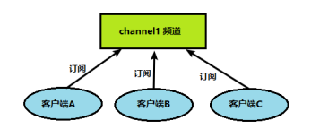
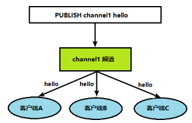
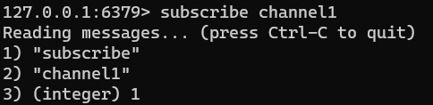
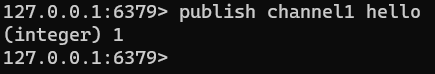
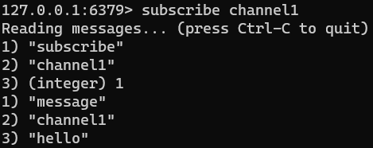

Redis 发布订阅 (pub/sub) 是一种消息通信模式：发送者 (pub) 发送消息，订阅者 (sub) 接收消息。

Redis 客户端可以订阅任意数量的频道。


客户端可以订阅频道如下图：




当给这个频道发布消息后，消息就会发送给订阅的客户端：




## 发布订阅命令行实现

1. 打开一个客户端进行订阅

```bash
subscribe channel1
```




2. 打开另一个客户端，给channel1发布消息hello

```bash
 publish channel1 hello
```




3. 打开第一个客户端可以看到发送的消息




> 如果发布的消息没有持久化，在订阅的客户端收不到hello，只能收到订阅后发布的消息

