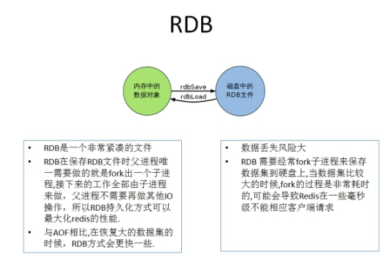
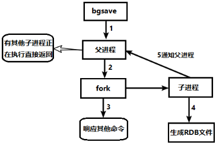
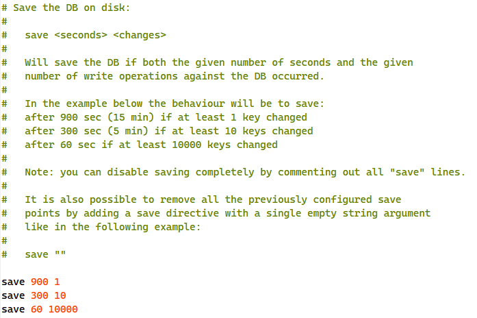
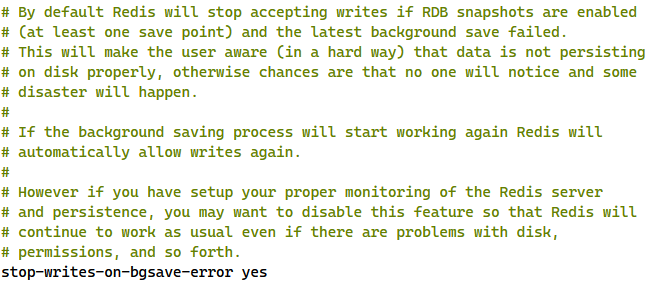
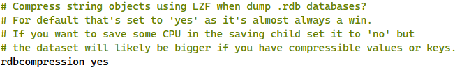
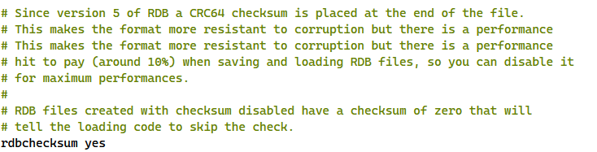
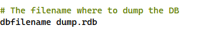
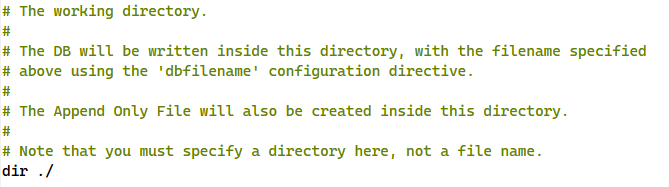
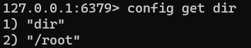
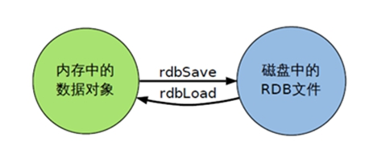

RDB（Redis DataBase），在指定的时间间隔内将内存中的数据集快照写入磁盘，也就是行话讲的Snapshot快照，它恢复时是将快照文件直接读到内存里。

Redis会单独创建（fork）一个子进程来进行持久化，会先将数据写入到 一个临时文件中，待持久化过程都结束了，再用这个临时文件替换上次持久化好的文件。整个过程中，主进程是不进行任何IO操作的，这就确保了极高的性能如果需要进行大规模数据的恢复，且对于数据恢复的完整性不是非常敏感，那RDB方式要比AOF方式更加的高效。**RDB的缺点是最后一次持久化后的数据可能丢失**。




> * Fork的作用是复制一个与当前进程一样的进程。新进程的所有数据（变量、环境变量、程序计数器等） 数值都和原进程一致，但是是一个全新的进程，并作为原进程的子进程。
> * 在Linux程序中，fork()会产生一个和父进程完全相同的子进程，但子进程在此后多会exec系统调用，出于效率考虑，Linux中引入了“**写时复制技术**”
> * **一般情况父进程和子进程会共用同一段物理内存**，只有进程空间的各段的内容要发生变化时，才会将父进程的内容复制一份给子进程。




## 配置
### save




写操作次数，格式：`save 秒钟`

RDB是整个内存的压缩过的Snapshot，RDB的数据结构，可以配置复合的快照触发条件，**默认是1分钟内改了1万次，或5分钟内改了10次，或15分钟内改了1次。**

> 禁用，不设置save指令，或者给save传入空字符串。


### stop-writes-on-bgsave-error



当Redis无法写入磁盘的话，直接关掉Redis的写操作。推荐yes


### rdbcompression 压缩文件



对于存储到磁盘中的快照，可以设置是否进行压缩存储。如果是的话，redis会采用LZF算法进行压缩。

如果不想消耗CPU来进行压缩的话，可以设置为关闭此功能。推荐yes


### rdbchecksum 检查完整性



在存储快照后，还可以让redis使用CRC64算法来进行数据校验，但是这样做会增加大约10%的性能消耗，如果希望获取到最大的性能提升，可以关闭此功能。推荐yes


### dbfilename 保存的文件名



配置文件名称，默认为`dump.rdb` 


### dir 保存路径



rdb文件的保存路径，也可以修改，默认为Redis启动时命令行所在的目录下


## 命令
### save 手动保存
手动保存，save时只管保存，其它不管，全部阻塞。不建议使用。


### bgsave 异步保存
**Redis会在后台异步进行快照操作， 快照同时还可以响应客户端请求。**


### lastsave 最后保存时间
可以通过lastsave命令获取最后一次成功执行快照的时间。


### flushall
执行flushall命令，也会产生dump.rdb文件，但里面是空的，无意义。


## rdb备份
**备份：**

通过 `config get dir` 查询rdb文件的目录，将 `*.rdb` 的文件拷贝到别的地方：




**恢复：**

1. 关闭Redis
2. 先把备份的文件拷贝到工作目录下 cp dump2.rdb dump.rdb
3. 启动Redis，备份数据会直接加载


## 优势
* 适合大规模的数据恢复
* 对数据完整性和一致性要求不高更适合使用
* 节省磁盘空间
* 恢复速度快




## 劣势

* Fork的时候，内存中的数据被克隆了一份，大致2倍的膨胀性需要考虑。
* 虽然Redis在fork时使用了**写时拷贝技术**,但是如果数据庞大时还是比较消耗性能。
* 在备份周期在一定间隔时间做一次备份，所以如果Redis意外down掉的话，就会丢失最后一次快照后的所有修改。


## 动态停止RDB

```bash
redis-cli config set save ""
```
save后给空值，表示禁用保存策略