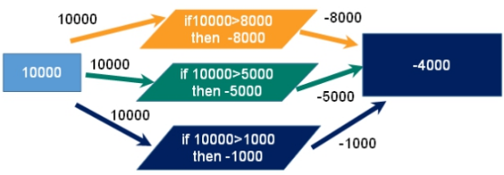
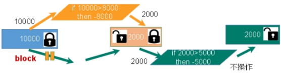
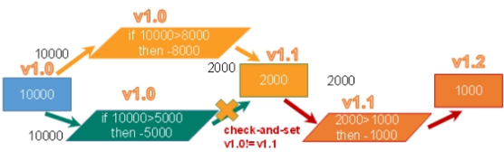
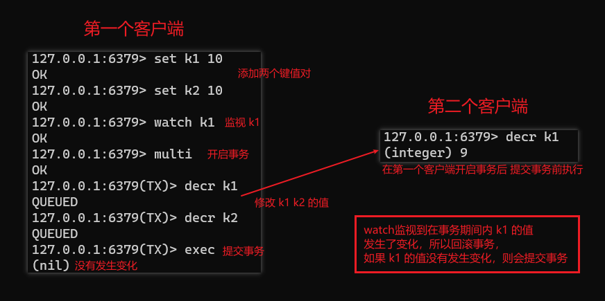

前提举例：一个账户中有10000元，一个请求想给金额减8000，一个请求想给金额减5000，一个请求想给金额减1000。

## 悲观锁

**悲观锁(Pessimistic Lock)**，很悲观，每次去拿数据的时候都认为别人会修改，所以每次在拿数据的时候都会上锁，这样别人想拿这个数据就会block(阻塞)直到它拿到锁。**传统的关系型数据库里边就用到了很多这种锁机制**，比如**行锁**，**表锁**等，**读锁**，**写锁**等，都是在做操作之前先上锁。

## 乐观锁

**乐观锁** **(Optimistic Lock)**，很乐观，每次去拿数据的时候都认为别人不会修改，所以不会上锁，但是在更新的时候会判断一下在此期间别人有没有去更新这个数据，可以使用版本号等机制。**乐观锁适用于多读的应用类型，这样可以提高吞吐量**。Redis就是利用这种check-and-set机制实现事务的。

## watch key \[key ...\]

在执行multi之前，先执行 `watch key1 [key2]` ，可以监视一个(或多个) key，如果在事务**执行之前这个(或这些) key 被其他命令所改动，那么事务将被打断。**

> [http://doc.redisfans.com/transaction/exec.html](http://doc.redisfans.com/transaction/exec.html)

## unwatch

取消 `watch` 命令对所有 key 的监视。

如果在执行 `watch` 命令之后，`exec` 命令或 `discard` 命令先被执行了的话，那么就不需要再执行 `unwatch` 了。
