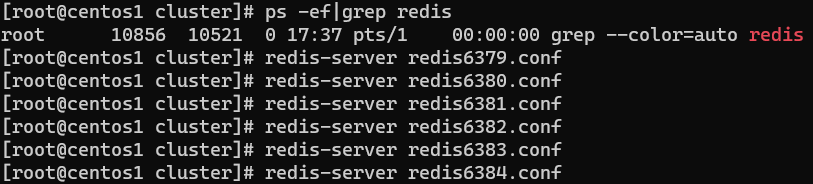
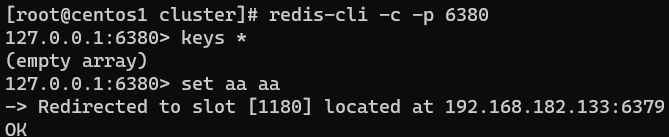

容量不够，redis如何进行扩容？并发写操作，redis如何分摊？主从模式，薪火相传模式，主机宕机，导致ip地址发生变化，应用程序中配置需要修改对应的主机地址、端口等信息。

之前通过代理主机来解决，但是redis3.0中提供了解决方案。就是无中心化集群配置。


Redis 集群实现了对Redis的水平扩容，即启动N个redis节点，将整个数据库分布存储在这N个节点中，每个节点存储总数据的1/N。

Redis 集群通过分区（partition）来提供一定程度的可用性（availability）： 即使集群中有一部分节点失效或者无法进行通讯， 集群也可以继续处理命令请求。


## 搭建集群

### 准备工作

因为是在同一台机器上，需要做些准备，生产可能是多台机器。

制作6个实例，配置文件，分别是6379,6380,6381,6382,6383,6384：

主配置文件开启：`daemonize yes` ，`appendonly` 关掉或者换名字

```bash
include /home/data/redis/redis.conf
pidfile "/var/run/redis_6379.pid"
port 6379
dbfilename "dump6379.rdb"
dir "/home/data/redis/cluster"
logfile "/home/data/redis/cluster/redis_err_6379.log"
# 打开集群模式
cluster-enabled yes
# 设定节点配置文件名
cluster-config-file nodes-6379.conf
# 设定节点失联时间，超过该时间（毫秒），集群自动进行主从切换。
cluster-node-timeout 15000
```


创建完第一个，复制出其它五个文件


使用查找替换修改另外5个文件：

使用：`:%s/6379/6380`


启动六个Redis服务：




确保所有redis实例启动后，nodes-xxxx.conf文件都生成正常：


### 合成集群

```bash
redis-cli --cluster create --cluster-replicas 1 192.168.182.133:6379 192.168.182.133:6380 192.168.182.133:6381 192.168.182.133:6382 192.168.182.133:6383 192.168.182.133:6384
```

此处不要用127.0.0.1， 使用真实IP地址

* `-replicas 1` ：采用最简单的方式配置集群，一台主机，一台从机，正好三组。


完整的输出日志：


### 登录

普通方式登录：可能直接进入读主机，存储数据时，会出现MOVED重定向操作。所以，应该以集群方式登录。


`-c` 采用集群策略连接，设置数据会自动切换到相应的写主机：




## 查看集群信息

通过 `cluster nodes` 命令查看集群信息


## cluster 如何分配节点

一个集群至少要有三个主节点。

选项 `--cluster-replicas 1` 表示希望为集群中的每个主节点创建一个从节点。

分配原则尽量保证每个主数据库运行在不同的IP地址，每个从库和主库不在一个IP地址上。


## slots


一个 Redis 集群包含 16384 个插槽（hash slot），数据库中的每个键都属于这 16384 个插槽的其中一个。

集群使用公式 `CRC16(key) % 16384` 来计算键 key 属于哪个槽，其中 CRC16(key) 语句用于计算键 key 的 CRC16 校验和。

集群中的每个节点负责处理一部分插槽。

举个例子，如果一个集群可以有主节点， 其中：

* 节点 A 负责处理 0 号至 5460 号插槽。
* 节点 B 负责处理 5461 号至 10922 号插槽。
* 节点 C 负责处理 10923 号至 16383 号插槽。


## 在集群中录入值

在redis-cli每次录入、查询键值，redis都会计算出该key应该送往的插槽，如果不是该客户端对应服务器的插槽，redis会报错，并告知应前往的redis实例地址和端口。

redis-cli客户端提供了 `–c` 参数实现自动重定向。

如 `redis-cli  -c –p 6379` 登入后，再录入、查询键值对可以自动重定向。

不在一个slot下的键值，是不能使用mget，mset等多键操作。


可以通过`{}`来定义组的概念，从而使key中{}内相同内容的键值对放到一个slot中去：


## 查询集群中的值

* `cluster getkeysinslot <slot> <count>` ：返回 count 个 slot 槽中的键。


## 故障恢复

如果主节点下线？从节点能否自动升为主节点？注意：**15秒超时**


> 原来的6380由读机变为了写机。


主节点恢复后，主从关系会如何？主节点回来变成从机。


> 6379重启后，变为了读机。


如果某一段插槽的主从都挂掉，而 `cluster-require-full-coverage` 为 `yes` ，整个集群都挂掉。

如果某一段插槽的主从都挂掉，而 `cluster-require-full-coverage` 为 `no` ，该插槽数据全都不能使用，也无法存储。

redis.conf 中的参数 `cluster-require-full-coverage` 。


## 集群的Jedis开发

即使连接的不是主机，集群会自动切换主机存储。主机写，从机读。

无中心化主从集群。无论从哪台主机写的数据，其他主机上都能读到数据。

```java
public class JedisClusterTest {
    public static void main(String[] args) { 
        Set<HostAndPort> set = new HashSet<HostAndPort>();
        set.add(new HostAndPort("192.168.182.133", 6379));
        JedisCluster jedisCluster = new JedisCluster(set);
        jedisCluster.set("k1", "v1");
        System.out.println(jedisCluster.get("k1"));
    }
}
```


## Redis集群好处

* 实现扩容
* 分摊压力
* 无中心配置相对简单


## Redis集群不足

* 多键操作是不被支持的 
* 多键的Redis事务是不被支持的
* lua脚本不被支持
* 由于集群方案出现较晚，很多公司已经采用了其他的集群方案，而代理或者客户端分片的方案想要迁移至redis cluster，需要整体迁移而不是逐步过渡，复杂度较大。


