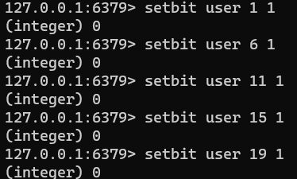
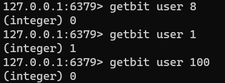
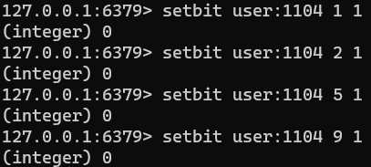
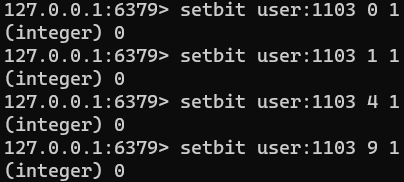
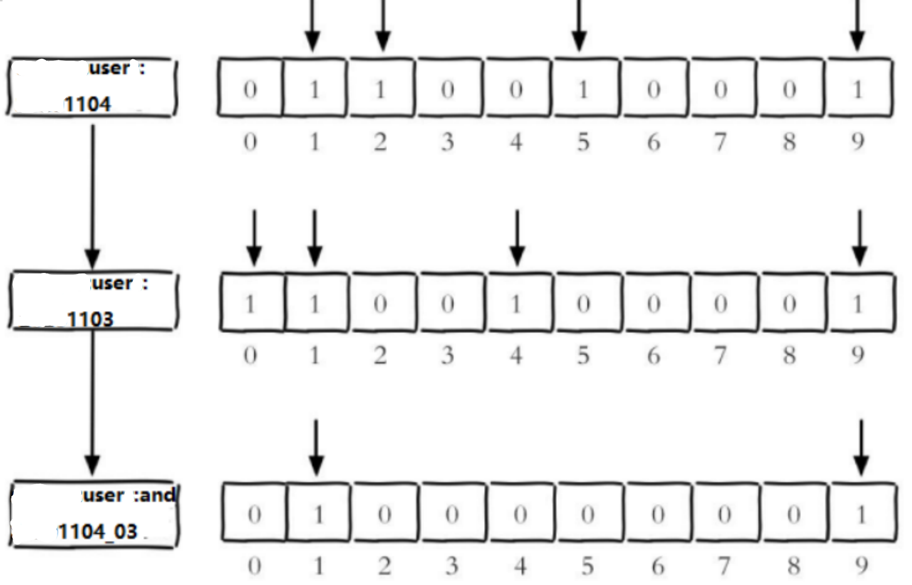

现代计算机用二进制（位） 作为信息的基础单位， 1个字节等于8位， 例如“abc”字符串是由3个字节组成， 但实际在计算机存储时将其用二进制表示， “abc”分别对应的ASCII码分别是97、 98、 99， 对应的二进制分别是01100001、 01100010和01100011，如下图


合理地使用操作位能够有效地提高内存使用率和开发效率。

Redis提供了Bitmaps这个“数据类型”可以实现对位的操作：

1. Bitmaps本身不是一种数据类型， 实际上它就是字符串（key-value） ， 但是它可以对字符串的位进行操作。
2. Bitmaps单独提供了一套命令， 所以在Redis中使用Bitmaps和使用字符串的方法不太相同。 可以把Bitmaps想象成一个以'位'为单位的数组， 数组的每个单元只能存储0和1， 数组的下标在Bitmaps中叫做偏移量。


#### setbit

* `setbit <key> <offset> <value>` ：设置Bitmaps中某个偏移量的值（0或1）
  * offset：偏移量从0开始


实例：每个独立用户是否访问过网站存放在Bitmaps中， 将访问的用户记做1， 没有访问的用户记做0， 用偏移量作为用户的id。

设置键的第offset个位的值（从0算起），假设现在有20个用户，userid=1、6、11、15、19 的用户对网站进行了访问， 那么当前Bitmaps初始化结果如图：





很多应用的用户id以一个指定数字（例如10000） 开头， 直接将用户id和Bitmaps的偏移量对应势必会造成一定的浪费， 通常的做法是每次做setbit操作时将用户id减去这个指定数字。

> 在第一次初始化Bitmaps时，假如偏移量非常大，整个初始化过程执行会比较慢，可能会造成Redis的阻塞。


#### getbit

* `getbit <key> <offset>` ：获取Bitmaps中某个偏移量的值，获取键的第offset位的值（从0开始算）


实例：获取id=8的用户是否访问过， 返回0说明没有访问过：




因为100根本不存在，所以也是返回0


#### bitcount

统计**字符串**被设置为1的bit数。一般情况下，给定的整个字符串都会被进行计数，通过指定额外的 start 或 end 参数，可以让计数只在特定的位上进行。

start 和 end 参数的设置，都可以使用负数值：比如 -1 表示最后一个位，而 -2 表示倒数第二个位，start、end 是指bit组的字节的下标数，二者皆包含。

* `bitcount <key> [start end]` ：统计字符串从start字节到end字节比特值为1的数量


实例：计算访问的用户数量


start和end代表起始和结束字节数，下面操作计算用户id在第1个字节到第3个字节之间的独立访问用户数， 对应的用户id是11，15， 19。


举例： K1 【01000001  01000000  00000000  00100001】，对应【0，1，2，3】

* `bitcount K1 1 2` ： 统计下标1、2字节组中bit=1的个数，即01000000  00000000
  * `bitcount K1 1 2` → 1
* `bitcount K1 1 3` ： 统计下标1、3字节组中bit=1的个数，即01000000  00000000  00100001
  * `bitcount K1 1 3` → 3
* `bitcount K1 0 -2`  ：统计下标0到下标倒数第2，字节组中bit=1的个数，即01000001  01000000   00000000
  * `bitcount K1 0 -2` → 3

> redis的setbit设置或清除的是bit位置，而bitcount计算的是byte位置


#### bitop

* `bitop  and(or/not/xor) <destkey> [key…]` ：bitop是一个复合操作，它可以做多个Bitmaps的and（交集）、or（并集）、not（非）、xor（异或）操作并将结果保存在destkey中。


实例：

11-04访问网站的userid=1,2,5,9。

```bash
setbit user:1104 1 1
setbit user:1104 2 1
setbit user:1104 5 1
setbit user:1104 9 1
```




11-03访问网站的userid=0,1,4,9。

```bash
setbit user:1103 0 1
setbit user:1103 1 1
setbit user:1103 4 1
setbit user:1103 9 1
```




计算出两天都访问过网站的用户数量：

```bash
bitop and user:and:1104_03 user:1103 user:1104
```





计算出任意一天都访问过网站的用户数量（例如月活跃就是类似这种），可以使用or求并集：

```bash
bitop or user:or:1104_03 user:1103 user:1104
```


### Bitmaps与set对比

假设网站有1亿用户，每天独立访问的用户有5千万，如果每天用集合类型和Bitmaps分别存储活跃用户可以得到表：

| 数据类型 | 每个用户id占用空间 | 需要存储的用户量 | 全部内存量              |
| -------- | ------------------ | ---------------- | ----------------------- |
| 集合类型 | 64位               | 50000000         | 64位\*50000000 = 400MB  |
| Bitmaps  | 1位                | 100000000        | 1位\*100000000 = 12.5MB |


很明显，这种情况下使用Bitmaps能节省很多的内存空间，尤其是随着时间推移节省的内存还是非常可观的：

| 数据类型 | 一天   | 一个月 | 一年  |
| -------- | ------ | ------ | ----- |
| 集合类型 | 400MB  | 12GB   | 144GB |
| Bitmaps  | 12.5MB | 375MB  | 4.5GB |


但Bitmaps并不是万金油，假如该网站每天的独立访问用户很少，例如只有10万（大量的僵尸用户），那么两者的对比如下表所示， 很显然，使用Bitmaps就不太合适了，因为基本上大部分位都是0。

| 数据类型 | 每个userid占用空间 | 需要存储的用户量 | 全部内存量              |
| -------- | ------------------ | ---------------- | ----------------------- |
| 集合类型 | 64位               | 100000           | 64位\*100000 = 800KB    |
| Bitmaps  | 1位                | 100000000        | 1位\*100000000 = 12.5MB |

