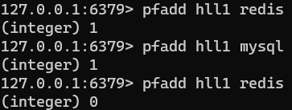
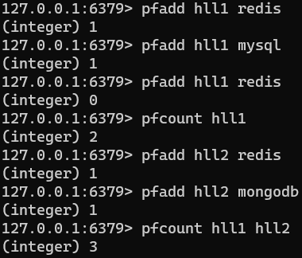
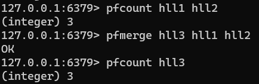

在工作当中，经常会遇到与统计相关的功能需求，比如统计网站PV（PageView页面访问量），可以使用Redis的incr、incrby轻松实现。

但像UV（UniqueVisitor，独立访客）、独立IP数、搜索记录数等需要去重和计数的问题如何解决？这种求集合中不重复元素个数的问题称为基数问题。

解决基数问题有很多种方案：

1. 数据存储在MySQL表中，使用distinct count计算不重复个数
2. 使用Redis提供的hash、set、bitmaps等数据结构来处理

以上的方案结果精确，但随着数据不断增加，导致占用空间越来越大，对于非常大的数据集是不切实际的。

能否能够降低一定的精度来平衡存储空间？Redis推出了HyperLogLog。

Redis HyperLogLog 是用来做基数统计的算法，HyperLogLog 的优点是，在输入元素的数量或者体积非常非常大时，计算基数所需的空间总是固定的、并且是很小的。

在 Redis 里面，每个 HyperLogLog 键只需要花费 12 KB 内存，就可以计算接近 2^64 个不同元素的基数。这和计算基数时，元素越多耗费内存就越多的集合形成鲜明对比。

但是，因为 HyperLogLog 只会根据输入元素来计算基数，而不会储存输入元素本身，所以 HyperLogLog 不能像集合那样，返回输入的各个元素。

 

> 什么是基数?
> 比如数据集 {1, 3, 5, 7, 5, 7, 8} 那么这个数据集的基数集为 {1, 3, 5 ,7, 8}，基数(不重复元素)为5。 基数估计就是在误差可接受的范围内，快速计算基数。

#### pfadd

* `pfadd <key> <element> [element ...]` ：添加指定元素到 HyperLogLog 中

实例：将所有元素添加到指定HyperLogLog数据结构中。如果执行命令后HLL估计的近似基数发生变化，则返回1，否则返回0。

#### pfcount

* `pfcount<key> [key ...]` ：计算HLL的近似基数，可以计算多个HLL，比如用HLL存储每天的UV，计算一周的UV可以使用7天的UV合并计算即可。

实例：

#### pfmerge

* `pfmerge <destkey> <sourcekey> [sourcekey ...]` ：将一个或多个HLL合并后的结果存储在另一个HLL中，比如每月活跃用户可以使用每天的活跃用户来合并计算可得

实例：

