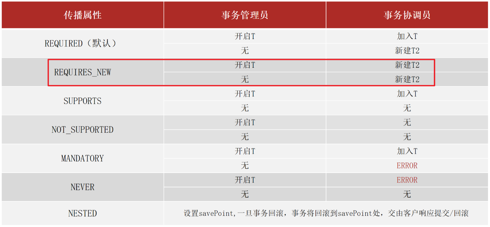

Spring 的声明式事务是采用声明的方式来处理事务。这里所说的声明，就是指在配置文件中声明，用在 Spring 配置文件中声明式的处理事务来代替代码式的处理事务。


事务管理不侵入开发的组件。具体来说，业务逻辑对象就不会意识到正在事务管理之中，事实上也应该如此，因为事务管理是属于系统层面的服务，而不是业务逻辑的一部分，如果想要改变事务管理策划的话，也只需要在定义文件中重新配置即可。

在不需要事务管理的时候，只要在设定文件上修改一下，即可移去事务管理服务，无需改变代码重新编译，这样维护起来极其方便。

**Spring 声明式事务控制底层就是AOP。**


## 七种不同传播特性

**REQUIRED**：默认的传播特性，如果当前没有事务，则新建一个事务，如果当前存在事务，则加入这个事务

* 如果a方法有事务 则不管b方法有无事务 都加入a的事务
* 如果a方法没有事务，则b方法新建一个事务（事务仅仅对b方法有效）


**SUPPORTS**：当前存在事务(a)，则加入当前事务(b加入)，如果当前没有事务（a），则以非事务的方式执行（整个a方法）


**MANDATORY**：当前存在事务，则加入当前事务，如果当前事务不存在，则抛出异常


**REQUIRED_NEW**：创建一个新事务，如果存在当前事务，则挂起改事务

* 若a方法有事务，则b方法创建一个事务，挂起a方法的事务。
* 若a方法没有事务，那b方法还是创建一个事务。那也就是和上面那句一样了执行效果


**NOT_SUPPORTED**：以非事务方式执行，如果存在当前事务，则挂起当前事务

* 若a方法有事务，则a方法的事务挂起，
* 如果a方法没有事务，那就没有事务咯


**NEVER**：不使用事务，如果当前事务存在，则抛出异常


**NESTED**：如果当前事务存在，则在嵌套事务中执行，否则REQUIRED的操作一样




## XML方式

1. 引入tx命名空间

```xml
<beans xmlns="http://www.springframework.org/schema/beans"
    xmlns:xsi="http://www.w3.org/2001/XMLSchema-instance"
    xmlns:context="http://www.springframework.org/schema/context"
    xmlns:aop="http://www.springframework.org/schema/aop"
    xmlns:tx="http://www.springframework.org/schema/tx"
    xsi:schemaLocation="
        http://www.springframework.org/schema/context
        http://www.springframework.org/schema/context/spring-context.xsd
        http://www.springframework.org/schema/aop
        http://www.springframework.org/schema/aop/spring-aop.xsd
        http://www.springframework.org/schema/tx 
        http://www.springframework.org/schema/tx/spring-tx.xsd
        http://www.springframework.org/schema/beans
        http://www.springframework.org/schema/beans/spring-beans.xsd">
```

2. 配置事务增强

```xml
<!--平台事务管理器-->
<bean id="transactionManager" 
    class="org.springframework.jdbc.datasource.DataSourceTransactionManager">
    <property name="dataSource" ref="dataSource"></property>
</bean>

<!--事务增强配置-->
<tx:advice id="txAdvice" transaction-manager="transactionManager">
    <tx:attributes>
        <tx:method name="*"/>
    </tx:attributes>
</tx:advice>
```

3. 配置事务 AOP 织入

```xml
<!--事务的aop增强-->
<aop:config>
    <aop:pointcut id="myPointcut" 
        expression="execution(* com.qaomuu.service.impl.*.*(..))"/>
    <aop:advisor advice-ref="txAdvice" pointcut-ref="myPointcut"></aop:advisor>
</aop:config>
```

4. 测试事务控制转账业务代码

```sql
@Override
public void transfer(String outMan, String inMan, double money) {
    accountDao.out(outMan,money);
    int i = 1/0;
    accountDao.in(inMan,money);
}
```


**`<tx:method>`** ：

代表切点方法的事务参数的配置

```xml
<tx:method name="transfer" isolation="REPEATABLE_READ" 
        propagation="REQUIRED" timeout="-1" read-only="false"/>
```

**参数：**

* name：切点方法名称
* isolation：事务的隔离级别
* propogation：事务的传播行为
* timeout：超时时间
* read-only：是否只读


## 注解方式

`@EnableTransactionManagement`：设置当前Spring环境中开启注解式事务支持

`@Transactional`：为当前业务层方法添加事务（如果设置在类或接口上方所有方法均添加事务）

属性：

* readOnly：true只读事务，false读写事务，增删改要设为false，查询设为true。
* timeout：设置超时时间单位秒，在多长时间之内事务没有提交成功就自动回滚，-1表示不设置超时时间。
* **rollbackFor：当出现指定异常进行事务回滚**
* noRollbackFor：当出现指定异常不进行事务回滚，**Spring的事务只会对`Error异常`和`RuntimeException异常`及其子类进行事务回滚，其他的异常类型不会回滚**

* rollbackForClassName：等同于rollbackFor，属性为异常的类全名字符串

* noRollbackForClassName：等同于noRollbackFor，属性为异常的类全名字符串
* isolation：设置事务的隔离级别
  * DEFAULT：默认隔离级别, 会采用数据库的隔离级别
  * READ\_UNCOMMITTED：读未提交
  * READ\_COMMITTED：读已提交
  * REPEATABLE\_READ：重复读取
  * SERIALIZABLE：串行化
* propagation：设置事务的传播行为


1.  编写 AccoutDao

```java
@Repository("accountDao")
public class AccountDaoImpl implements AccountDao {
    @Autowired
    private JdbcTemplate jdbcTemplate;

    public void out(String outMan, double money) {
        jdbcTemplate.update("update account set money=money-? where name=?",
            money, outMan);
    }
    
    public void in(String inMan, double money) {
        jdbcTemplate.update("update account set money=money+? where name=?",
            money, inMan);
    }
}
```

2.  编写 AccoutService

```java
@Service("accountService")
@Transactional
public class AccountServiceImpl implements AccountService {
    @Autowired
    private AccountDao accountDao;

    @Transactional(isolation = Isolation.READ_COMMITTED,
        propagation = Propagation.REQUIRED)
    public void transfer(String outMan, String inMan, double money) {
        accountDao.out(outMan,money);
        int i = 1/0;
        accountDao.in(inMan,money);
    }
}
```

3. 编写 applicationContext.xml 配置文件

```xml
<!--之前省略datsSource、jdbcTemplate、平台事务管理器的配置-->
<!--组件扫描-->
<context:component-scan base-package="com.qaomuu"/>
<!--事务的注解驱动-->
<tx:annotation-driven/>
```


1. 使用 @Transactional 在需要进行事务控制的类或是方法上修饰，注解可用的属性同 xml 配置方式，例如隔离级别、传播行为等。
2. 注解使用在类上，那么该类下的所有方法都使用同一套注解参数配置。
3. 使用在方法上，不同的方法可以采用不同的事务参数配置。
4. Xml配置文件中要开启事务的注解驱动`<tx:annotation-driven />`