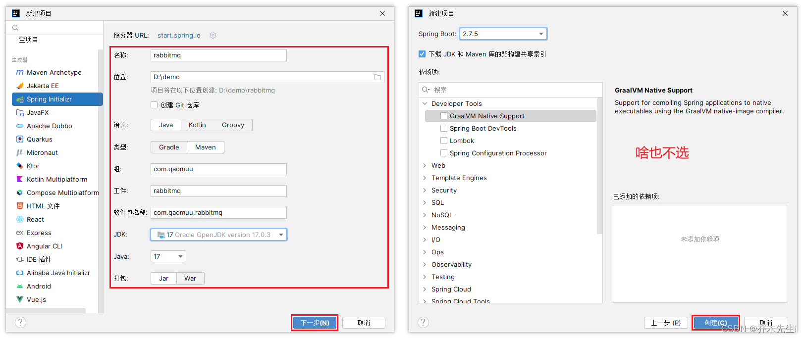

SpringAMQP是基于RabbitMQ封装的一套模板，并且还利用SpringBoot对其实现了自动装配，使用起来非常方便。

SpringAmqp的官方地址：[https://spring.io/projects/spring-amqp](https://spring.io/projects/spring-amqp)

## 创建项目



## 修改pom文件

将SpringBoot的版本改为2.3.4.RELEASE

```xml
<parent>
    <groupId>org.springframework.boot</groupId>
    <artifactId>spring-boot-starter-parent</artifactId>
    <version>2.3.4.RELEASE</version>
    <relativePath/> <!-- lookup parent from repository -->
</parent>
```


添加RabbitMQ依赖：

```xml
<!--RabbitMQ 依赖-->
<dependency>
    <groupId>org.springframework.boot</groupId>
    <artifactId>spring-boot-starter-amqp</artifactId>
</dependency>
<!--RabbitMQ 测试依赖-->
<dependency>
    <groupId>org.springframework.amqp</groupId>
    <artifactId>spring-rabbit-test</artifactId>
    <scope>test</scope>
</dependency>
```


其他依赖根据实际情况添加：

```xml
<dependency>
    <groupId>org.springframework.boot</groupId>
    <artifactId>spring-boot-starter-web</artifactId>
</dependency>

<dependency>
    <groupId>org.projectlombok</groupId>
    <artifactId>lombok</artifactId>
    <scope>provided</scope>
</dependency>
```


## 修改配置文件

```Plain Text
spring.rabbitmq.host=192.168.182.130
spring.rabbitmq.port=5672
spring.rabbitmq.username=admin
spring.rabbitmq.password=123123
```


## 创建配置文件类

创建两个队列 QA 和 QB，两者队列 TTL 分别设置为 10S 和 40S，然后在创建一个交换机 X 和死信交换机 Y，它们的类型都是direct，创建一个死信队列 QD，它们的绑定关系如下：


```java
import org.springframework.amqp.core.*;

@Configuration
public class TtlQueueConfig {

    public static final String X_EXCHANGE = "X";
    public static final String QUEUE_A = "A";
    public static final String QUEUE_B = "B";
    public static final String Y_DEAD_LETTER_EXCHANGE = "Y";
    public static final String DEAD_LETTER_QUEUE = "D";

    /**
     * 声明 X 交换机
     */
    @Bean("xExchange")
    public DirectExchange xExchange() {
        return new DirectExchange(X_EXCHANGE);
    }

    /**
     * 声明 Y 死信交换机
     */
    @Bean("yExchange")
    public DirectExchange yExchange() {
        return new DirectExchange(Y_DEAD_LETTER_EXCHANGE);
    }

    /**
     * 声明 A 队列，绑定死信交换机，并设置TTL时间为 10 秒
     */
    @Bean("aQueue")
    public Queue aQueue() {
        Map<String, Object> args = new HashMap<>(3);
        // 声明当前队列绑定的死信交换机
        args.put("x-dead-letter-exchange", Y_DEAD_LETTER_EXCHANGE);
        // 声明当前队列的死信路由 key
        args.put("x-dead-letter-routing-key", "YD");
        // 声明队列的 TTL
        args.put("x-message-ttl", 10000);
        return QueueBuilder.durable(QUEUE_A).withArguments(args).build();
    }

    /**
     * 声明 A 队列与 X 交换机绑定
     */
    @Bean
    public Binding aQueueBindingX(@Qualifier("aQueue") Queue aQueue,
                                  @Qualifier("xExchange") DirectExchange xExchange) {
        return BindingBuilder.bind(aQueue).to(xExchange).with("XA");
    }

    /**
     * 声明 B 队列，绑定死信交换机，并设置TTL时间为 40 秒
     */
    @Bean("bQueue")
    public Queue bQueue() {
        Map<String, Object> args = new HashMap<>(3);
        //声明当前队列绑定的死信交换机
        args.put("x-dead-letter-exchange", Y_DEAD_LETTER_EXCHANGE);
        //声明当前队列的死信路由 key
        args.put("x-dead-letter-routing-key", "YD");
        //声明队列的 TTL
        args.put("x-message-ttl", 40000);
        return QueueBuilder.durable(QUEUE_B).withArguments(args).build();
    }

    /**
     * 声明队列A与交换机X绑定
     */
    @Bean
    public Binding bQueueBindingX(@Qualifier("bQueue") Queue bQueue,
                                  @Qualifier("xExchange") DirectExchange xExchange) {
        return BindingBuilder.bind(bQueue).to(xExchange).with("XB");
    }

    /**
     * 声明死信队列 D
     */
    @Bean("dQueue")
    public Queue dQueue() {
        return new Queue(DEAD_LETTER_QUEUE);
    }

    /**
     * 声明死信队列 D 与死信交换机 Y 绑定
     */
    @Bean
    public Binding dDeadLetterQueueBindingY(@Qualifier("dQueue") Queue queueD,
                                            @Qualifier("yExchange") DirectExchange yExchange) {
        return BindingBuilder.bind(queueD).to(yExchange).with("YD");
    }
}
```


## 消息生产者

```java
@Slf4j
@RequestMapping("/ttl")
@RestController
public class SendMsgController {

    @Autowired
    private RabbitTemplate rabbitTemplate;

    @GetMapping("sendMsg/{message}")
    public void sendMsg(@PathVariable String message) {
        log.info("当前时间：{}，发送一条信息给两个 TTL 队列：{}", LocalDateTime.now(), message);
        rabbitTemplate.convertAndSend("X", "XA", "消息来自 ttl 为 10S 的队列: " + message);
        rabbitTemplate.convertAndSend("X", "XB", "消息来自 ttl 为 40S 的队列: " + message);
    }
}
```


## 消息消费者

```java
@Slf4j
@Component
public class DeadLetterQueueConsumer {

    @RabbitListener(queues = TtlQueueConfig.DEAD_LETTER_QUEUE)
    public void receiveD(Message message, Channel channel) {
        String msg = new String(message.getBody());
        log.info("当前时间：{}，收到死信队列信息{}", LocalDateTime.now(), msg);
    }
}
```


## 测试

启动项目，发起一个请求 `http://localhost:8080/ttl/sendMsg/124123` 


第一条消息在 10S 后变成了死信消息，然后被消费者消费掉，第二条消息在 40S 之后变成了死信消息，然后被消费掉，这样一个延时队列就打造完成了。