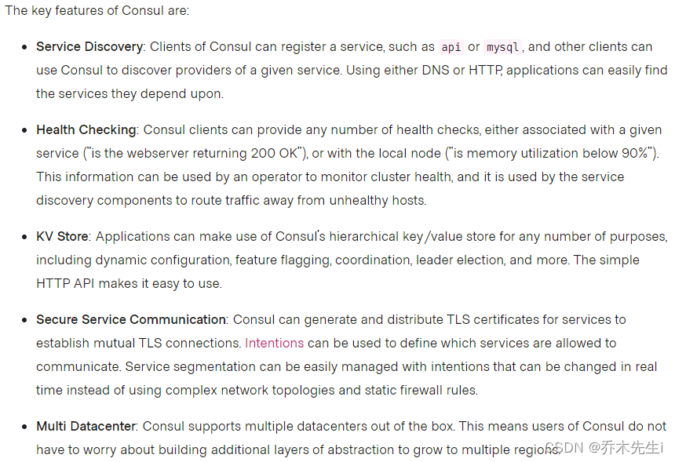
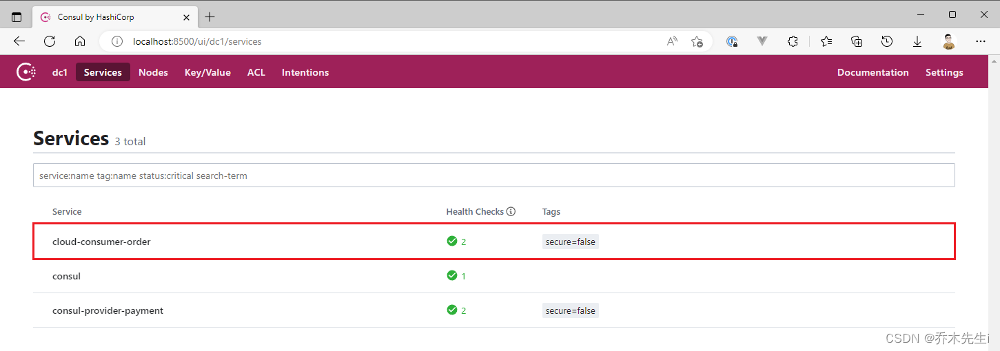
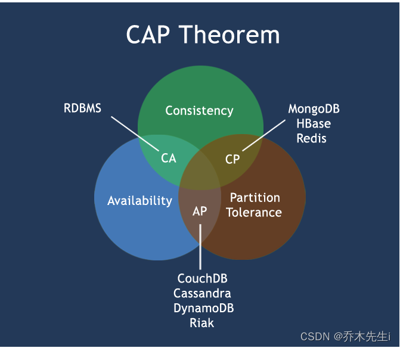
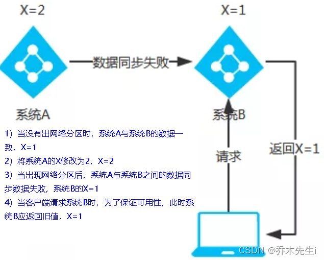
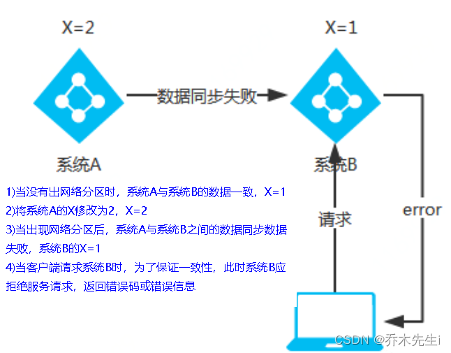

Consul 是一套开源的分布式服务发现和配置管理系统，由 HashiCorp 公司用 Go 语言开发。

提供了微服务系统中的服务治理、配置中心、控制总线等功能。这些功能中的每一个都可以根据需要单独使用，也可以一起使用以构建全方位的服务网格，总之Consul提供了一种完整的服务网格解决方案。

它具有很多优点。包括：基于raft协议，比较简洁； 支持健康检查，同时支持 HTTP 和 DNS 协议，支持跨数据中心的 WAN 集群，提供图形界面，跨平台，支持 Linux、Mac、Windows。

官网：[https://developer.hashicorp.com/consul/docs/intro](https://developer.hashicorp.com/consul/docs/intro)


SpringCloud Consul 具有如下特性：




* 服务发现：提供HTTP和DNS两种发现方式。
* 健康监测：支持多种方式，HTTP、TCP、Docker、Shell脚本定制化监控
* KV存储：Key、Value的存储方式
* 多数据中心：Consul支持多数据中心
* 可视化Web界面


## 下载&安装

下载地址：[https://www.consul.io/downloads.html](https://www.consul.io/downloads.html)

中文文档：[https://www.springcloud.cc/spring-cloud-consul.html](https://www.springcloud.cc/spring-cloud-consul.html)

下载后查看版本号：


使用开发模式启动：

```bash
consul agent -dev
```


通过http://localhost:8500访问Consul的首页：


## 服务提供者

新建一个maven工程，添加相关依赖

```xml
<!--SpringCloud consul-server -->
<dependency>
    <groupId>org.springframework.cloud</groupId>
    <artifactId>spring-cloud-starter-consul-discovery</artifactId>
</dependency>
```


配置yml文件：

```yaml
# consul服务端口号
server:
  port: 8006

spring:
  application:
    name: consul-provider-payment

# consul注册中心地址
  cloud:
    consul:
      host: localhost
      port: 8500
      discovery:
        #hostname: 127.0.0.1
        service-name: ${spring.application.name}
```


主启动类：

```java
@SpringBootApplication
@EnableDiscoveryClient //该注解用于向使用consul或者zookeeper作为注册中心时注册服务
public class PaymentMain8006 {
    public static void main(String[] args) {
        SpringApplication.run(PaymentMain8006.class, args);
    }
}
```


Controller，随便写一个接口，以检查是否注册进consul服务：

```java
@RestController
public class PaymentController {
    @Value("${server.port}")
    private String serverPort;

    @RequestMapping(value = "/payment/consul")
    public String paymentConsul() {
        return "springcloud with consul: " + serverPort + "\t   " + UUID.randomUUID();
    }
}
```


启动项目，可以在Consul的管理页面看到该服务：


调用接口，也是成功的：


## 服务消费者

创建一个Maven工程，pom文件和上面的服务提供者一样，

配置yml文件：

```yaml
# consul服务端口号
server:
  port: 80

spring:
  application:
    name: cloud-consumer-order

# consul注册中心地址
  cloud:
    consul:
      host: localhost
      port: 8500
      discovery:
        #hostname: 127.0.0.1
        service-name: ${spring.application.name}
```


主启动类加上`@EnableDiscoveryClient` 注解。

将RestTemplate加入到容器。

```java
@Bean
@LoadBalanced
public RestTemplate getRestTemplate() {
    return new RestTemplate();
}
```


使用RestTemplate调用服务提供者的接口：

```java
@RestController
public class OrderConsulController {
    public static final String INVOKE_URL = "http://consul-provider-payment";

    @Resource
    private RestTemplate restTemplate;

    @GetMapping(value = "/consumer/payment/consul")
    public String paymentInfo() {
        String result = restTemplate.getForObject(INVOKE_URL + "/payment/consul", String.class);
        return result;
    }
}
```


启动项目，服务消费者也注册进了Consul中，并且调用服务消费者的接口成功：




## 三个注册中心异同点

| **组件名** | **语言** | **CAP** | **服务健康检查** | **对外暴露接口** | **SpringCloud集成** |
| ---------- | -------- | ------- | ---------------- | ---------------- | ------------------- |
| Eureka     | Java     | AP      | 可配支持         | HTTP             | 已集成              |
| Consul     | Go       | CP      | 支持             | HTTP/DNS         | 已集成              |
| Zookeeper  | Java     | CP      | 支持             | 客户端           | 已集成              |


## CAP

* C：Consistency（强一致性）
* A：Availability（可用性）
* P：Partition tolerance（分区容错性）

CAP理论关注粒度是数据，而不是整体系统设计的策略

### 经典CAP图

最多只能同时较好的满足两个。

CAP理论的核心是：一个分布式系统不可能同时很好的满足一致性，可用性和分区容错性这三个需求，因此，根据 CAP 原理将 NoSQL 数据库分成了满足 CA 原则、满足 CP 原则和满足 AP 原则三 大类：

* CA - 单点集群，满足一致性，可用性的系统，通常在可扩展性上不太强大。
* CP - 满足一致性，分区容忍必的系统，通常性能不是特别高。
* AP - 满足可用性，分区容忍性的系统，通常可能对一致性要求低一些。




### AP(Eureka)

当网络分区出现后，为了保证可用性，系统B可以返回旧值，保证系统的可用性。

> 结论：违背了一致性C的要求，只满足可用性和分区容错，即AP




### CP(Zookeeper/Consul)

当网络分区出现后，为了保证一致性，就必须拒接请求，否则无法保证一致性

> 结论：违背了可用性A的要求，只满足一致性和分区容错，即CP



