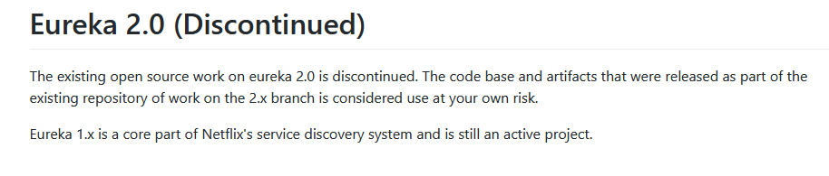
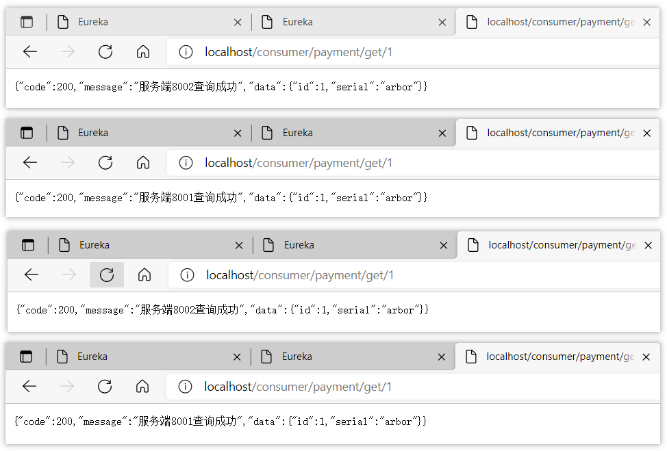

## 服务治理

Spring Cloud 封装了 Netflix 公司开发的 Eureka 模块来实现服务治理，在传统的rpc远程调用框架中，管理每个服务与服务之间依赖关系比较复杂，管理比较复杂，所以需要使用服务治理，管理服务于服务之间依赖关系，可以实现服务调用、负载均衡、容错等，实现服务发现与注册。


## Eureka概述

Eureka是基于REST（Representational State Transfer）服务，主要以AWS云服务为支撑，提供服务发现并实现负载均衡和故障转移。Eureka是一款由Netflix公司开发的服务注册组件，已经停止更新了。



## 基本原理

Eureka采用C-S的设计架构，包含Eureka Server 和Eureka Client两个组件

服务启动后向Eureka注册，Eureka Server会将注册信息向其他Eureka Server进行同步，当服务消费者要调用服务提供者，则向服务注册中心获取服务提供者地址，然后会将服务提供者地址缓存在本地，下次再调用时，则直接从本地缓存中取，完成一次调用。

### 服务注册与发现

Eureka Server 作为服务注册功能的服务器，它是服务注册中心。而系统中的其他微服务，使用 Eureka的客户端连接到Eureka Server 并维持心跳连接。这样系统的维护人员就可以通过 Eureka Server 来监控系统中各个微服务是否正常运行。

在服务注册与发现中，有一个注册中心。当服务器启动的时候，会把当前自己服务器的信息(比如服务地址通讯地址等)以别名方式注册到注册中心上。另一方(消费者|服务提供者)，以该别名的方式去注册中心上获取到实际的服务通讯地址，然后再实现本地RPC调用RPC远程调用框架。

> 核心设计思想：在于注册中心，因为使用注册中心管理每个服务与服务之间的一个依赖关系(服务治理概念)。在任何rpc远程框架中，都会有一个注册中心(存放服务地址相关信息(接口地址))


> **Eureka包含两个组件：Eureka Server和Eureka Client**


### Eureka Server提供服务注册服务

各个微服务节点通过配置启动后，会在EurekaServer中进行注册，这样EurekaServer中的服务注册表中将会存储所有可用服务节点的信息，服务节点的信息可以在界面中直观看到。


### EurekaClient通过注册中心进行访问

是一个Java客户端，用于简化Eureka Server的交互，客户端同时也具备一个内置的、使用轮询(round-robin)负载算法的负载均衡器。在应用启动后，将会向Eureka Server发送心跳(默认周期为30秒)。如果Eureka Server在多个心跳周期内没有接收到某个节点的心跳，EurekaServer将会从服务注册表中把这个服务节点移除（默认90秒）。

但是会存在当网络分区发生故障，导致该时间内没有心跳连接，但该服务本身还是健康运行的情况。Eureka通过“自我保护模式”来解决这个问题。在自我保护模式中，Eureka Server会保护服务注册表中的信息，不再注销任何服务实例。


## Eureka单机

### EurekaServer搭建

创建一个maven模块，添加依赖

```xml
<!-- eureka-server -->
<dependency>
    <groupId>org.springframework.cloud</groupId>
    <artifactId>spring-cloud-starter-netflix-eureka-server</artifactId>
</dependency>

<!-- cloud2018以前的版本 -->
<dependency>
    <groupId>org.springframework.cloud</groupId>
    <artifactId>spring-cloud-starter-eureka</artifactId>
</dependency>
```


配置application.yml文件

```yaml
# 端口号
server:
  port: 7001

eureka:
  instance:
    hostname: localhost #eureka服务端的实例名称
  client:
    #false表示不向注册中心注册自己。
    register-with-eureka: false
    #false表示自己端就是注册中心，维护服务实例，并不需要去检索服务
    fetch-registry: false
    service-url:
      #设置与Eureka Server交互的地址查询服务和注册服务都需要依赖这个地址。
      defaultZone: http://${eureka.instance.hostname}:${server.port}/eureka/
                          #     指向 localhost           指向  7001
```


编写主方法

```java
@SpringBootApplication
@EnableEurekaServer // 表示这个项目是服务注册中心
public class EurekaMain {
    public static void main(String[] args) {
        SpringApplication.run(EurekaMain.class, args);
    }
}
```


启动该项目，显示该页面表示服务注册中心启动成功


### EurekaCilent搭建

添加依赖

```xml
<dependency>
    <groupId>org.springframework.cloud</groupId>
    <artifactId>spring-cloud-starter-netflix-eureka-client</artifactId>
</dependency>

<!-- cloud2018以前的版本 -->
<dependency>
    <groupId>org.springframework.cloud</groupId>
    <artifactId>spring-cloud-starter-eureka</artifactId>
</dependency>
```


在启动类上加入该注解

```java
// 表示这个项目入驻Eureka
@EnableEurekaClient 
```


在application.yml文件中配置Eureka

```yaml
# 端口号
server:
  port: 8001

# 服务名
spring:
  application:
    # 这里的名字就是注册进Eureka的服务名
    name: cloud-payment-service 

eureka:
  client:
    # 表示是否将自己注册进EurekaServer默认为true。
    register-with-eureka: true
    # 是否从EurekaServer抓取已有的注册信息，默认为true。
    # 单节点无所谓，集群必须设置为true才能配合ribbon使用负载均衡
    fetchRegistry: true
    service-url:
      defaultZone: http://localhost:7001/eureka
                #   指向服务注册中心的url
```


启动项目，需要先启动eureka的服务端，进入服务端的服务注册中心页面，看到Client端的服务名表示注册成功


## Eureka集群

Eureka是SpringCloud应用中的注册中心，用来提供服务注册与发现功能。在实际生产活动中，如果单机部署的Eureka服务发生宕机，虽然已注册到Eureka的微服务可以被其客户端记录并保留，但无法再提供故障节点的剔除与新服务节点的发现功能。

Eureka集群则可以创建多个Eureka应用，互相之间同步客户端注册信息，又可以独立提供服务发现与注册服务。

其实Eureka本身就是为集群部署而设计的，所以部署Eureka集群需要修改的配置项并不多。


### EurekaServer集群

> 互相注册，相互守望

在学习阶段集群是部署在同一台电脑上的，eureka服务端的实例名称会是一样的，需要修改一下系统的映射配置。在`C:\Windows\System32\drivers\etc`文件夹下找到hosts文件。


将自己的集群信息进行配置进去


修改原来的application.yml文件，将其变更为集群的环境

```yaml
# 端口号
server:
  port: 7001

eureka:
  instance:
    # eureka服务端的实例名称
    hostname: eureka7001.com 
  client:
    # false表示不向注册中心注册自己。
    register-with-eureka: false
    # false表示自己端就是注册中心，我的职责就是维护服务实例，并不需要去检索服务
    fetch-registry: false
    service-url:
      # 设置与Eureka Server交互的地址查询服务和注册服务都需要依赖这个地址。
      defaultZone: http://eureka7002.com:7002/eureka/
                      # 指向7002的服务中心
```


新建一个模块，pom.xml和主启动类不变。application.yml配置为7002的服务中心

```yaml
# 端口号
server:
  port: 7002

eureka:
  instance:
    # eureka服务端的实例名称
    hostname: eureka7002.com 
  client:
    #false表示不向注册中心注册自己。
    register-with-eureka: false
    #false表示自己端就是注册中心，我的职责就是维护服务实例，并不需要去检索服务
    fetch-registry: false
    service-url:
      #设置与Eureka Server交互的地址查询服务和注册服务都需要依赖这个地址。
      defaultZone: http://eureka7001.com:7002/eureka/
                          # 指向7001服务中心
```


> 到目前为止就创建了两个eureka服务端，在service-url中，7001和7002相互指向。


启动两个服务，访问


当7001和7002服务互相指向的时候，说明集群搭建成功


> 相互注册，如果还有一台eureka服务端(7003)，则在配置yml文件的时候需要将7001指向7002和7003

```yaml
eureka:
  client:
    register-with-eureka: true
    fetchRegistry: true
    service-url:
      # 集群
      defaultZone: http://eureka7001.com:7001/eureka,http://eureka7002.com:7002/eureka

```


### EurekaCilent注册进Server集群

将服务注册中心的url配置为集群的url即可

```yaml
# defaultZone: http://localhost:7001/eureka  # 单机版
defaultZone: http://eureka7001.com:7001/eureka,http://eureka7002.com:7002/eureka  # 集群版
```

下面是完整的yml文件

```yaml
# 端口号
server:
  port: 8001

# 服务名
spring:
  application:
    # 这里的名字就是注册进Eureka的服务名
    name: cloud-payment-service 

eureka:
  client:
    #表示是否将自己注册进EurekaServer默认为true。
    register-with-eureka: true
    #是否从EurekaServer抓取已有的注册信息，默认为true。
    #单节点无所谓，集群必须设置为true才能配合ribbon使用负载均衡
    fetchRegistry: true
    service-url:
#      defaultZone: http://localhost:7001/eureka  # 单机版
      defaultZone: http://eureka7001.com:7001/eureka,http://eureka7002.com:7002/eureka  # 集群版
                #   指向服务注册中心的url
```


将四个微服务启动，**要先启动Server集群，后启动Client服务**


调用接口测试，一般即启动成功


此时，服务中心有两个，服务提供者确只有一个，下面搭建服务提供者的集群


### EurekaCilent集群

创建一个端口号为8002的服务提供模块：

```yaml
server:
  port: 8002

spring:
  application:
    name: cloud-payment-service

eureka:
  client:
    #表示是否将自己注册进EurekaServer默认为true。
    register-with-eureka: true
    #是否从EurekaServer抓取已有的注册信息，默认为true。单节点无所谓，集群必须设置为true才能配合ribbon使用负载均衡
    fetchRegistry: true
    service-url:
      #defaultZone: http://localhost:7001/eureka
      defaultZone: http://eureka7001.com:7001/eureka,http://eureka7002.com:7002/eureka  # 集群版
```


按顺序打开所有服务，此时已经注册了三个服务




### 负载均衡

> 现在的系统逻辑是：order服务使用RestTemplate调用payment服务，但现在payment有两台机器，之前的写法是ip+端口号写死的，现在则需要负载均衡到两台机器上。

```java
    @GetMapping("/consumer/payment/get/{id}")
    public CommonResult<Payment> getPayment(@PathVariable("id") Long id) {
        return restTemplate.getForObject("http://localhost:8001/payment/get/" + id, CommonResult.class);
    }
```


现在服务提供者有两台机器，可以让RestTemplate去选择调用哪一个，可以将调用变更为：

```java
private static final String PAYMENT_URL = "http://CLOUD-PAYMENT-SERVICE";

@GetMapping("/consumer/payment/get/{id}")
public CommonResult<Payment> getPayment(@PathVariable("id") Long id) {
    return restTemplate.getForObject(PAYMENT_URL + "/payment/get/" + id, CommonResult.class);
}
```

url和服务名是相互对应的


因为一个服务名下有多个服务，修改好之后，重启，此时RestTemplate并不知道到底要调用哪一个，就会报错：


**给RestTemplate赋予负载均衡的能力，**在声明RestTemplate的配置类中，加入`@LoadBalanced`注解

```java
@Configuration
public class ApplicationContextConfig {
    @Bean
    @LoadBalanced   // 赋予RestTemplate负载均衡的能力
    public RestTemplate getRestTemplate() {
        return new RestTemplate();
    }
}
```


再次重启后就可以通过服务名称直接调用服务，多次调用该接口，会发现是交替(轮询)的切换两个服务提供者，此时Consumer可以直接调用服务而不再关心地址和端口号，并且该服务还具备了负载均衡的功能


## 信息完善

### 修改服务名

在Eureka中，机器的名字默认显示的是`主机名:服务名:端口号` ，对于服务的机器辨识会比较模糊，如果是使用“1号机”、“5号机”等类似的名称可能更直观，如果有此方面的需求，可以进行修改服务名称。


需要引入以下两个依赖：

```xml
<dependency>
    <groupId>org.springframework.boot</groupId>
    <artifactId>spring-boot-starter-web</artifactId>
</dependency>
<dependency>
    <groupId>org.springframework.boot</groupId>
    <artifactId>spring-boot-starter-actuator</artifactId>
</dependency>
```


下面是修改后的yml文件：

```yaml
server:
  port: 8001

spring:
  application:
    name: cloud-payment-service

eureka:
  client:
    #表示是否将自己注册进EurekaServer默认为true。
    register-with-eureka: true
    #是否从EurekaServer抓取已有的注册信息，默认为true。
    fetchRegistry: true
    service-url:
      defaultZone: http://eureka7001.com:7001/eureka,http://eureka7002.com:7002/eureka
  instance:
      # 设置eureka服务注册中心中的主机名称
      instance-id: payment8001
```


修改过后的样子：


### IP信息显示

在yml文件中修改配置：

```yaml
eureka:
  client:
    register-with-eureka: true
    fetchRegistry: true
    service-url:
      defaultZone: http://eureka7001.com:7001/eureka,http://eureka7002.com:7002/eureka
  instance:
      instance-id: payment8001
      #访问路径可以显示IP地址
      prefer-ip-address: true
```


## 服务发现Discovery

对于注册进eureka里面的微服务，可以通过服务发现来获得该服务的信息


开启服务发现`@EnableDiscoveryClient`：

```java
@SpringBootApplication
@EnableEurekaClient
@EnableDiscoveryClient    // 开启服务发现
public class PaymentMain8001 {
    public static void main(String[] args) {
        SpringApplication.run(PaymentMain8001.class, args);
    }
}
```


修改Eureku中的客户端Controller：

```java
@Resource
private DiscoveryClient discoveryClient;

@GetMapping("/payment/discovery")
public Object discovery() {
    // 获得服务清单列表
    List<String> services = discoveryClient.getServices();
    for (String service : services) {
        log.info("service：{}", service);
    }
    // 一个微服务名称下面的所有实例
    List<ServiceInstance> instances = discoveryClient.getInstances("CLOUD-PAYMENT-SERVICE");
    for (ServiceInstance instance : instances) {
        log.info("{}\t{}\t{}\t{}", instance.getInstanceId(), instance.getHost(), 
            instance.getPort(), instance.getUri());
    }
    return this.discoveryClient;
}
```


通过服务发现类`DiscoveryClient`的`getServices()`方法，可以获取到服务的清单列表


通过`getInstances("CLOUD-PAYMENT-SERVICE");`方法可以得到该服务名下的所有实例的信息，该方法的传参就是服务名

两个方法的调用和输出，看到如下信息：


而web端打印的信息则是服务的列表，order表示的是当前服务的顺序


## 自我保护

> 某时刻某一个微服务不可用了，Eureka不会立刻清理，依旧会对该微服务的信息进行保存。属于CAP里面的AP分支。

保护模式主要用于一组客户端和Eureka Server之间存在网络分区场景下的保护。一旦进入保护模式，Eureka Server将会尝试保护其服务注册表中的信息，不再删除服务注册表中的数据，也就是不会注销任何微服务。

如果在Eureka Server的首页看到以下这段提示，则说明Eureka进入了保护模式：


**为什么会产生Eureka自我保护机制？**

> 为了防止EurekaClient可以正常运行，但是与EurekaServer网络不通情况下，EurekaServer不会立刻将EurekaClient服务剔除。


**什么是自我保护模式？**

> 默认情况下，如果EurekaServer在一定时间内没有接收到某个微服务实例的心跳，EurekaServer将会注销该实例（默认90秒）。但是当网络分区故障发生(延时、卡顿、拥挤)时，微服务与EurekaServer之间无法正常通信，以上行为可能变得非常危险了——因为微服务本身其实是健康的，此时本不应该注销这个微服务。Eureka通过“自我保护模式”来解决这个问题——当EurekaServer节点在短时间内丢失过多客户端时（可能发生了网络分区故障），那么这个节点就会进入自我保护模式。


在自我保护模式中，Eureka Server会保护服务注册表中的信息，不再注销任何服务实例。它的设计哲学就是宁可保留错误的服务注册信息，也不盲目注销任何可能健康的服务实例。

综上，自我保护模式是一种应对网络异常的安全保护措施。它的架构哲学是宁可同时保留所有微服务（健康的微服务和不健康的微服务都会保留）也不盲目注销任何健康的微服务。使用自我保护模式，可以让Eureka集群更加的健壮、稳定。


### 禁止自我保护

#### 服务端配置

在application.yml文件中加入配置

```yaml
eureka:
  instance:
    hostname: eureka7001.com
  client:
    register-with-eureka: false
    fetch-registry: false
    service-url:
      defaultZone: http://eureka7002.com:7002/eureka/
# ####################禁止自我保护####################
  server:
    # 关闭自我保护机制，保证不可用服务被及时清除
    enable-self-preservation: false
    # 2000毫秒没有反应就清除
    eviction-interval-timer-in-ms: 2000
```


配置好后，就能在eureka的页面看到如下信息：


#### 客户端配置

在application.yml配置文件中进行配置：

```yaml
eureka:
  client:
    register-with-eureka: true
    fetchRegistry: true
    service-url:
      defaultZone: http://eureka7001.com:7001/eureka,http://eureka7002.com:7002/eureka
  instance:
    instance-id: payment8001
    prefer-ip-address: true
    # ####################设置心跳时间####################
    # Eureka客户端向服务端发送心跳的时间间隔，单位为秒(默认是30秒)
    lease-renewal-interval-in-seconds: 1
    # Eureka服务端在收到最后一次心跳后等待时间上限，单位为秒(默认是90秒)，超时将剔除服务
    lease-expiration-duration-in-seconds: 2
```


配置成功后重启发现8001服务已经被注册进了eureka  


假设现在8001出现问题(关闭8001服务)，此时可以看到8001服务立刻被清除，不再进行自我保护机制  


