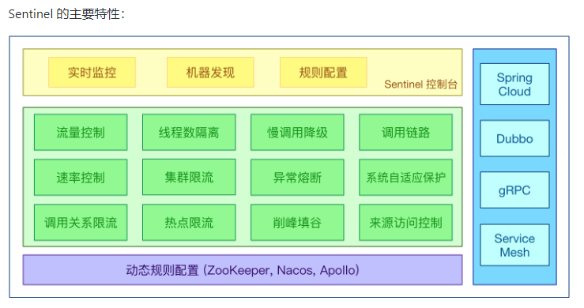

官网：[https://github.com/alibaba/Sentinel](https://github.com/alibaba/Sentinel)
中文文档：[https://sentinelguard.io/zh-cn/](https://sentinelguard.io/zh-cn/)



Spring官网：[https://spring-cloud-alibaba-group.github.io/github-pages/greenwich/spring-cloud-alibaba.html#_spring_cloud_alibaba_sentinel](https://spring-cloud-alibaba-group.github.io/github-pages/greenwich/spring-cloud-alibaba.html#_spring_cloud_alibaba_sentinel)

服务使用中的各种问题：

- 服务雪崩
- 服务降级
- 服务熔断
- 服务限流

sentinel组件由2部分构成：


## 安装

### 控制台

下载地址：[https://github.com/alibaba/Sentinel/releases](https://github.com/alibaba/Sentinel/releases)

启动：
```bash
java -Dserver.port=8080 -Dcsp.sentinel.dashboard.server=localhost:8501 -Dproject.name=sentinel-dashboard -jar sentinel-dashboard-1.8.8.jar
```

- `csp.sentinel.dashboard.server`：客户端的http地址

端口号是8080，[http://localhost:8080](http://localhost:8080/)，登录账号密码均为 `sentinel`

### 客户端

相关依赖：

```xml
<dependency>  
    <groupId>com.alibaba.cloud</groupId>  
    <artifactId>spring-cloud-starter-alibaba-sentinel</artifactId> 
</dependency>
```

yaml文件：

```yml
spring:
  cloud:  
  sentinel:  
    transport:  
      dashboard: 192.168.0.170:8080 # 指向Sentinel Dashboard  
      port: 8501                    # 本地客户端暴露的端口
    eager: true                     # 提前初始化Sentinel
```


