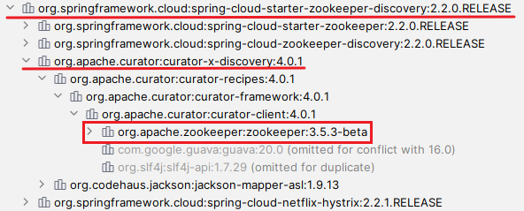
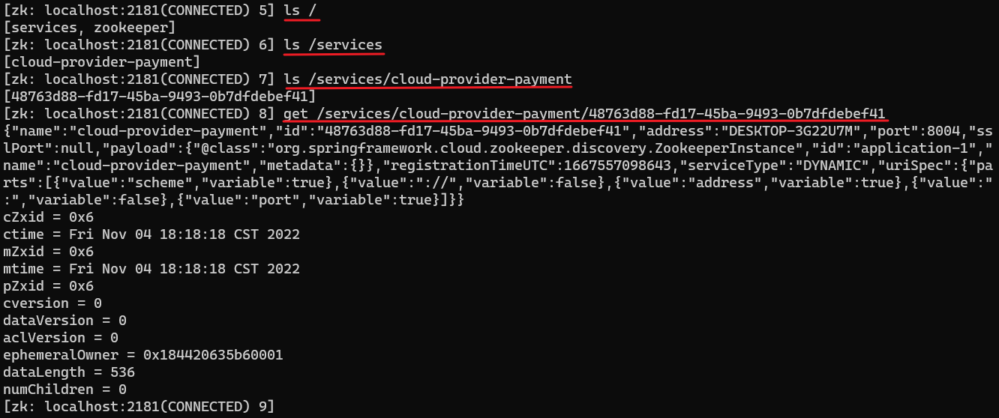

Zookeeper是一个分布式协调工具，可以实现注册中心功能。使用Zookeeper服务器取代Eureka服务器，作为服务注册中心。

## 快速安装

安装Docker

```bash
curl -sSL https://get.daocloud.io/docker | sh
systemctl enable --now docker
```


拉取zookeeper的镜像，创建并启动容器

```bash
docker pull zookeeper:3.4.9
docker run -d -e TZ="Asia/Shanghai" -p 2181:2181 -v /home/data/zookeeper:/data --name zookeeper --restart always zookeeper:3.4.9
```


关闭Linux服务器防火墙

```bash
systemctl stop firewalld
```


查看防火墙状态

```bash
systemctl status firewalld
```


进入Zookeeper容器

```bash
# 第一种方式：直接进入到zkCli中
docker run -it --rm --link zookeeper:zookeeper zookeeper zkCli.sh -server zookeeper

# 第二种方式：先进入容器，再进入到zkCli中
docker exec -it zookeeper bash
./bin/zkCli.sh
```


## 服务提供者

新建一个maven工程，添加相关依赖，版本号是3.4.9

```xml
<!-- SpringBoot整合zookeeper客户端 -->
<dependency>
    <groupId>org.springframework.cloud</groupId>
    <!-- 会包含3.5.3-bata的jar包，如下图，所以需要排除掉，并设置自己版本的依赖 -->
    <artifactId>spring-cloud-starter-zookeeper-discovery</artifactId>
    <!--先排除自带的zookeeper3.5.3-->
    <exclusions>
        <exclusion>
            <groupId>org.apache.zookeeper</groupId>
            <artifactId>zookeeper</artifactId>
        </exclusion>
    </exclusions>
</dependency>

<!--添加zookeeper3.4.9版本-->
<dependency>
    <groupId>org.apache.zookeeper</groupId>
    <artifactId>zookeeper</artifactId>
    <version>3.4.9</version>
</dependency>
```




配置yml文件：

```yaml
#8004表示注册到zookeeper服务器的支付服务提供者端口号
server:
  port: 8004
#服务别名----注册zookeeper到注册中心名称
spring:
  application:
    name: cloud-provider-payment
  cloud:
    zookeeper:
      # zookeeper的ip+端口
      connect-string: 192.168.182.130:2181
```


主启动类：

```java
@SpringBootApplication
@EnableDiscoveryClient //该注解用于向使用consul或者zookeeper作为注册中心时注册服务
public class PaymentMain8004 {
    public static void main(String[] args) {
        SpringApplication.run(PaymentMain8004.class, args);
    }
}
```


Controller，随便写一个接口，以检查是否注册进Zookeeper服务：

```java
@RestController
public class PaymentController {
    @Value("${server.port}")
    private String serverPort;

    @RequestMapping(value = "/payment/zk")
    public String paymentzk() {
        return "springcloud with zookeeper: " + serverPort + "\t" + UUID.randomUUID();
    }
}
```


启动项目后，进入Zookeeper客户端，可以看到：


调用接口：成功


**服务节点是临时节点还是持久节点？**

> 在服务运行的时候，把服务停掉，可以明确的看到Zookeeper会将停掉的节点给清除掉，所以服务节点是临时节点。重启后，得到的流水号也是不一样的。


## 服务消费者

创建一个Maven工程，pom文件和上面的服务提供者一样，

配置yml文件：

```yaml
server:
  port: 80

spring:
  application:
    name: cloud-consumer-order
  cloud:
  #注册到zookeeper地址
    zookeeper:
      connect-string: 192.168.182.130:2181
```


主启动类加上`@EnableDiscoveryClient` 注解。

将RestTemplate加入到容器。

```java
@Bean
@LoadBalanced
public RestTemplate getRestTemplate() {
    return new RestTemplate();
}
```


使用RestTemplate调用服务提供者的接口：

```java
@RestController
public class OrderZKController {
    public static final String INVOKE_URL = "http://cloud-provider-payment";

    @Resource
    private RestTemplate restTemplate;

    @GetMapping(value = "/consumer/payment/zk")
    public String paymentInfo() {
        return restTemplate.getForObject(INVOKE_URL + "/payment/zk", String.class);
    }
}
```


启动项目，服务消费者也注册进了Zookeeper中，并且调用服务消费者的接口成功：


