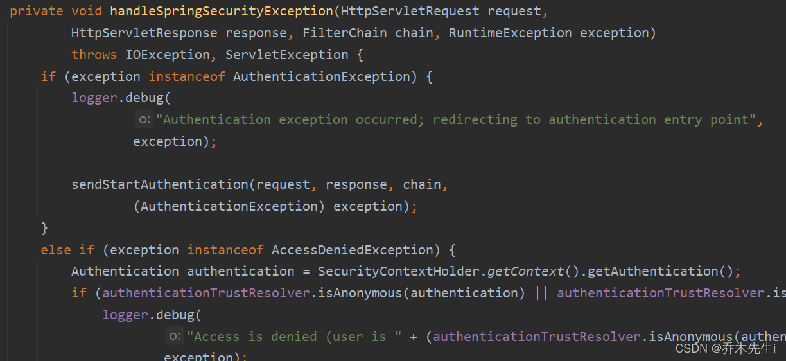

## 过滤器链

SpringSecurity 本质是一个过滤器链：
从启动是可以获取到过滤器链：
```java
org.springframework.security.web.context.request.async.WebAsyncManagerIntegrationFilter
org.springframework.security.web.context.SecurityContextPersistenceFilter 
org.springframework.security.web.header.HeaderWriterFilter
org.springframework.security.web.csrf.CsrfFilter
org.springframework.security.web.authentication.logout.LogoutFilter 
org.springframework.security.web.authentication.UsernamePasswordAuthenticationFilter 
org.springframework.security.web.authentication.ui.DefaultLoginPageGeneratingFilter 
org.springframework.security.web.authentication.ui.DefaultLogoutPageGeneratingFilter
org.springframework.security.web.savedrequest.RequestCacheAwareFilter
org.springframework.security.web.servletapi.SecurityContextHolderAwareRequestFilter
org.springframework.security.web.authentication.AnonymousAuthenticationFilter 
org.springframework.security.web.session.SessionManagementFilter 
org.springframework.security.web.access.ExceptionTranslationFilter 
org.springframework.security.web.access.intercept.FilterSecurityInterceptor
```

### FilterSecurityInterceptor

一个方法级的权限过滤器，基本位于过滤器链的最底部

此类实现了`Filter`接口，说明是一个过滤器


在`doFilter()`方法中执行了`invoke()`方法


### ExceptionTranslationFilter

异常过滤器，用来处理在认证授权过程中抛出的异常

在`doFilter()`方法中放行，在`handleSpringSecurityException()`方法中对不同的异常进行处理


### UsernamePasswordAuthenticationFilter 

对`/login`的 POST 请求做拦截，校验表单中用户名和密码。
`attemptAuthentication()`方法根据post请求中的用户名密码进行校验


往上看，`UsernamePasswordAuthenticationFilter`类是继承了抽象类`AbstractAuthenticationProcessingFilter`

在抽象类`AbstractAuthenticationProcessingFilter`中可以看到两个方法，上面的方法是用户名和密码认证成功后执行的代码，下面的则是认证失败执行的代码，所以在`UsernamePasswordAuthenticationFilter`过滤器中，登录认证成功或失败都会默认调用父类的方法

 


## 过滤器加载过程

1.  使用SpringSecurty配置过滤器，也就是SpringBoot项目中自动配置的`DelegatingFilterProxy`类

而在`doFilter()`方法各种判断过后调用了`initDelegate()`方法，在该方法里可以获取到`FilterChainProxy`对象

2. 在`FilterChainProxy`也会进入`doFilter()`方法，然后再进行各种判断后，会进入`doFilterInternal()`方法

而在`doFilterInternal()`方法中会将过滤器链中的过滤器加载进来，进行逐个执行


## 两个重要的接口

### UserDetailsService

当什么也没有配置的时候，账号和密码是由 Spring Security 定义生成的。而在实际项目中账号和密码都是从数据库中查询出来的。 所以要通过自定义逻辑控制认证逻辑。

如果需要自定义逻辑时，只需要实现 `UserDetailsService` 接口即可。

在 `UserDetailsService` 接口中只有一个方法`loadUserByUsername()`。
- 该方法的返回值是`UserDetails`接口的实现类对象，这个类是系统默认的用户 **“主体”** ，在Spring Security有一个`UserDetails`接口的实现类，类名就叫`User`。
- 该方法的参数`username`，表示用户名。此值是客户端表单传递过来的数据。默认情况下必须叫 username，否则无法接收。

```java
public interface UserDetailsService {
	UserDetails loadUserByUsername(String username) throws UsernameNotFoundException;
}
```

所以，使用该接口的步骤则是：
> 创建类继承`UsernamePasswordAuthenticationFilter `过滤器，并且重写该类中的三个方法(doFilter方法，认证成功的方法，认证失败的方法)
> 创建类实现`UserDetailsService `，编写查询数据的过程，返回User对象(该对象是Spring Security提供的对象)

### PasswordEncoder

数据加密接口，用于返回User对象里面密码加密，而`BCryptPasswordEncoder`类是`PasswordEncoder`的实现类。

BCryptPasswordEncoder 是 Spring Security 官方推荐的密码解析器，平时多使用这个解析器。
BCryptPasswordEncoder 是对 bcrypt 强散列方法的具体实现。是基于 Hash 算法实现的单向加密。可以通过 strength 控制加密强度，默认 10.

在PasswordEncoder接口中有三个方法：
- `String encode(CharSequence rawPassword)`：加密原始密码。而BCrypt实现类会随机生成的salt来进行加密。
- `boolean matches(CharSequence rawPassword, String encodedPassword)`：对加密的密码和传入的原始密码进行验证。如果密码匹配则返回true，否则返回false。存储的密码本身永远不会被解码。
	* `rawPassword`：原始密码，比如加密前密码是“123”，这里就传入“123”
	* `encodedPassword`：加密后的密码
- `boolean upgradeEncoding(String encodedPassword)`：如果加密后的密码需要重新加密以提高安全性，则返回true，否则返回false。默认返回false。
	* `encodedPassword`：加密后的密码


测试方法：

```java
public class BcryptTest {
    public static void main(String[] args) {
        // 用户密码
        String password = "123123";
        // 创建密码加密的对象
        BCryptPasswordEncoder passwordEncoder = new BCryptPasswordEncoder();
        // 密码加密
        String newPassword = passwordEncoder.encode(password);
        System.out.println("加密后的密码为：" + newPassword);

        // 校验这两个密码是否是同一个密码
        // matches方法第一个参数是原密码，第二个参数是加密后的密码
        boolean matches = passwordEncoder.matches(password, newPassword);
        System.out.println("两个密码一致:" + matches);
    }
}
```

执行结果：
