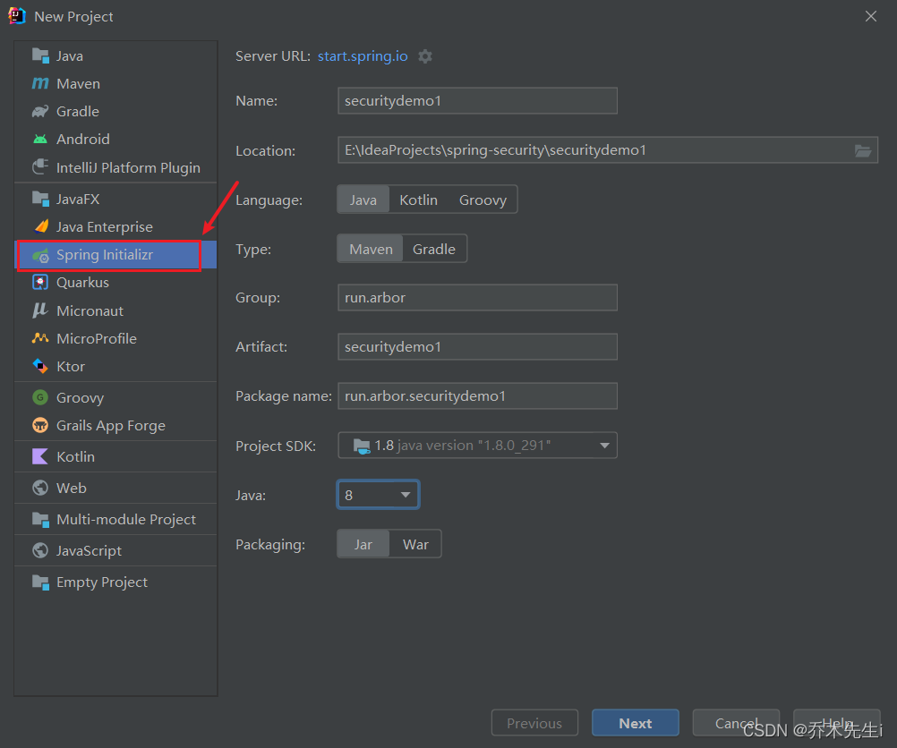
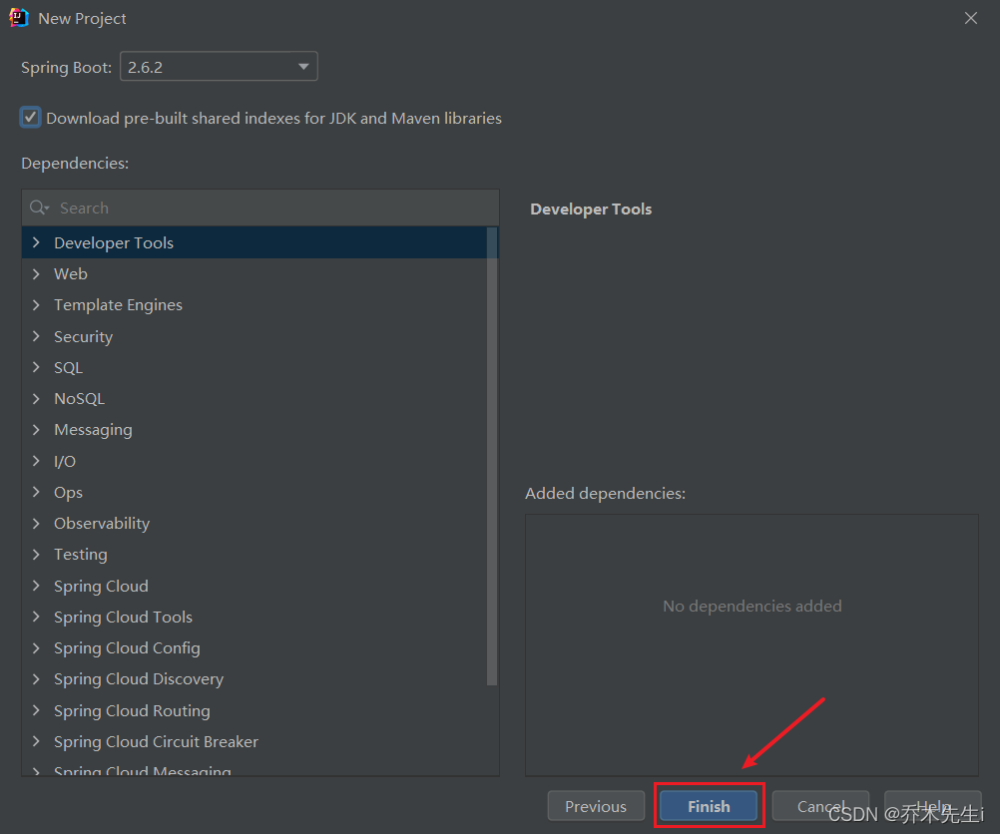
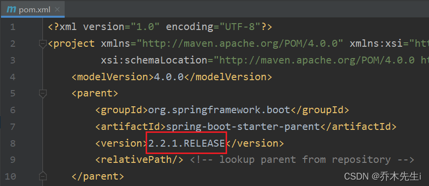
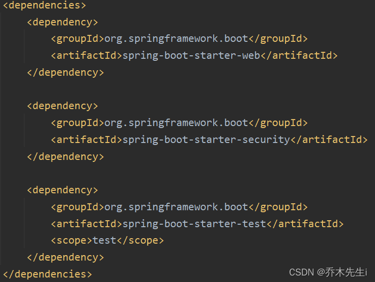
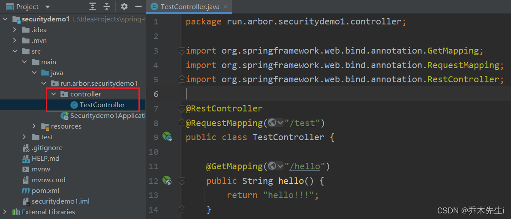
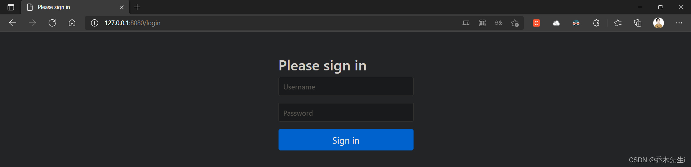
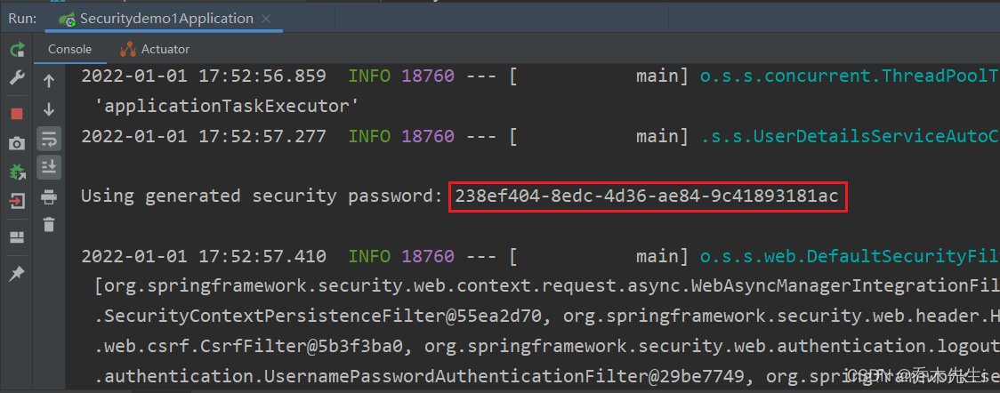
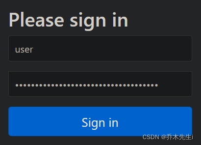
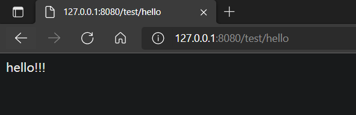

Spring 是非常流行和成功的 Java 应用开发框架，Spring Security 正是 Spring 家族中的成员。Spring Security 基于 Spring 框架，提供了一套 Web 应用安全性的完整解决方案。

关于安全方面的两个主要区域是 **“认证”** 和 **“授权”** （或者访问控
制），一般来说，Web 应用的安全性包括用户认证（Authentication）和用户授权（Authorization）两个部分，这两点也是 Spring Security 重要核心功能。

1. 用户认证指的是：验证某个用户是否为系统中的合法主体，也就是说用户能否访问该系统。用户认证一般要求用户提供用户名和密码。系统通过校验用户名和密码来完成认证过程。通俗点说就是==系统认为用户是否能登录==

2. 用户授权指的是验证某个用户是否有权限执行某个操作。在一个系统中，不同用户所具有的权限是不同的。比如对一个文件来说，有的用户只能进行读取，而有的用户可以进行修改。一般来说，系统会为不同的用户分配不同的角色，而每个角色则对应一系列的权限。通俗点讲就是==系统判断用户是否有权限去做某些事情==

SpringSecurity 特点：
- 和 Spring 无缝整合。
- 全面的权限控制。
- 专门为 Web 开发而设计。
	* 旧版本不能脱离 Web 环境使用。
	* 新版本对整个框架进行了分层抽取，分成了核心模块和 Web 模块。单独引入核心模块就可以脱离 Web 环境。
- 重量级。

Shiro 特点：
Apache 旗下的轻量级权限控制框架
- 轻量级。Shiro 主张的理念是把复杂的事情变简单。针对对性能有更高要求的互联网应用有更好表现。
- 通用性。
	* 好处：不局限于 Web 环境，可以脱离 Web 环境使用。
	* 缺陷：在 Web 环境下一些特定的需求需要手动编写代码定制。

Spring Security 是 Spring 家族中的一个安全管理框架，在 Spring Boot 出现之前，Spring Security 就已经发展了多年了，但是使用的并不多，安全管理这个领域，一直是 Shiro 的天下。

相对于 Shiro，在 SSM 中整合 Spring Security 都是比较麻烦的操作，所以，Spring Security 虽然功能比 Shiro 强大，但是使用反而没有 Shiro 多（Shiro 虽然功能没有Spring Security 多，但是对于大部分项目而言，Shiro 也够用了）。

自从有了 Spring Boot 之后，Spring Boot 对于 Spring Security 提供了自动化配置方案，可以使用更少的配置来使用 Spring Security。

因此，一般来说，常见的安全管理技术栈的组合是这样的：
> - SSM + Shiro
> - Spring Boot/Spring Cloud + Spring Security

以上只是一个推荐的组合而已，如果单纯从技术上来说，无论怎么组合，都是可以运行的。

## 入门案例

第一步：创建一个SpringBoot项目



第二步：修改SpringBoot的版本，修改为比较稳定的版本
`<version>2.2.1.RELEASE</version>`


将此项目更改为web项目，一共三个依赖



```xml
<dependency>
	<groupId>org.springframework.boot</groupId>
	<artifactId>spring-boot-starter-web</artifactId>
</dependency>

<dependency>
	<groupId>org.springframework.boot</groupId>
	<artifactId>spring-boot-starter-security</artifactId>
</dependency>
```

第三步：编写一个测试的controller


```java
@RestController
@RequestMapping("/test")
public class TestController {
    @GetMapping("/hello")
    public String hello() {
        return "hello!!!";
    }
}
```

第四步：启动SpringBoot项目，并且访问刚刚的接口，可以看到这样的页面，这就说明整合Security成功

第五步：Security默认有个账户是`user`，密码则是启动项目的时候控制台输出的密码，使用该账户密码进行登录，可以看到访问刚刚的接口成功




