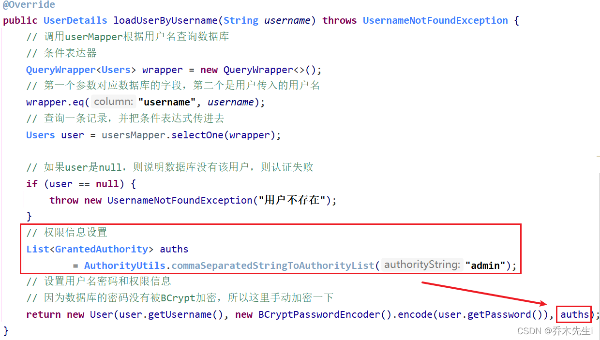
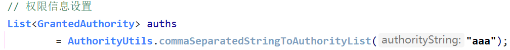
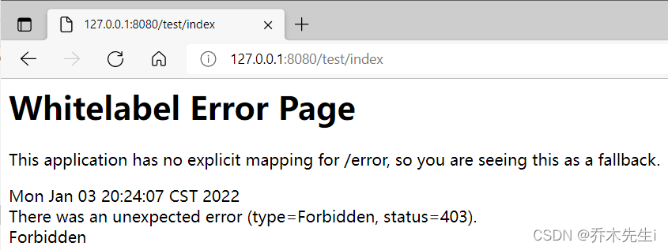
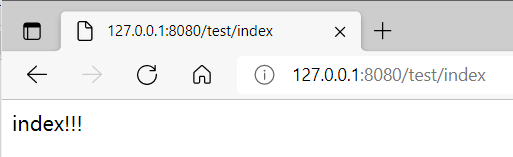
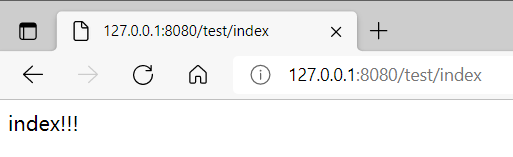
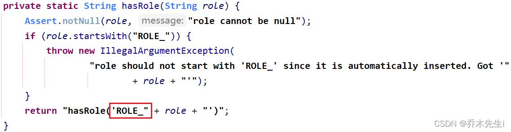
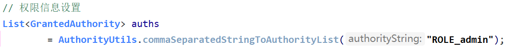

## 基于权限进行访问控制

### `hasAuthority()`方法

如果当前的主体具有指定的权限，则返回 true，否则返回 false
> 当前用户的权限必须和接口的权限完全一致，才允许访问

**第一步：在配置类中设置哪些地址要权限**
（不知道配置类的，看上一章）

```java
@Override
protected void configure(HttpSecurity http) throws Exception {
    // 定义自己编写的登录页面
    http.formLogin()
            .loginPage("/login.html")
            .loginProcessingUrl("/user/login")
            .defaultSuccessUrl("/test/index").permitAll()
            .and().authorizeRequests()
            .antMatchers("/", "/test/hello", "/user/login").permitAll()
            // 当前登录的用户，具有admin权限才可以访问这个路径
            .antMatchers("/test/index").hasAuthority("admin")
            .anyRequest().authenticated()
            .and().csrf().disable();
}
```

**第二步：在UserDetailsService中，用户登录的接口设置用户的权限**


**第三步：测试**
首先改成其他权限

登录后，出现403，说明权限设置成功


将用户权限变回admin，登录后访问成功


当一个接口有两个权限都可以访问的时候，此时如果用户的权限还只是admin，则访问不了，如果现在访问的话，则会出现`type=Forbidden, status=403`


所以这里需要使用`hasAnyAuthority()`方法。↓↓↓↓

### `hasAnyAuthority()`方法
如果当前的主体有任何提供的角色（给定的作为一个逗号分隔的字符串列表）的话，返回true.
> 当前用户的权限只要有一个和接口的权限匹配，就允许访问

所以上面的方法是必须得有所有的权限才能访问，而这个方法则是主要有其中一个权限就可以访问。

```java
@Override
protected void configure(HttpSecurity http) throws Exception {
    http.formLogin()
            .loginPage("/login.html")
            .loginProcessingUrl("/user/login")
            .defaultSuccessUrl("/test/index").permitAll()
            .and().authorizeRequests()
            .antMatchers("/", "/test/hello", "/user/login").permitAll()
            // 当前登录的用户，具有admin和user权限才可以访问这个路径
            // .antMatchers("/test/index").hasAuthority("admin,user")
            
            // 当前登录的用户，具有admin或user权限就可以访问这个路径
            .antMatchers("/test/index").hasAnyAuthority("admin,user")
            .anyRequest().authenticated()
            .and().csrf().disable();
}
```

现在进行测试：

接口执行成功！！

## 基于角色进行访问控制

### `hasRole`方法

如果当前主体具有指定的角色，则返回 true。
> 当前用户的角色必须和接口的角色完全一致，才允许访问


查看该方法的源码，可以发现该方法在角色的名字前加上了`ROLE_`，所以在配置用户的角色的时候，需要加上该字符串


**第一步：在配置类中配置哪些角色对应哪些接口**

```java
@Override
protected void configure(HttpSecurity http) throws Exception {
    http.formLogin()
            .loginPage("/login.html")
            .loginProcessingUrl("/user/login")
            .defaultSuccessUrl("/test/index").permitAll()
            .and().authorizeRequests()
            .antMatchers("/", "/test/hello", "/user/login").permitAll()
            // .antMatchers("/test/index").hasAuthority("admin,user")
            // .antMatchers("/test/index").hasAnyAuthority("admin,user")
            // 只有角色为ROLE_admin的用户才能访问
             .antMatchers("/test/index").hasRole("admin")
            .anyRequest().authenticated()
            .and().csrf().disable();
}
```

**第二步：在UserDetailsService中，给用户配置角色信息**
根本文的1.1的第二步类似


**第三步：测试**

执行成功！！


### `hasAnyRole()`方法
表示用户具备任何一个条件都可以访问。

> 当前用户的权限只要有一个和接口的权限匹配，就允许访问

只要用户是其中某一个角色，就可以访问接口

```java
@Override
protected void configure(HttpSecurity http) throws Exception {
    http.formLogin()
            .loginPage("/login.html")
            .loginProcessingUrl("/user/login")
            .defaultSuccessUrl("/test/index").permitAll()
            .and().authorizeRequests()
            .antMatchers("/", "/test/hello", "/user/login").permitAll()
            // .antMatchers("/test/index").hasAuthority("admin,user")
            // .antMatchers("/test/index").hasAnyAuthority("admin,user")
            // .antMatchers("/test/index").hasRole("admin")
            // 只要角色为ROLE_admin或者ROLE_user的用户就能访问
            .antMatchers("/test/index").hasAnyRole("admin,user")
            .anyRequest().authenticated()
            .and().csrf().disable();
}
```


