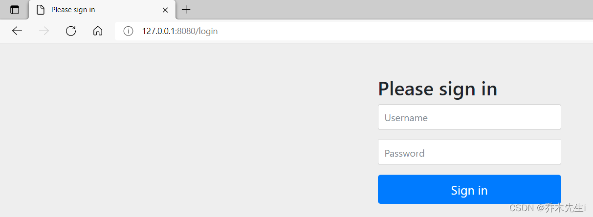
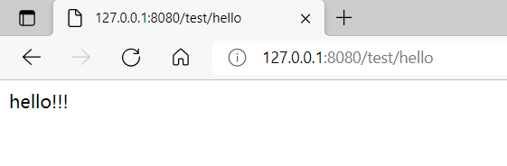
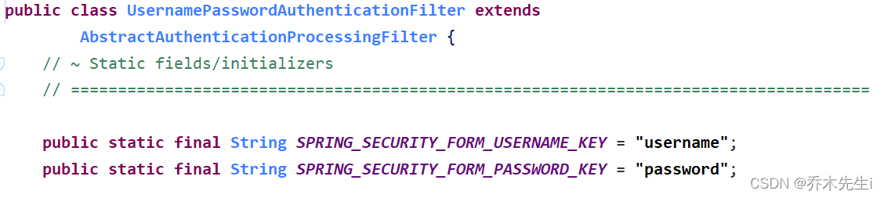
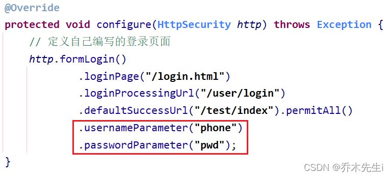
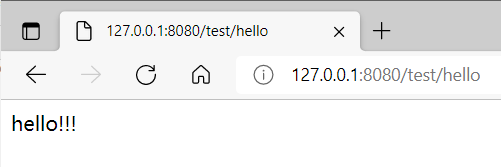
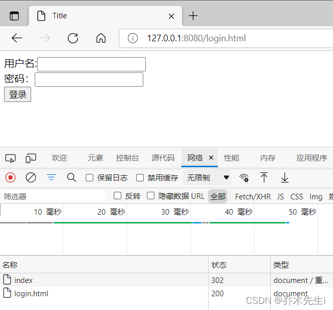
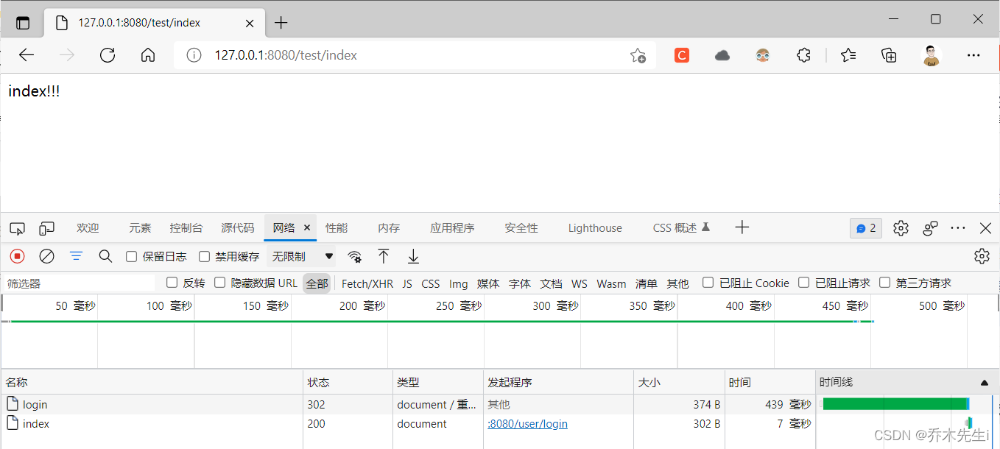

### 创建配置类

设置使用哪个UserDetailService实现类
将自定义的实现类注入进来并设置到`AuthenticationManagerBuilder`对象中

```java
@Configuration
public class SecurityConfig extends WebSecurityConfigurerAdapter {
    /**
     * 自动注入编写的实现类
     */
    @Autowired
    private UserDetailsService userDetailsService;

    @Bean
    PasswordEncoder passwordEncoder() {
        return new BCryptPasswordEncoder();
    }


    @Override
    protected void configure(AuthenticationManagerBuilder auth) throws Exception {
        // 将实现类对象和密码加密对象设置到用户认证的对象中
        auth.userDetailsService(userDetailsService)
                .passwordEncoder(passwordEncoder());
    }
}
```

### 编写UserDetailsService接口的实现类

返回User对象，User对象有用户名密码和操作权限

在实现类中定义自己的逻辑和查询，最终将用户名和密码封装到User对象中返回即可
```java
@Service
public class UsersService implements UserDetailsService {

    @Autowired
    private UsersMapper usersMapper;

    @Override
    public UserDetails loadUserByUsername(String username) throws UsernameNotFoundException {
        // 调用userMapper根据用户名查询数据库
        // 条件表达器
        QueryWrapper<Users> wrapper = new QueryWrapper<>();
        // 第一个参数对应数据库的字段，第二个是用户传入的用户名
        wrapper.eq("username", username);
        // 查询一条记录，并把条件表达式传进去
        Users user = usersMapper.selectOne(wrapper);

        // 如果user是null，则说明数据库没有该用户，则认证失败
        if (user == null) {
            throw new UsernameNotFoundException("用户不存在");
        }

        // 权限信息设置，后面详解
        List<GrantedAuthority> auths = AuthorityUtils.commaSeparatedStringToAuthorityList("role");
        // 设置用户名密码和权限信息
        // 因为数据库的密码没有被BCrypt加密，所以这里手动加密一下
        return new User(user.getUsername(), new BCryptPasswordEncoder().encode(user.getPassword()), auths);
    }
}
```

测试：
运行项目，调用`/test/hello`接口会进入下面的页面

在此输出用户名和密码，这里的username将会被传入第六步的`loadUserByUsername()`的方法中，并根据编写的逻辑进行校验，当用户名和密码都正确的时候，才会调用`/test/hello`接口


## 自定义登录页面、过滤不需要登录的接口

### 在配置类中实现相关配置

需要在配置类中重写`configure(HttpSecurity http)`方法

```java
@Override
protected void configure(HttpSecurity http) throws Exception {
    // 定义自己编写的登录页面
    http.formLogin()
        // 登录页面设置
        .loginPage("/login.html")
        // 登录访问的路径，登录的接口uri
        .loginProcessingUrl("/user/login")
        // 登录成功后跳转的路径
        .defaultSuccessUrl("/test/index").permitAll()
        // 定义哪些接口需要登录认证，哪些不需要登录认证
        .and().authorizeRequests()
        // 当访问下面两个路径的时候可以直接访问，不需要认证
        .antMatchers("/test/hello", "/user/login").permitAll()
        // 表示其他请求需要进行认证
        .anyRequest().authenticated()
        // 表示关闭csrf的认证防护
        .and().csrf().disable();
}
```

### 编写前端 index.html 页面

一个html基础的页面，请求时的参数名字必须是`username`和`password`，否则Security是得不到前端请求的用户名和密码的

在执行登录的时候会走一个过滤器 UsernamePasswordAuthenticationFilter定义好的字段名


如果想要修改配置可以调用`usernameParameter()`和`passwordParameter()`方法。
在第一步中的方法中调用


```html
<!DOCTYPE html>
<html lang="en">
<head>
    <meta charset="UTF-8">
    <title>Title</title>
</head>
<body>
<form action="/user/login" method="post">
    用户名:<input type="text" name="username"/>
    <br/>
    密码：<input type="password" name="password"/>
    <br/>
    <input type="submit" value="登录">
</form>
</body>
</html>
```


测试：
现在访问`/test/hello`可以看到，不需要认证可以直接访问



而访问`/tset/index`接口的时候被重定向到了`index.html`页面



输入正确的用户名和密码，就跳转到了上面第一步设置的接口中




