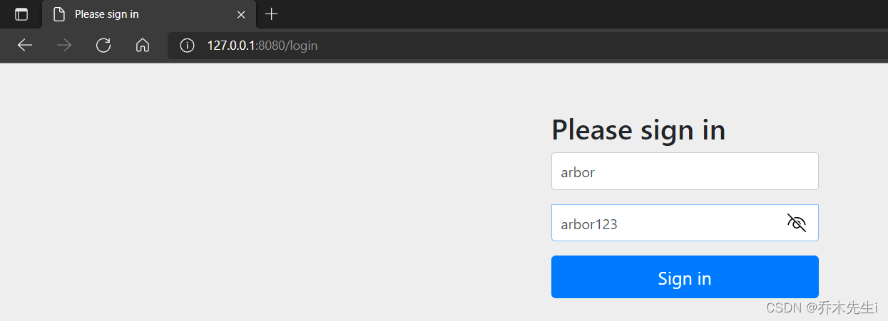
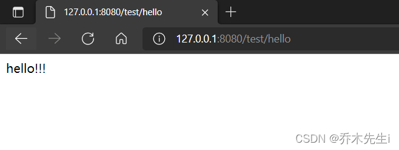
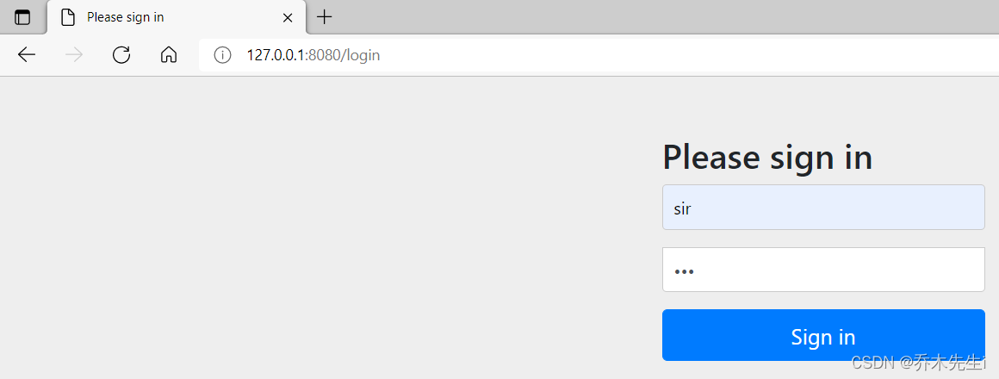
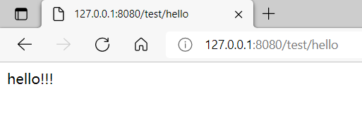
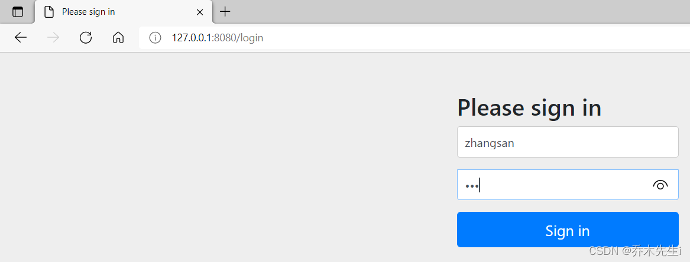
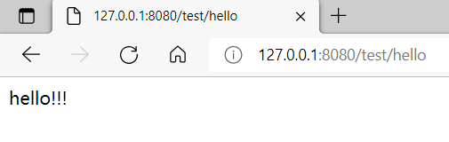

## 设置登录的用户名和密码

### 第一种方式：通过配置文件
在application配置文件中加入下面的配置

```java
spring.security.user.name=arbor
spring.security.user.password=arbor123
```

此时，认证的用户名和密码已经被改为`arbor`和`arbor123`，启动项目运行测试：


执行成功，说明修改的配置生效了


### 第二种方式：通过配置类
因为用的是同一个项目，所以先把第一种方式的配置文件进行注释

因为是配置类，所以需要加上`@Configuration`注解，并且此类需要继承`WebSecurityConfigurerAdapter `类，并重写`configure()`方法。
具体可以看下方代码的注释：

```java
@Configuration
public class SecurityConfig extends WebSecurityConfigurerAdapter {

    /**
     * 因为Security在认证用户的时候需要用到BCryptPasswordEncoder来进行密码校验
     * 所以需要手动创建一个BCryptPasswordEncoder的实例
     */
    @Bean
    PasswordEncoder passwordEncoder() {
        return new BCryptPasswordEncoder();
    }

    @Override
    protected void configure(AuthenticationManagerBuilder auth) throws Exception {
        // 创建密码加密对象
        BCryptPasswordEncoder bcpe = new BCryptPasswordEncoder();
        // 将密码"123"进行加密
        String password = bcpe.encode("123");

        // 将该对象放入内存
        auth.inMemoryAuthentication()
                // 设置用户名
                .withUser("sir")
                // 设置密码
                .password(password)
                // 设置角色信息
                .roles("admin");
    }
}
```

启动项目运行并测试：


执行成功

### 第三种方式【最常用】：自定义编写实现类
**第一步：创建配置类，设置使用哪个UserDetailService实现类**

跟上面第二种方式差不多，只不过将自定义的实现类注入进来并设置到`AuthenticationManagerBuilder`对象中

```java
@Configuration
public class SecurityConfigTest extends WebSecurityConfigurerAdapter {
    /**
     * 自动注入编写的实现类
     */
    @Autowired
    private UserDetailsService userDetailsService;

    @Bean
    PasswordEncoder passwordEncoder() {
        return new BCryptPasswordEncoder();
    }

    @Override
    protected void configure(AuthenticationManagerBuilder auth) throws Exception {
        // 将实现类对象和密码加密对象设置到用户认证的对象中
        auth.userDetailsService(userDetailsService)
                .passwordEncoder(passwordEncoder());
    }
}
```

**第二步：编写实现类，返回User对象，User对象有用户名密码和操作权限**

因为第一步注入的对象是`userDetailsService`，所以这里需要在`@Service`注解中配置名字。
返回一个`User`对象，里面包含了用户名、密码和权限信息，如果需要从数据库中查询来设置用户名密码和权限或者进行其他操作，可以在该方法中编写业务逻辑，后面会发文详解(可以在同系列专栏中查找)

```java
@Service("userDetailsService")
public class MyUserDetailsService implements UserDetailsService {
    @Override
    public UserDetails loadUserByUsername(String username) throws UsernameNotFoundException {
        // 权限信息设置
        List<GrantedAuthority> auths = AuthorityUtils.commaSeparatedStringToAuthorityList("role");
        // 设置用户名密码和权限信息
        return new User("zhangsan", new BCryptPasswordEncoder().encode("123"), auths);
    }
}
```

配置好后进行测试：


执行成功


