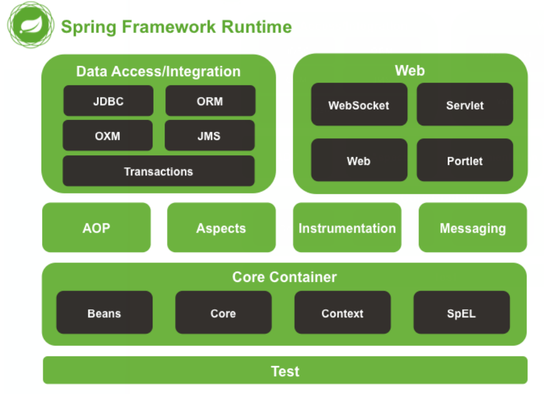

Spring是分层的 Java SE/EE应用 full-stack 轻量级开源框架，以 IoC（Inverse Of Control：反转控制）和AOP（Aspect Oriented Programming：面向切面编程）为内核。

提供了展现层 SpringMVC 和持久层 Spring JDBCTemplate 以及业务层事务管理等众多的企业级应用技术，还能整合开源世界众多著名的第三方框架和类库，逐渐成为使用最多的Java EE 企业应用开源框架。

**Spring的核心部分：IOC、AOP。**

* **IOC**：控制反转，把创建对象过程交给Spring进行管理
* **AOP**：面向切面，不修改源代码进行功能增强

**Spring的特点：**

* 方便解耦，简化开发
* AOP编程支持
* 方便程序测试
* 方便和其他框架进行整合
* 方便进行事务操作
* 降低API开发难度

## **Spring的发展历程**

* 1997 年 IBM 提出了 EJB 的思想
* 1998 年，SUN 制定开发标准规范 EJB1.0
* 1999 年，EJB1.1 发布
* 2001 年，EJB2.0 发布
* 2003 年，EJB2.1 发布
* 2006 年，EJB3.0 发布

Rod Johnson（spring 之父）

Expert One-to-One J2EE Design and Development(2002)

阐述了 J2EE 使用 EJB 开发设计的优点及解决方案

Expert One-to-One J2EE Development without EJB(2004)

阐述了 J2EE 开发不使用 EJB 的解决方式（Spring 雏形）

* 2017 年 9 月份发布了 spring 的最新版本 spring 5.0 通用版（GA）

## Spring的优势

**方便解耦，简化开发**

通过 Spring 提供的 IOC 容器，可以将对象间的依赖关系交由 Spring 进行控制，避免硬编码所造成的过度程序耦合。用户也不必再为单例模式类、属性文件解析等这些很底层的需求编写代码，可以更专注于上层的应用。

**AOP 编程的支持**

通过 Spring 的 AOP 功能，方便进行面向切面的编程，许多不容易用传统 OOP 实现的功能可以通过 AOP 轻松应付。

**声明式事务的支持**

可以将我们从单调烦闷的事务管理代码中解脱出来，通过声明式方式灵活的进行事务的管理，提高开发效率和质量。方便程序的测试可以用非容器依赖的编程方式进行几乎所有的测试工作，测试不再是昂贵的操作，而是随手可做的事情。

**方便集成各种优秀框架**

Spring 可以降低各种框架的使用难度，提供了对各种优秀框架（Struts、Hibernate、Hessian、Quartz等）的直接支持。

**降低 JavaEE API 的使用难度**

Spring 对 JavaEE API（如 JDBC、JavaMail、远程调用等）进行了薄薄的封装层，使这些 API 的使用难度大为降低。

**Java 源码是经典学习范例**

Spring 的源代码设计精妙、结构清晰、匠心独用，处处体现着大师对 Java 设计模式灵活运用以及对 Java 技术的高深造诣。它的源代码无意是 Java 技术的最佳实践的范例。

## Spring的体系结构

