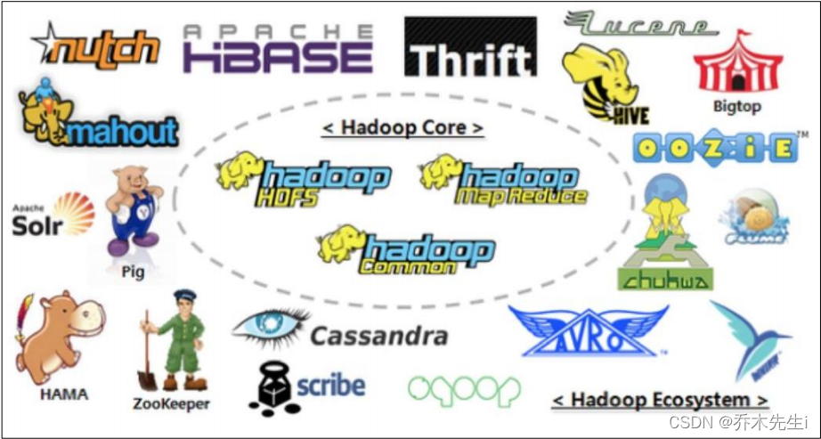
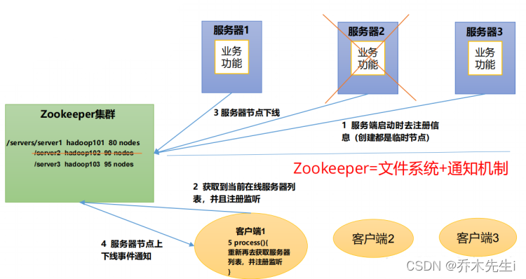
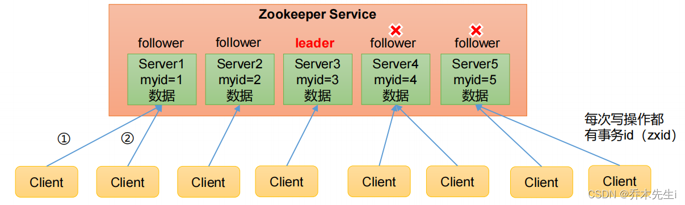
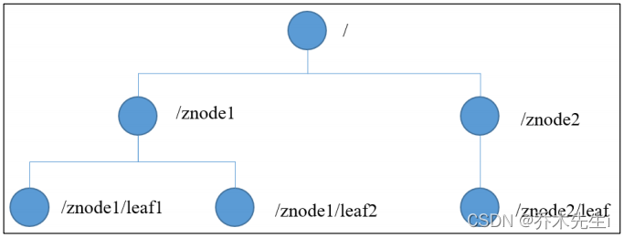
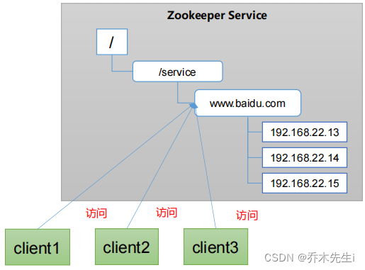
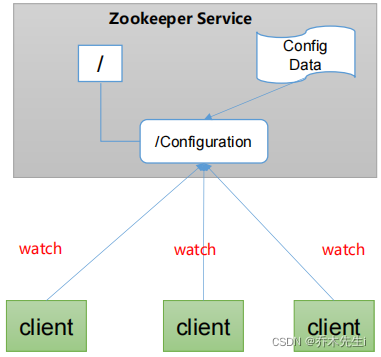
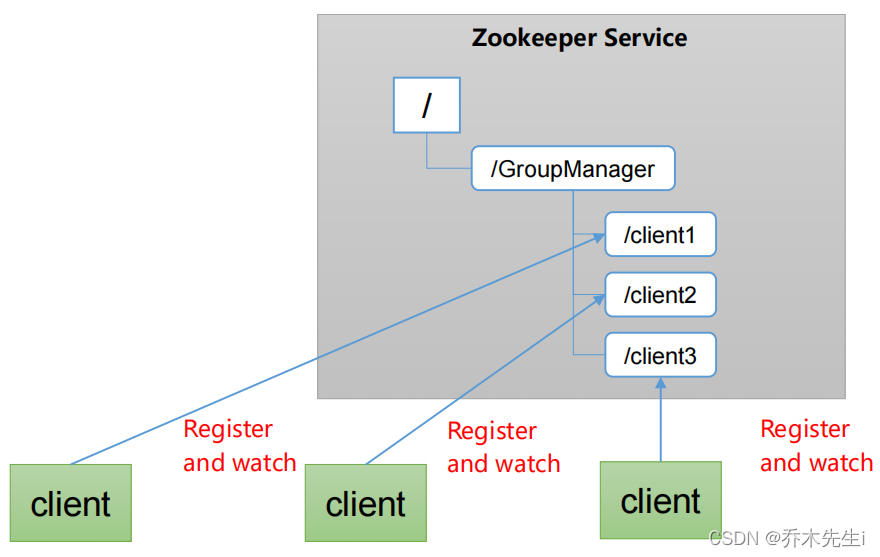
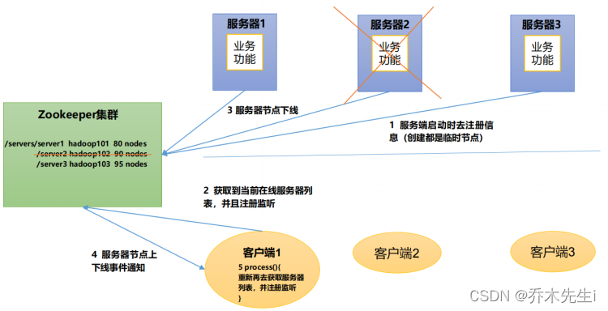
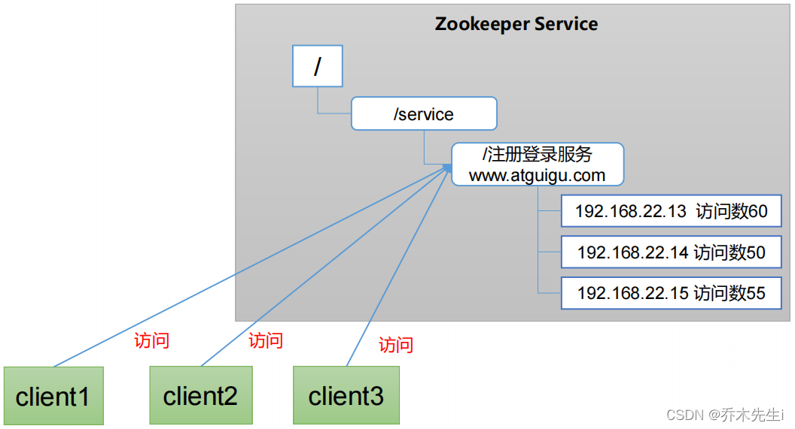
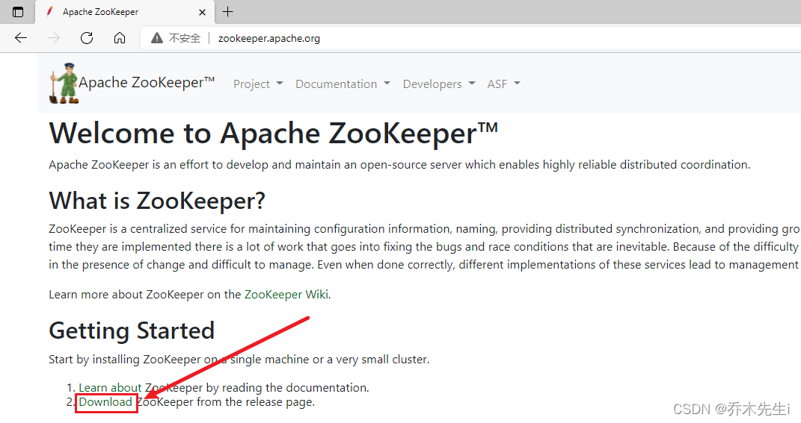

---
tags:
- ZooKeeper
---


Zookeeper 是一个开源的分布式的，为分布式框架提供协调服务的 Apache 项目。


## Zookeeper工作机制

Zookeeper从设计模式角度来理解：是一个基于观察者模式设计的分布式服务管理框架，它负责存储和管理大家都关心的数据，然后接受观察者的注册，一旦这些数据的状态发生变化，Zookeeper就将负责通知已经在Zookeeper上注册的那些观察者做出相应的反应。



## Zookeeper特点



- Zookeeper：一个领导者（Leader），多个跟随者（Follower）组成的集群。
- 集群中只要有半数以上节点存活，Zookeeper集群就能正常服务。所以Zookeeper适合安装奇数台服务器。
- 全局数据一致：每个Server保存一份相同的数据副本，Client无论连接到哪个Server，数据都是一致的。
- 更新请求顺序执行，来自同一个Client的更新请求按其发送顺序依次执行。
- 数据更新原子性，一次数据更新要么成功，要么失败。
- 实时性，在一定时间范围内，Client能读到最新数据。


## 数据结构

ZooKeeper 数据模型的结构与 Unix 文件系统很类似，整体上可以看作是一棵树，每个节点称做一个 ZNode。每一个 ZNode 默认能够存储 1MB 的数据，每个 ZNode 都可以通过其路径唯一标识。




## 应用场景

提供的服务包括：统一命名服务、统一配置管理、统一集群管理、服务器节点动态上下线、软负载均衡等。

### 统一命名服务

在分布式环境下，经常需要对应用/服务进行统一命名，便于识别。

例如：IP不容易记住，而域名容易记住。




### 统一配置管理

**分布式环境下，配置文件同步非常常见。**

- 一般要求一个集群中，所有节点的配置信息是一致的，比如 Kafka 集群。
- 对配置文件修改后，希望能够快速同步到各个节点上。

**配置管理可交由ZooKeeper实现。**

- 可将配置信息写入ZooKeeper上的一个Znode。
- 各个客户端服务器监听这个Znode。
- 一旦Znode中的数据被修改，ZooKeeper将通知各个客户端服务器。




### 统一集群管理

**分布式环境中，实时掌握每个节点的状态是必要的。**

- 可根据节点实时状态做出一些调整。

**ZooKeeper可以实现实时监控节点状态变化。**

- 可将节点信息写入ZooKeeper上的一个ZNode。
- 监听这个ZNode可获取它的实时状态变化。




### 服务器动态上下线

客户端能实时洞察到服务器上下线的变化。




### 软负载均衡

在Zookeeper中记录每台服务器的访问数，让访问数最少的服务器去处理最新的客户端请求。




## 下载
官网： [http://zookeeper.apache.org/](http://zookeeper.apache.org/)




## 安装
安装前需要现在系统中安装jdk没有的话可以看之前的文章

将`apache-zookeeper-3.5.7-bin.tar.gz`文件拷贝到虚拟机的Linux系统中
这里将文件传入到了`/opt`的一个目录下

执行命令，安装到`/opt/module/`中，没有这个文件夹可以新建一个，或者安装到其他文件夹中

```bash
tar -zxvf apache-zookeeper-3.5.7-bin.tar.gz -C /opt/module/
```

 
解压成功后可以看到对应的文件夹


创建一个文件夹，用于存放zookeeper的数据


复制这个文件夹的全路径


进入`conf`的文件夹，编辑`zoo_sample.cfg`文件


执行命令：
```bash
vim zoo_sample.cfg
i
```
将刚刚的命令复制到dataDir的位置

点击`ESC`键，退出插入模式，然后输入
```bash
:wq
```
回车后保存

将`zoo_sample.cfg`的文件名字改为`zoo.cfg`
```bash
mv zoo_sample.cfg zoo.cfg
```


### 启动服务端

回到zookeeper的主目录，执行命令

```bash
bin/zkServer.sh start
```


### 启动客户端

执行命令
```bash
bin/zkCli.sh
```


### 退出客户端

```bash
quit
```


### 关闭服务端

```bash
bin/zkServer.sh stop
```


## 配置参数

① tickTIme = 2000：通信心跳时间，ZooKeeper服务器与客户端的心跳时间，单位毫秒


② initLimit = 10：LF初始通信时限


Leader和Fllower初始连接时能容忍的最多心跳数(tickTime的数量，10就是10个心跳，这里一个心跳两秒就是20秒)


③ syncLimit = 5：LF同步通信时限


Leader和Fllower之间通信事件如果超过`syncLimit * tickTime`，Leader认为Follwer死掉，从服务器列表中删除Follwer。


④ dataDir：保存zookeeper中的数据
因为默认的目录是tmp目录，容易被Llinux系统定期删除，所以一般更改一个目录，而不使用tmp目录


⑤ clientPort = 2181：客户端连接的端口，通常不做修改


## 集群安装

这里使用三台服务器，都在`/opt/module/zookeeper-3.5.7/`安装并配置了zookeeper。具体可以看上一张zookeeper的安装

**第一步：给三台服务器的`zkData`目录下新建文件`myid`，里面填上对应的id，这里给第一台服务器设置为1，第二台为2，第三台为3**

**第二步：给`conf`目录下的`zoo.cfg`添加配置**
```bash
##########cluster##########
server.1=192.168.56.133:2888:3888
server.2=192.168.56.134:2888:3888
server.3=192.168.56.135:2888:3888
```


然后使用`:wq`保存退出

这里的配置参数是`server.A=B:C:D`，根据自己的修改：

> A：是一个数字，表示第几个服务器，在集群模式下，在第一步中操作的文件myid，这个文件实在dataDir目录下的，这个文件里面的一个数据就是A的值，ZooKepper启动时读取此文件，拿到里面的数据与zoo.cfg里面的配置信息比较，从而判断到底是哪个server。
> .
> B：当前服务器的地址
>.
> C：这个服务器Follower与集群中的Leader服务器交换信息的端口
> .
> D：万一集群中的Leader服务挂了，需要一个新的端口来的重新进行选举，选出一个新的Leader，而这个端口就是用来执行选举时服务器的相互通信的端口。

**第三步：启动一台服务器的服务端，并查看状态**

```bash
bin/zkServer.sh start
bin/zkServer.sh status
```


这里可以看到启动失败了，因为集群是要存活半数以上才能正常运行，这里只启动了一台，所以失败

**第四步：再启动一台服务器的zookeeper服务端服务**


这里可以看到，启动的这台被注册为follower，而另一台，也就是第一次启动的被注册为了leader


**第五步：启动最后一台机器，这里可以看到最后一台机器也被注册为了follower**

