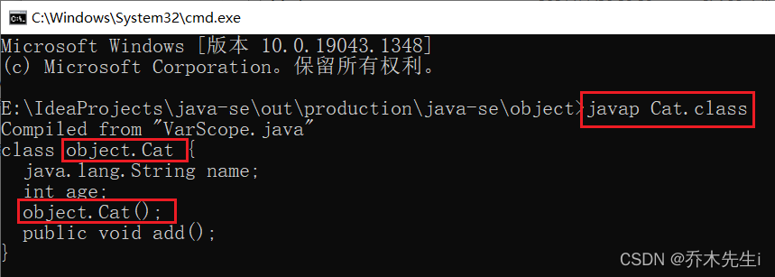

javap是JDK提供的一个命令行工具，javap能对给定的class文件提供的字节代码进行反编译。

通过它可以对照源代码和字节码，从而了解很多编译器内部的工作，对更深入地理解如何提高程序执行的效率等问题有极大的帮助。

**使用格式：**

`javap <options> <classes>`

**常用：** 

`javap -c -v 类名`

**举例：**

| 命令                  | 描述                                                    |
| :--------------------- |  :------------------------------------------------------- |
| -help    --help    -? | 输出此用法消息                                          |
| -version              | 版本信息                                                |
| -v    -verbose        | 输出附加信息                                            |
| -l                    | 输出行号和本地变量表                                    |
| -public               | 仅显示公共类和成员                                      |
| -protected            | 显示受保护的/公共类和成员                               |
| -package              | 显示程序包/受保护的/公共类和成员 (默认)                 |
| -p    -private        | 显示所有类和成员                                        |
| -c                    | 对代码进行反汇编                                        |
| -s                    | 输出内部类型签名                                        |
| -sysinfo              | 显示正在处理的类的系统信息 (路径，大小，日期，MD5 散列) |
| -constants            | 显示最终常量                                            |
| -classpath <path>     | 指定查找用户类文件的位置                                |
| -cp <path>            | 指定查找用户类文件的位置                                |
| -bootclasspath <path> | 覆盖引导类文件的位置                                    |
