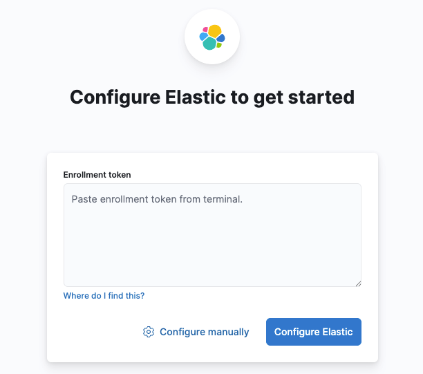
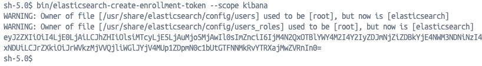
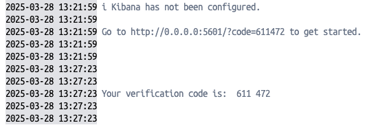
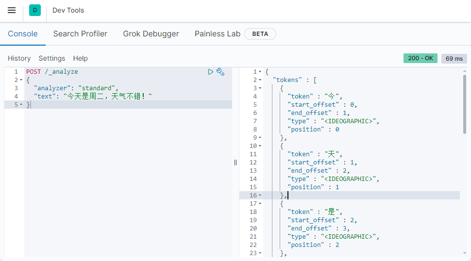
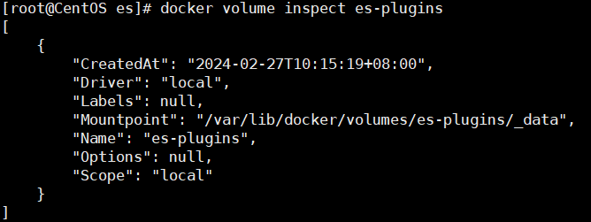
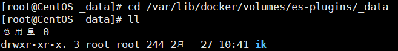
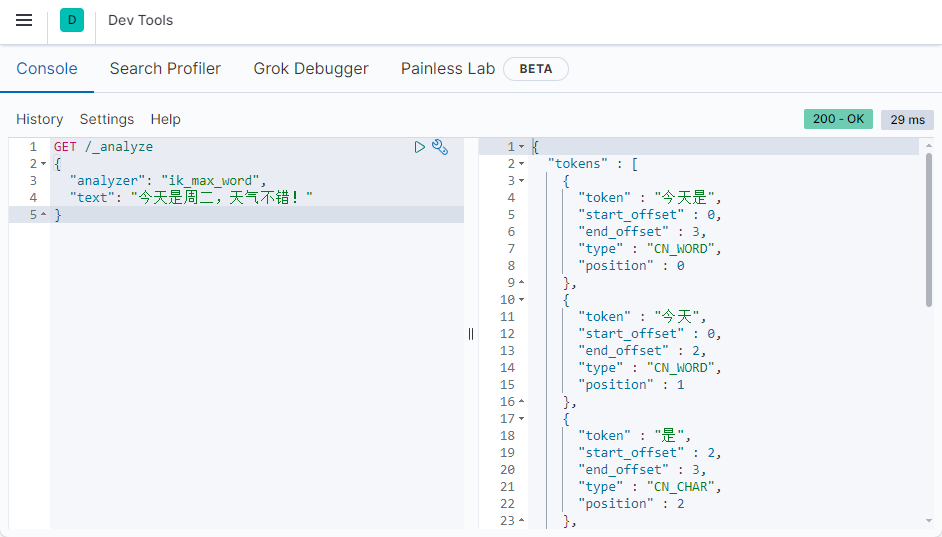
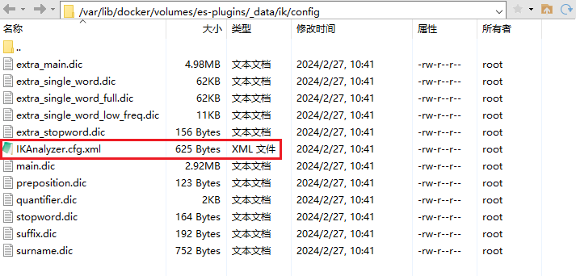
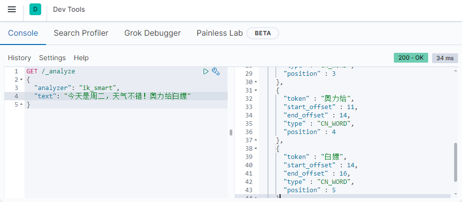

elasticsearch是一款非常强大的开源搜索引擎，可以从海量数据中快速找到需要的内容。

ELK技术栈：elasticsearch结合kibana、Logstash、Beats，也就是elastic stack（ELK）。被广泛应用在日志数据分析、实时监控等领域。
而elasticsearch是elastic stack的核心，负责存储、搜索、分析数据。


### elasticsearch和lucene

elasticsearch底层是基于**lucene**来实现的。

**Lucene**是一个Java语言的搜索引擎类库，是Apache公司的顶级项目，由DougCutting于1999年研发。官网地址：https://lucene.apache.org/ 。

**elasticsearch**的发展历史：

- 2004年Shay Banon基于Lucene开发了Compass
- 2010年Shay Banon 重写了Compass，取名为Elasticsearch。

相比与Lucene，elasticsearch具备下列优势：
- 支持分布式，可水平扩展
- 提供Restful接口，可被任何语言调用


目前比较知名的搜索引擎技术排名：

在早期，Apache Solr是最主要的搜索引擎技术，但随着发展elasticsearch已经渐渐超越了Solr，独占鳌头。

### 正向索引

如果是根据id查询，那么直接走索引，查询速度非常快。

但如果是基于title做模糊查询，只能是逐行扫描数据，流程如下：

1. 用户搜索数据，条件是title符合`"%手机%"`
2. 逐行获取数据，比如id为1的数据
3. 判断数据中的title是否符合用户搜索条件
4. 如果符合则放入结果集，不符合则丢弃。回到步骤1

逐行扫描，也就是全表扫描，随着数据量增加，其查询效率也会越来越低。当数据量达到数百万时，就是一场灾难。

### 倒排索引

倒排索引中有两个非常重要的概念：

- 文档（`Document`）：用来搜索的数据，其中的每一条数据就是一个文档。例如一个网页、一个商品信息
- 词条（`Term`）：对文档数据或用户搜索数据，利用某种算法分词，得到的具备含义的词语就是词条。例如：我是中国人，就可以分为：我、是、中国人、中国、国人这样的几个词条

**创建倒排索引**是对正向索引的一种特殊处理，流程如下：

- 将每一个文档的数据利用算法分词，得到一个个词条
- 创建表，每行数据包括词条、词条所在文档id、位置等信息
- 因为词条唯一性，可以给词条创建索引，例如hash表结构索引


倒排索引的**搜索流程**如下（以搜索"华为手机"为例）：

1. 用户输入条件`"华为手机"`进行搜索。
2. 对用户输入内容**分词**，得到词条：`华为`、`手机`。
3. 拿着词条在倒排索引中查找，可以得到包含词条的文档id：1、2、3。
4. 拿着文档id到正向索引中查找具体文档。


虽然要先查询倒排索引，再查询倒排索引，但是无论是词条、还是文档id都建立了索引，查询速度非常快！无需全表扫描。

### 正向和倒排

- **正向索引**是最传统的，根据id索引的方式。但根据词条查询时，必须先逐条获取每个文档，然后判断文档中是否包含所需要的词条，是**根据文档找词条的过程**。

- 而**倒排索引**则相反，是先找到用户要搜索的词条，根据词条得到保护词条的文档的id，然后根据id获取文档。是**根据词条找文档的过程**。

**正向索引**：
- 优点：
  - 可以给多个字段创建索引
  - 根据索引字段搜索、排序速度非常快
- 缺点：
  - 根据非索引字段，或者索引字段中的部分词条查找时，只能全表扫描。

**倒排索引**：
- 优点：
  - 根据词条搜索、模糊搜索时，速度非常快
- 缺点：
  - 只能给词条创建索引，而不是字段
  - 无法根据字段做排序

### es的一些概念

elasticsearch中有很多独有的概念，与mysql中略有差别，但也有相似之处。

#### 文档和字段

elasticsearch是面向 **文档（Document）** 存储的，可以是数据库中的一条商品数据，一个订单信息。文档数据会被序列化为json格式后存储在elasticsearch中：

而Json文档中往往包含很多的**字段（Field）**，类似于数据库中的列。

#### 索引和映射

**索引（Index）**，就是相同类型的文档的集合。

例如：

- 所有用户文档，就可以组织在一起，称为用户的索引；
- 所有商品的文档，可以组织在一起，称为商品的索引；
- 所有订单的文档，可以组织在一起，称为订单的索引；


因此，可以把索引当做是数据库中的表。

数据库的表会有约束信息，用来定义表的结构、字段的名称、类型等信息。索引库中就有**映射（mapping）**，是索引中文档的字段约束信息，类似表的结构约束。

#### mysql与elasticsearch

| **MySQL** | **Elasticsearch** | **说明**                                                     |
| --------- | ----------------- | ------------------------------------------------------------ |
| Table     | Index             | 索引(index)，就是文档的集合，类似数据库的表(table)           |
| Row       | Document          | 文档（Document），就是一条条的数据，类似数据库中的行（Row），文档都是JSON格式 |
| Column    | Field             | 字段（Field），就是JSON文档中的字段，类似数据库中的列（Column） |
| Schema    | Mapping           | Mapping（映射）是索引中文档的约束，例如字段类型约束。类似数据库的表结构（Schema） |
| SQL       | DSL               | DSL是elasticsearch提供的JSON风格的请求语句，用来操作elasticsearch，实现CRUD |

- Mysql：擅长事务类型操作，可以确保数据的安全和一致性
- Elasticsearch：擅长海量数据的搜索、分析、计算

因此在企业中，往往是两者结合使用：
- 对安全性要求较高的写操作，使用mysql实现
- 对查询性能要求较高的搜索需求，使用elasticsearch实现
- 两者再基于某种方式，实现数据的同步，保证一致性


## 部署单点es

创建网络：

因为还需要部署kibana容器，让es和kibana容器互联。这里先创建一个网络：

```bash
docker network create es-network
```

加载镜像：

```bash
docker pull elasticsearch:8.15.5
```


运行docker命令，部署单点es：

```bash
docker run -d --name elasticsearch --net es-network -p 9200:9200 -p 9300:9300 -e "discovery.type=single-node" elasticsearch:8.15.5
```

命令解释：

- `-e "cluster.name=es-docker-cluster"`：设置集群名称
- `-e "http.host=0.0.0.0"`：监听的地址，可以外网访问
- `-e "ES_JAVA_OPTS=-Xms512m -Xmx512m"`：JVM堆内存大小，默认是1G
- `-e "discovery.type=single-node"`：非集群模式
- `-v es-data:/usr/share/elasticsearch/data`：挂载逻辑卷，绑定es的数据目录
- `-v es-logs:/usr/share/elasticsearch/logs`：挂载逻辑卷，绑定es的日志目录
- `-v es-plugins:/usr/share/elasticsearch/plugins`：挂载逻辑卷，绑定es的插件目录
- `--privileged`：授予逻辑卷访问权
- `--network es-net` ：加入一个名为es-net的网络中
- `-p 9200:9200`：端口映射配置


**密码设置：**

> 官方文档配置密码：https://www.elastic.co/guide/en/elasticsearch/reference/7.12/security-minimal-setup.html#_enable_elasticsearch_security_features


```bash
# 随机生成密码
./bin/elasticsearch-setup-passwords auto

# 自己设置密码
./bin/elasticsearch-setup-passwords interactive
```

> 密码统一设置为：`es1019`

在kibana中使用 `elastic` 登录即可。


## 部署kibana

kibana可以给提供一个elasticsearch的可视化界面，便于学习。

运行docker命令，部署kibana

```bash
docker pull kibana:8.15.5
docker run -d --name kibana --net es-network -p 5601:5601 kibana:8.15.5
```

命令解释：

- `--network es-net` ：加入一个名为es-net的网络中，与elasticsearch在同一个网络中
- `-p 5601:5601`：端口映射配置


**连接elasticsearch：**

打开kibana的页面：http://127.0.0.1:5601/


前往elasticsearch的控制台执行命令：

```bash
bin/elasticsearch-create-enrollment-token --scope kibana
```



获得token后在kibana的日志中获取验证码验证即可：



## 分词

es在创建倒排索引时需要对文档分词，但默认的分词规则对中文处理并不友好。
在kibana的DevTools中测试：
```
POST /_analyze
{
  "analyzer": "standard",
  "text": "今天是周二，天气不错！"
}
```

语法说明：
- `POST`：请求方式
- `/_analyze`：请求路径，这里省略了`http://192.168.182.128/:9200`，有kibana补充
- 请求参数，json风格：
	- `analyzer`：分词器类型，这里是默认的standard分词器
	- `text`：要分词的内容



### 安装IK分词器

分词器官网：https://release.infinilabs.com/analysis-ik/stable/

#### 在线安装ik插件（较慢）

```bash
# 进入容器内部
docker exec -it elasticsearch /bin/bash

# 在线下载并安装
./bin/elasticsearch-plugin install https://get.infini.cloud/elasticsearch/analysis-ik/8.15.5
```

#### 离线安装ik插件

**查看数据卷目录**

安装插件需要知道elasticsearch的plugins目录位置，因为用了数据卷挂载，通过下面命令查看elasticsearch的数据卷目录：
```bash
docker volume inspect es-plugins
```

说明plugins目录被挂载到了：`/var/lib/docker/volumes/es-plugins/_data `这个目录中。

**解压并上传**



**重启容器**
```bash
# 重启容器
docker restart es

# 查看es日志
docker logs -f es
```

**测试**

IK分词器包含两种模式：
* `ik_smart`：最少切分
* `ik_max_word`：最细切分

```
GET /_analyze
{
  "analyzer": "ik_max_word",
  "text": "今天是周二，天气不错！"
}
```



### 扩展词词典 & 停用词词典

随着互联网的发展，“造词运动”也越发的频繁。出现了很多新的词语，在原有的词汇列表中并不存在。比如“奥力给”、“白嫖”等 。并且很多语言是不允许在网络上传递的，如：关于宗教、政治等敏感词语，那么在搜索时也应该忽略当前词汇。

所以词汇也需要不断的更新，IK分词器提供了扩展词汇的功能。

1. 打开IK分词器config目录：

2. 在`IKAnalyzer.cfg.xml`配置文件内容添加：

```xml
<?xml version="1.0" encoding="UTF-8"?>
<!DOCTYPE properties SYSTEM "http://java.sun.com/dtd/properties.dtd">
<properties>

        <comment>IK Analyzer 扩展配置</comment>
        
        <!--用户可以在这里配置自己的扩展字典 *** 添加扩展词典-->
        <entry key="ext_dict">ext.dic</entry>
        
         <!--用户可以在这里配置自己的扩展停止词字典  *** 添加停用词词典-->
        <entry key="ext_stopwords">stopword.dic</entry>
        
</properties>
```

3. 新建一个 `ext.dic` 和  `stopword.dic`，可以参考config目录下复制一个配置文件进行修改
例如：
```
奥力给
白嫖
```

> 当前文件的编码必须是 UTF-8 格式，严禁使用Windows记事本编辑

4. 重启elasticsearch

```bash
docker restart es

# 查看 日志
docker logs -f es
```




