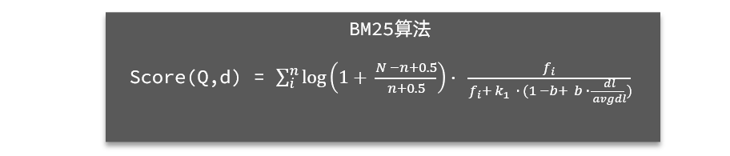
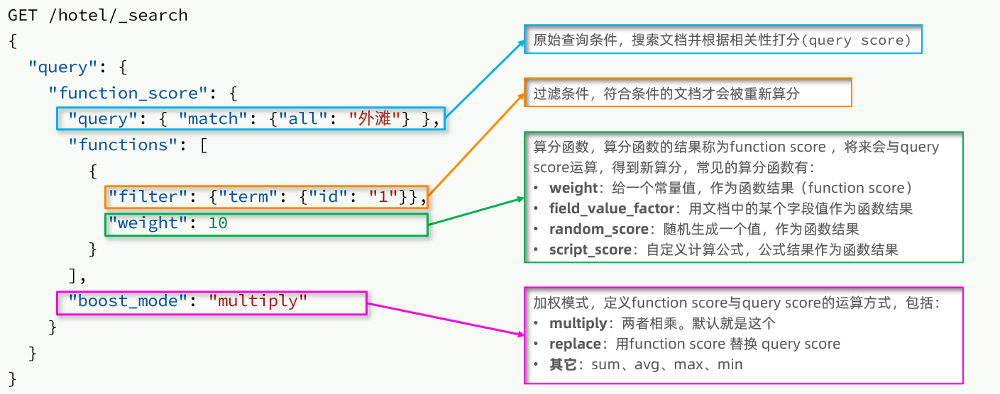

### 全文检索（Full Text）查询

- `match` 适用于单个字段的全文匹配，推荐使用 `copy_to` 构造 `all` 字段。
- `multi_match` 可对多个字段执行搜索，参与查询字段越多，查询性能越差。

#### match 查询

```json
GET /test_index/_search
{
  "query": {
    "match": {
      "name": "测试商品"
    }
  }
}
```

```java
public void matchQuery() throws IOException {
    SearchResponse<Product> response = client.search(s -> s
            .index("test_index")
            .query(q -> q.match(m -> m.field("name").query("测试商品"))), Product.class);
    response.hits().hits().forEach(hit -> System.out.println(hit.source()));
}
```
#### multi_match 查询

```json
GET /test_index/_search
{
  "query": {
    "multi_match": {
      "query": "测试",
      "fields": ["name", "category"]
    }
  }
}
```

```java
public void multiMatchQuery() throws IOException {
    SearchResponse<Product> response = client.search(s -> s
            .index("test_index")
            .query(q -> q.multiMatch(m -> m.fields("name", "category").query("测试"))), Product.class);
    response.hits().hits().forEach(hit -> System.out.println(hit.source()));
}
```

### 精确查询（Term-Level Queries）

- `term` 查询不进行分词，适用于 `keyword` 类型、数值类型、布尔类型、日期类型字段。
- `range` 查询可用于数值、日期等范围筛选。

> 精确查询**不会**对搜索条件分词。

#### term 查询

```json
GET /test_index/_search
{
  "query": {
    "term": {
      "category": {
        "value": "电子产品"
      }
    }
  }
}
```

```java
public void termQuery() throws IOException {
    SearchResponse<Product> response = client.search(s -> s
            .index("test_index")
            .query(q -> q.term(t -> t.field("category").value("电子产品"))), Product.class);
    response.hits().hits().forEach(hit -> System.out.println(hit.source()));
}
```
#### range 查询

```json
GET /test_index/_search
{
  "query": {
    "range": {
      "price": {
        "gte": 100,
        "lte": 500
      }
    }
  }
}
```

```java
public void rangeQuery() throws IOException {
    SearchResponse<Product> response = client.search(s -> s
            .index("test_index")
            .query(q -> q.range(r -> r.field("price").gte("100").lte("500"))), Product.class);
    response.hits().hits().forEach(hit -> System.out.println(hit.source()));
}
```

### 地理（Geo）查询

> 根据经纬度查询，官方文档：[https://www.elastic.co/guide/en/elasticsearch/reference/current/geo-queries.html](https://www.elastic.co/guide/en/elasticsearch/reference/current/geo-queries.html)

常见的使用场景包括：
- 携程：搜索我附近的酒店
- 滴滴：搜索我附近的出租车
- 微信：搜索我附近的人

#### geo_distance 查询

- `geo_distance` 查询根据地理位置查找指定范围内的数据。

> 在地图上找一个点作为圆心，以指定距离为半径，画一个圆，落在圆内的坐标都算符合条件。

```json
GET /test_index/_search
{
  "query": {
    "geo_distance": {
      "distance": "10km",
      "location": {
        "lat": 40.7128,
        "lon": -74.0060
      }
    }
  }
}
```

```java
public void geoDistanceQuery() throws IOException {
    SearchResponse<Product> response = client.search(s -> s
            .index("test_index")
            .query(q -> q.geoDistance(g -> g
                    .field("location")
                    .distance("10km")
                    .location(l -> l.lat(40.7128).lon(-74.0060)))), Product.class);
    response.hits().hits().forEach(hit -> System.out.println(hit.source()));
}
```

#### geo_bounding_box

- `geo_bounding_box` 指定矩形的**左上**、**右下**两个点的坐标，然后画出一个矩形，落在该矩形内的都是符合条件的点。

```json
GET /your_index/_search
{
  "query": {
    "geo_bounding_box": {
      "location": {
        "top_left": {
          "lat": 40.73,
          "lon": -74.1
        },
        "bottom_right": {
          "lat": 40.01,
          "lon": -71.12
        }
      }
    }
  }
}
```


### 复合（Compound）查询

#### bool 查询

布尔查询，利用逻辑关系组合多个其它的查询，实现复杂搜索。

```java
public void boolQuery() throws IOException {
    SearchResponse<Product> response = client.search(s -> s
            .index("test_index")
            .query(q -> q.bool(b -> b
                    .must(m -> m.match(t -> t.field("name").query("测试")))
                    .filter(f -> f.term(t -> t.field("category").value("电子产品")))))), Product.class);
    response.hits().hits().forEach(hit -> System.out.println(hit.source()));
}
```

- `bool` 查询可以组合多个查询条件。
  - `must`：必须匹配。
  - `filter`：用于过滤。

#### function_score 查询

算分函数查询，可以控制文档相关性算分，控制文档排名。

elasticsearch会根据词条和文档的相关度做打分，算法由两种：
- TF-IDF算法
- BM25算法，elasticsearch5.1版本后采用的算法

在elasticsearch中，早期使用的打分算法是TF-IDF算法，公式如下：

> TF（词条频率）计算公式：
$$
TF = \frac{\text{词条出现次数}}{\text{文档中词条总数}}
$$
> IDF（逆文档频率）计算公式：
$$
IDF = \log\left(\frac{\text{文档总数}}{\text{包含词条的文档总数}}\right)
$$
> TF-IDF 评分计算：
$$
score = \sum_{i}^{n} TF \times IDF
$$


在后来的5.1版本升级中，elasticsearch将算法改进为BM25算法。

BM25 评分计算公式：
$$
Score(Q, d) = \sum_{i}^{n} \log \left( 1 + \frac{N - n + 0.5}{n + 0.5} \right) \cdot 
\frac{f_i}{f_i + k_1 \cdot (1 - b + b \cdot \frac{dl}{avgdl})}
$$

其中：
- \( Q \)：查询
- \( d \)：文档
- \( N \)：文档总数
- \( n \)：包含查询词的文档数
- \( f_i \)：查询词 \( i \) 在文档 \( d \) 中的词频
- \( k_1 \) 和 \( b \)：超参数，通常取 \( k_1 = 1.2 \) 或 \( 2.0 \)，\( b = 0.75 \)
- \( dl \)：文档 \( d \) 的长度（词条数）
- \( avgdl \)：语料库中文档的平均长度

TF-IDF算法有一各缺陷，就是词条频率越高，文档得分也会越高，单个词条对文档影响较大。而BM25则会让单个词条的算分有一个上限，曲线更加平滑：


##### 语法说明


1. **原始查询条件（query）**
   - 通过 `query` 部分定义原始查询条件，搜索符合条件的文档，并使用 BM25 算法计算 **原始查询评分（query score）**。

2. **过滤条件（filter）**
   - 只有满足 `filter` 条件的文档，才会被应用新的评分调整。

3. **算分函数（function score）**
   - 通过特定的函数计算 **函数评分（function score）**，主要包括以下四种方式：
     - **weight**：固定一个权重值。
     - **field_value_factor**：使用文档中特定字段的值作为评分依据。
     - **random_score**：使用随机数进行评分（适用于随机排序）。
     - **script_score**：自定义脚本计算评分。

4. **运算模式（boost_mode）**
   - 计算 **原始评分（query score）** 与 **函数评分（function score）** 之间的关系，支持以下方式：
     - `multiply`（相乘）
     - `replace`（用 `function score` 替换 `query score`）
     - `sum`（相加）
     - `avg`（取平均值）
     - `max`（取最大值）
     - `min`（取最小值）


**运行流程：**
1. 根据 **原始查询条件** 搜索文档，并计算 **原始查询评分（query score）**。
2. 通过 **过滤条件** 筛选文档，只有符合条件的文档才会进行评分调整。
3. 对符合 **过滤条件** 的文档，应用 **算分函数** 计算 **函数评分（function score）**。
4. 根据 **运算模式（boost_mode）**，将 **原始查询评分** 和 **函数评分** 进行计算，得到最终的相关性评分。

```java
public void functionScoreQuery() throws IOException {
    SearchResponse<Product> response = client.search(s -> s
            .index("test_index")
            .query(q -> q.functionScore(fs -> fs
                    .query(q2 -> q2.match(m -> m.field("name").query("测试")))
                    .functions(f -> f.gauss(g -> g.field("popularity").origin("5").scale("1")))))), Product.class);
    response.hits().hits().forEach(hit -> System.out.println(hit.source()));
}
```

- `function_score` 允许根据字段值调整查询得分。

---

**示例：** 希望让 **"如家"** 品牌的酒店排名靠前。
**转换逻辑：**
- **原始查询条件（query）：** 可根据业务需求自定义。
- **过滤条件（filter）：** 仅对 `brand = "如家"` 的文档进行评分调整。
- **算分函数（function score）：** 直接赋予额外的固定评分 `weight`。
- **运算模式（boost_mode）：** 采用 `sum`（求和）模式。

```json
GET /hotel/_search
{
  "query": {
    "function_score": {
      "query": {  ...  },  // 原始查询条件，可任意定义
      "functions": [
        {
          "filter": {  // 仅对 "如家" 进行评分调整
            "term": {
              "brand": "如家"
            }
          },
          "weight": 2  // 赋予额外评分 2
        }
      ],
      "boost_mode": "sum"  // 评分模式：求和
    }
  }
}
```


**按字段值调整评分（field_value_factor）**

如果希望根据酒店的评分 rating 进行加权，可使用 field_value_factor：

```json
GET /hotel/_search
{
  "query": {
    "function_score": {
      "query": { "match_all": {} },
      "functions": [
        {
          "field_value_factor": {
            "field": "rating",
            "factor": 1.5,  // 评分权重
            "modifier": "sqrt"  // 取平方根作为评分
          }
        }
      ],
      "boost_mode": "multiply"  // 评分模式：相乘
    }
  }
}
```


**随机排序（random_score）**

如果希望每次查询结果的顺序不同，可以使用 random_score：

```json
GET /hotel/_search
{
  "query": {
    "function_score": {
      "query": { "match_all": {} },
      "functions": [
        {
          "random_score": {}
        }
      ]
    }
  }
}
```


**自定义评分（script_score）**

如果需要根据更复杂的逻辑计算评分，可以使用 script_score：

```json
GET /hotel/_search
{
  "query": {
    "function_score": {
      "query": { "match_all": {} },
      "functions": [
        {
          "script_score": {
            "script": {
              "source": "Math.log(1 + doc['reviews_count'].value) + doc['rating'].value"
            }
          }
        }
      ],
      "boost_mode": "sum"
    }
  }
}
```


