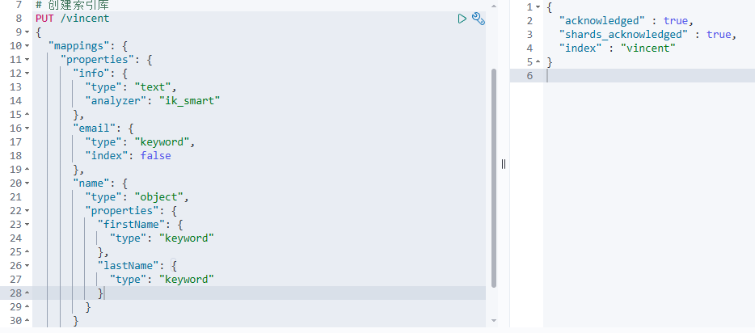
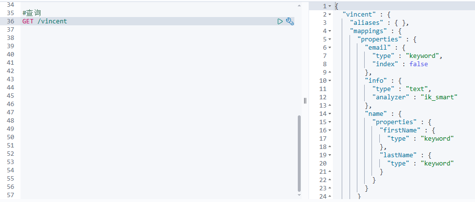
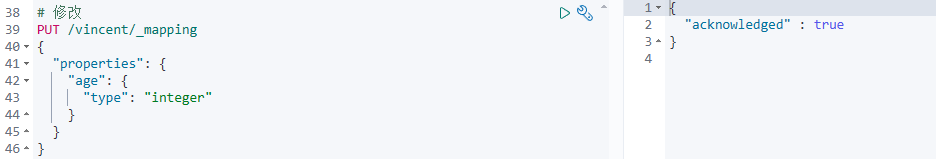

索引库就类似数据库表，mapping映射就类似表的结构。要向es中存储数据，必须先创建“库”和“表”。


## mapping映射属性

mapping是对索引库中文档的约束，常见的mapping属性包括：

- **type：** 字段数据类型，常见的简单类型有：
  - 字符串：`text`（可分词的文本）、`keyword`（精确值，例如：品牌、国家、ip地址）
  - 数值：`long`、`integer`、`short`、`byte`、`double`、`float`
  - 布尔：`boolean`
  - 日期：`date`
  - 对象：`object`
- **index：** 是否创建索引，默认为true
- **analyzer：** 使用哪种分词器
- **properties：** 该字段的子字段


## 索引库的CRUD
### 创建索引库和映射

- 请求方式：PUT
- 请求路径：/索引库名，可以自定义
- 请求参数：mapping映射

格式：

```json
PUT /索引库名称
{
  "mappings": {
    "properties": {
      "字段名":{
        "type": "text",
        "analyzer": "ik_smart"
      },
      "字段名2":{
        "type": "keyword",
        "index": "false"
      },
      "字段名3":{
        "properties": {
          "子字段": {
            "type": "keyword"
          }
        }
      },
      // ...略
    }
  }
}
```

例如：



### 查询索引库

- 请求方式：GET
- 请求路径：/索引库名
- 请求参数：无


```json
GET /索引库名
```


**例如**：



### 修改索引库

倒排索引结构虽然不复杂，但是一旦数据结构改变（比如改变了分词器），就需要重新创建倒排索引，这简直是灾难。因此索引库**一旦创建，无法修改mapping**。

虽然无法修改mapping中已有的字段，但是却允许添加新的字段到mapping中，因为不会对倒排索引产生影响。

```json
PUT /索引库名/_mapping
{
  "properties": {
    "新字段名":{
      "type": "integer"
    }
  }
}
```


**例如**：


### 删除索引库

- 请求方式：DELETE
- 请求路径：/索引库名
- 请求参数：无

```json
DELETE /索引库名
```


在kibana中测试：

