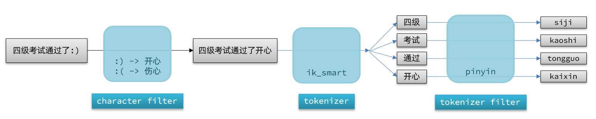

## 拼音分词器

要实现根据字母做补全，就必须对文档按照拼音分词。在GitHub上恰好有elasticsearch的拼音分词插件。
地址：[https://github.com/medcl/elasticsearch-analysis-pinyin](https://github.com/medcl/elasticsearch-analysis-pinyin)

```bash
# 进入容器内部
docker exec -it elasticsearch /bin/bash

# 在线下载并安装
bin/elasticsearch-plugin install https://get.infini.cloud/elasticsearch/analysis-pinyin/8.15.5
```

## 自定义拼音分词器

默认的拼音分词器会将每个汉字单独分为拼音，期望每个词条形成一组拼音，需要对拼音分词器做个性化定制，形成自定义分词器。

官网文档查询地址：[https://github.com/medcl/elasticsearch-analysis-pinyin](https://github.com/medcl/elasticsearch-analysis-pinyin)

Elasticsearch 中分词器（analyzer）的组成包含三部分：
- `character filters`：在 `tokenizer` 之前对文本进行处理。例如删除字符、替换字符。
- `tokenizer`：将文本按照一定的规则切割成词条（term）。例如 `keyword`，就是不分词；还有 `ik_smart` 。
- `tokenizer filter`：将 `tokenizer` 输出的词条做进一步处理。例如大小写转换、同义词处理、拼音处理等。

文档分词时会依次由这三部分来处理文档：



```json
PUT /test
{
  "settings": {
    "analysis": {
      // 自定义分词器
      "analyzer": {
        // 分词器名称
        "my_analyzer": {
	      // 使用 IK 的最大化分词
          "tokenizer": "ik_max_word",
          // 使用拼音过滤器（名为 py）处理分词结果
          "filter": "py"
        }
      },
      // 自定义tokenizer filter
      "filter": {
        // 过滤器名称
        "py": {
          // 过滤器类型，这里是pinyin
          "type": "pinyin",
          // 不保留全拼（如：zhangsan → zhangsan 不保留）
		  "keep_full_pinyin": false,
		  // 保留连写拼音（zhangsan）
          "keep_joined_full_pinyin": true,
          // 保留原始中文（张三）
          "keep_original": true,
          // 首字母最大长度限制
          "limit_first_letter_length": 16,
          // 去除重复词
          "remove_duplicated_term": true,
          // 非中文内容不拼音分词
          "none_chinese_pinyin_tokenize": false
        }
      }
    }
  },
  "mappings": {
    "properties": {
      "name": {
        "type": "text",
        // 索引时使用自定义的拼音分析器
        "analyzer": "my_analyzer",
        // 查询时使用较粗粒度的 IK 分词器，提高召回率
        "search_analyzer": "ik_smart"
      }
    }
  }
}
```

> 可以通过输入拼音、汉字、或者拼音首字母（如“zs”）等方式来查询“张三”。


```java
public void createIndexWithPinyinAnalyzer() throws IOException {
    CreateIndexRequest request = new CreateIndexRequest.Builder()
        .index("test")
        .settings(s -> s
            .analysis(a -> a
                .analyzer("my_analyzer", an -> an
                    .tokenizer("ik_max_word")
                    .filter("py")
                )
                .filter("py", f -> f
                    .custom(c -> c
                        .type("pinyin")
                        .option("keep_full_pinyin", "false")
                        .option("keep_joined_full_pinyin", "true")
                        .option("keep_original", "true")
                        .option("limit_first_letter_length", "16")
                        .option("remove_duplicated_term", "true")
                        .option("none_chinese_pinyin_tokenize", "false")
                    )
                )
            )
        )
        .mappings(m -> m
            .properties("name", p -> p
                .text(t -> t
                    .analyzer("my_analyzer")
                    .searchAnalyzer("ik_smart")
                )
            )
        )
        .build();

    CreateIndexResponse response = client.indices().create(request);
    System.out.println("Acknowledged: " + response.acknowledged());
}
```


## 自动补全查询

Elasticsearch提供了 Completion Suggester 查询来实现自动补全功能。这个查询会匹配以用户输入内容开头的词条并返回。

为了提高补全查询的效率，对于文档中字段的类型有一些约束：

- 参与补全查询的字段必须是completion类型。
- 字段的内容一般是用来补全的多个词条形成的数组。

### 创建索引库

```json
// 创建索引库
PUT test
{
  "mappings": {
    "properties": {
      "title":{
        "type": "completion"
      }
    }
  }
}
```

> Elasticsearch 中专用于 **自动补全建议（Suggesters）** 的字段类型。这种字段可支持：前缀匹配补全、多值输入、权重排序（weight）、上下文补全（context）。

```java
public void createCompletionIndex() throws IOException {
    CreateIndexRequest request = new CreateIndexRequest.Builder()
        .index("test")
        .mappings(m -> m
            .properties("title", p -> p
                .completion(c -> c) // 设置字段类型为 completion
            )
        )
        .build();

    CreateIndexResponse response = client.indices().create(request);
    System.out.println("Index created: " + response.acknowledged());
}
```


### 添加数据

```json
// 示例数据
POST test/_doc
{
  "title": {
    "input": ["Sony", "WH-1000XM3"]  // 与下面格式等价
  }
}
POST test/_doc
{
  "title": ["SK-II", "PITERA"]
}
POST test/_doc
{
  "title": ["Nintendo", "switch"]
}
```


```java
public void insertCompletionData() throws IOException {
    // 示例 1：Sony 耳机
    client.index(i -> i
        .index("test")
        .document(Map.of("title", Map.of("input", List.of("Sony", "WH-1000XM3"))))
    );

    // 示例 2：SK-II
    client.index(i -> i
        .index("test")
        .document(Map.of("title", Map.of("input", List.of("SK-II", "PITERA"))))
    );

    // 示例 3：Nintendo Switch
    client.index(i -> i
        .index("test")
        .document(Map.of("title", Map.of("input", List.of("Nintendo", "switch"))))
    );
}
```


### 查询数据

```json
GET /test/_search
{
  "suggest": {
    "title_suggest": {         // 自动补全的名称，自定义即可
      "text": "s",             // 用户输入前缀
      "completion": {
        "field": "title",      // completion 类型字段名
        "skip_duplicates": true,  // 跳过重复的
        "size": 10             // 返回建议数量限制
      }
    }
  }
}
```

```java
public void suggestTitles(String prefix) throws IOException {
    SearchResponse<Void> response = client.search(s -> s
        .index("test")
        .suggest(sg -> sg
            .suggesters("title_suggest", sug -> sug
                .text(prefix)
                .completion(c -> c
                    .field("title")
                    .skipDuplicates(true)
                    .size(10)
                )
            )
        ),
        Void.class // 不需要 source
    );

    // 解析结果
    System.out.println("补全建议：");
    response.suggest().get("title_suggest").forEach(entry ->
        entry.options().forEach(option ->
            System.out.println(" - " + option.text())
        )
    );
}
```
