主机数据更新后根据配置和策略，自动同步到备机的master/slaver机制，**Master以写为主，Slave以读为主。**

* 读写分离，性能扩展
* 容灾快速恢复

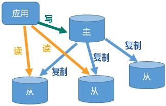


## 主从复制

这里演示只有一台机器的操作，生产应该是多台机器。

既然需要启动多个服务，就需要多个配置文件。每个配置文件对应修改以下信息：

* 拷贝多个redis.conf文件include(写绝对路径)

* 端口号（port）
* pid文件名（pidfile）
* 日志文件名（logfile）
* rdb文件名（dbfilename）


新建redis6379.conf：

```bash
include /home/data/redis/redis.conf # 写绝对路径
pidfile /var/run/redis_6379.pid
port 6379
dbfilename dump6379.rdb
```


新建redis6380.conf：

```bash
include /home/data/redis/redis.conf
pidfile /var/run/redis_6380.pid
port 6380
dbfilename dump6380.rdb
```


新建redis6381.conf：

```bash
include /home/data/redis/redis.conf
pidfile /var/run/redis_6381.pid
port 6381
dbfilename dump6381.rdb
```


`slave-priority 10` ：设置从机的优先级，值越小，优先级越高，用于选举主机时使用。默认100。


启动三台redis服务器：

```bash
redis-server redis6379.conf
redis-server redis6380.conf
redis-server redis6381.conf
```

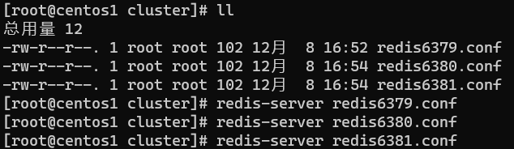


查看系统进程，看看三台服务器是否启动：

```bash
ps -ef|grep redis
```

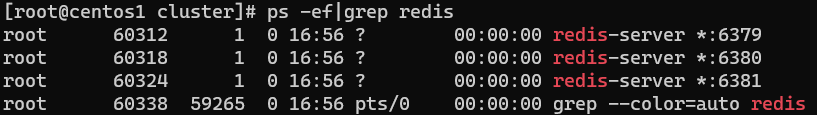


进入对应主机的redis-cli中，查看主从复制的情况：

* `info replication` ：打印主从复制的相关信息

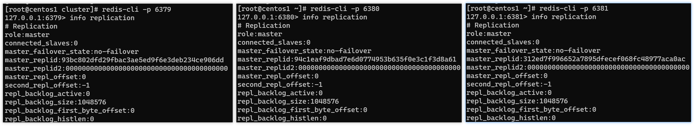


配从(库)不配主(库)：

* `slaveof <ip> <port>` ：成为某个实例的从服务器

在6380和6381上执行：`slaveof 127.0.0.1 6379`

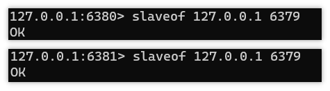


再次查看主从复制信息：

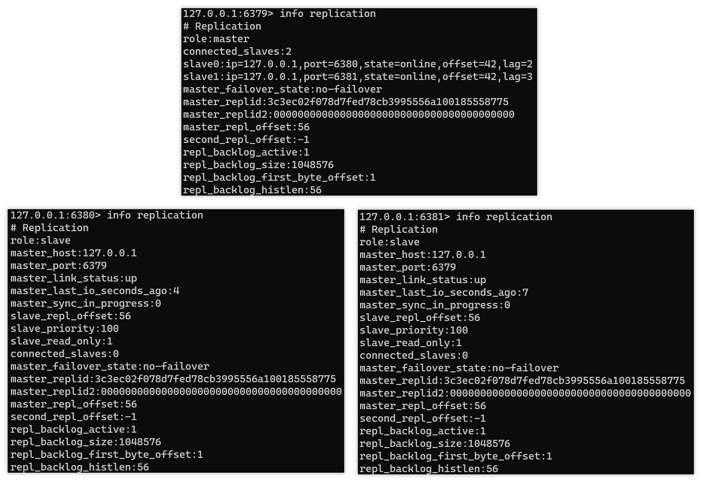


在主机上写，在从机上可以读取数据：

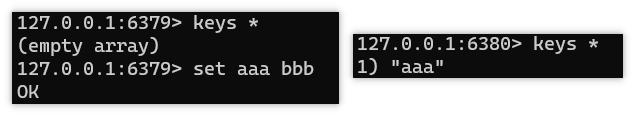


在从机上写数据报错：

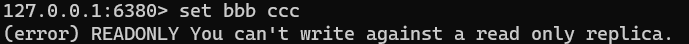


如果主机挂掉，重启就行，一切如初：

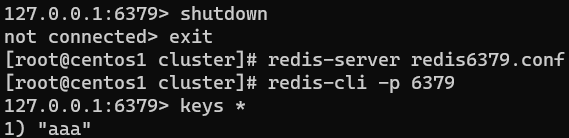


从机重启需重设：`slaveof 127.0.0.1 6379` 

可以将配置增加到文件中，永久生效。

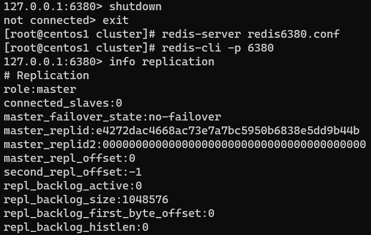


## 常用的三种主从复制配置

### 一主二仆

如果连接不是直接在配置文件中写好的，而是启动6380端口和6381端口后使用 `slaveof 127.0.0.1 6379` 命令，让他成为6379服务器的从机的话。那么，当他们发生宕机之后，再次启动，他们将作为主机重启，且数据不会自动跟6379进行同步。此时，要想让数据同步，需要重新调用命令 `slaveof 127.0.0.1 6379` 来让其重新成为6379的从机，如此，数据才会进行同步。

如果主从关系，在从机的配置文件中写好，从机重启后，将会自动作为主机的从机启动，且同步彼此的数据。

主从复制中，如果主机宕机，两台**从机不做任何操作**，他们仍然会将6379服务器认作自己的大哥（主机），此时在从机使用命令 `info replication` 的时候，会显示主机down。等主机再次复活（重启）后，从机会继续将6379当做大哥（主机）来对待。

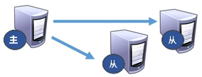


### 薪火相传

上一个slave可以是下一个slave的master，slave同样可以接收其他 slaves的连接和同步请求，该slave作为了链条中下一个的master，可以有效减轻master的写压力，去中心化降低风险。

中途变更转向会清除之前的数据，重新建立拷贝最新的。风险是一旦某个slave宕机，后面的slave都没法备份，主机挂了，从机还是从机，无法写数据了。


### 反客为主

当一个master宕机后，后面的slave可以立刻升为master，其后面的slave不用做任何修改。

用 `slaveof no one` 将从机变为主机。

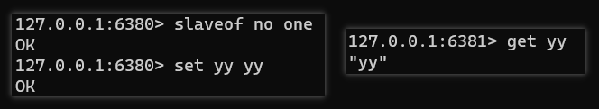


## 复制原理

1. slave启动成功连接到master后会发送一个sync命令
2. master接到命令启动后台的存盘进程，同时收集所有接收到的用于修改数据集命令，在后台进程执行完毕之后，master将传送整个数据文件到slave，以完成一次完全同步。


* 全量复制：而slave服务在接收到数据库文件数据后，将其存盘并加载到内存中。
* 增量复制：master继续将新的所有收集到的修改命令依次传给slave，完成同步。

> 只要是重新连接master，一次完全同步(全量复制)，将被自动执行。


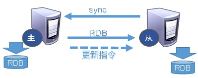


## 哨兵模式(sentinel)

**反客为主的自动版**，能够后台监控主机是否故障，如果故障了根据投票数自动将从库转换为主库。

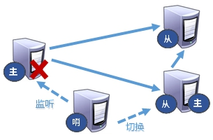


### 使用步骤

调整为一主二仆模式，6379带着6380、6381

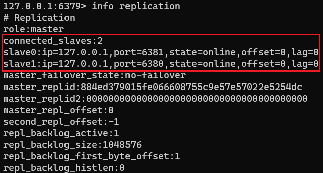


自定义的Redis配置文件目录下新建 `sentinel.conf` 文件，名字绝不能错，**配置哨兵，填写内容：**

```bash
sentinel monitor mymaster 127.0.0.1 6379 1
```

> 其中mymaster为监控对象起的服务器名称，1 为至少有多少个哨兵同意迁移的数量。


启动哨兵：

redis做压测可以用自带的redis-benchmark工具，在/usr/local/bin中。

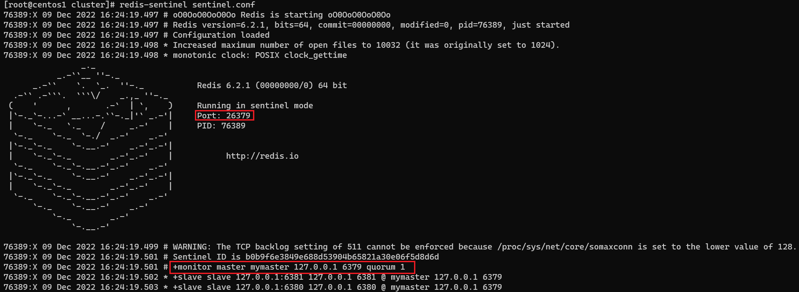


当主机挂掉，从机选举中产生新的主机(根据优先级别：`slave-priority`)

> 大概10秒左右可以看到哨兵窗口日志，切换了新的主机

原主机重启后会变为从机。

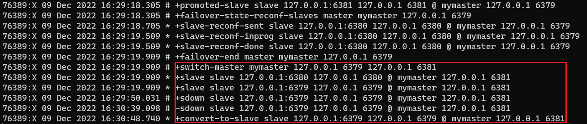


### 复制延时

由于所有的写操作都是先在master上操作，然后同步更新到slave上，所以从master同步到slave机器有一定的延迟，当系统很繁忙的时候，延迟问题会更加严重，slave机器数量的增加也会使这个问题更加严重。


### 故障恢复

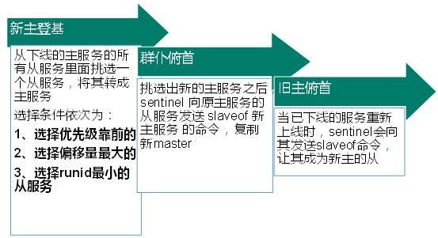


* 优先级在redis.conf中默认：`slave-priority 100` ，值越小优先级越高
* 偏移量是指获得原主机数据最全的
* 每个redis实例启动后都会随机生成一个40位的runid


### 配置文件

完整的哨兵模式配置文件 sentinel.conf

```bash
# Example sentinel.conf
 
# 哨兵 sentinel 实例运行的端口 默认 26379
port 26379
 
# 哨兵 sentinel 的工作目录
dir /tmp
 
# 哨兵 sentinel 监控的 redis 主节点的 ip port 
# master-name：可以自己命名的主节点名字 只能由字母 A-z、数字 0-9 、这三个字符 ".-_" 组成。
# quorum：当这些 quorum 个数 sentinel 哨兵认为 Master 主节点失联 那么这时客观上认为主节点失联了
# sentinel monitor <master-name> <ip> <redis-port> <quorum>
sentinel monitor mymaster 127.0.0.1 6379 1
 
# 当在 Redis 实例中开启了 requirepass foobared 授权密码 这样所有连接 Redis 实例的客户端都要提供密码
# 设置哨兵 sentinel 连接主从的密码 注意必须为主从设置一样的验证密码
# sentinel auth-pass <master-name> <password>
sentinel auth-pass mymaster MySUPER--secret-0123passw0rd
 
 
# 指定多少毫秒之后 主节点没有应答哨兵 sentinel 此时 哨兵主观上认为主节点下线 默认 30 秒
# sentinel down-after-milliseconds <master-name> <milliseconds>
sentinel down-after-milliseconds mymaster 30000
 
# 这个配置项指定了在发生 failover 主备切换时最多可以有多少个 Slave 同时对新的 Master 进行同步，
# 这个数字越小，完成 failover 所需的时间就越长，
# 但是如果这个数字越大，就意味着越 多的 Slave 因为 replication 而不可用。
# 可以通过将这个值设为 1 来保证每次只有一个 Slave 处于不能处理命令请求的状态。
# sentinel parallel-syncs <master-name> <numslaves>
sentinel parallel-syncs mymaster 1
 

 
# 故障转移的超时时间 failover-timeout 可以用在以下这些方面： 
#1. 同一个 sentinel 对同一个 Master 两次 failover 之间的间隔时间。
#2. 当一个 Slave 从一个错误的 Master 那里同步数据开始计算时间。直到 Slave 被纠正为向正确的 Master 那里同步数据时。
#3. 当想要取消一个正在进行的 failover 所需要的时间。  
#4. 当进行 failover 时，配置所有 Slaves 指向新的 Master 所需的最大时间。不过，即使过了这个超时，Slaves 依然会被正确配置为指向Master，但是就不按 parallel-syncs 所配置的规则来了
# 默认三分钟
# sentinel failover-timeout <master-name> <milliseconds>
sentinel failover-timeout mymaster 180000
 
# SCRIPTS EXECUTION
 
# 配置当某一事件发生时所需要执行的脚本，可以通过脚本来通知管理员，例如当系统运行不正常时发邮件通知相关人员。
# 对于脚本的运行结果有以下规则：
# 若脚本执行后返回 1，那么该脚本稍后将会被再次执行，重复次数目前默认为 10
# 若脚本执行后返回 2，或者比 2 更高的一个返回值，脚本将不会重复执行。
# 如果脚本在执行过程中由于收到系统中断信号被终止了，则同返回值为 1 时的行为相同。
# 一个脚本的最大执行时间为 60s，如果超过这个时间，脚本将会被一个 SIGKILL 信号终止，之后重新执行。
 
# 通知型脚本:当 sentinel 有任何警告级别的事件发生时（比如说 Redis 实例的主观失效和客观失效等等），将会去调用这个脚本，
# 这时这个脚本应该通过邮件，SMS 等方式去通知系统管理员关于系统不正常运行的信息。调用该脚本时，将传给脚本两个参数，
# 一个是事件的类型，
# 一个是事件的描述。
# 如果 sentinel.conf 配置文件中配置了这个脚本路径，那么必须保证这个脚本存在于这个路径，并且是可执行的，否则 sentinel 无法正常启动成功。
# 通知脚本
# sentinel notification-script <master-name> <script-path>
  sentinel notification-script mymaster /var/redis/notify.sh
 
# 客户端重新配置主节点参数脚本
# 当一个 Master 由于 failover 而发生改变时，这个脚本将会被调用，通知相关的客户端关于 Master 地址已经发生改变的信息。
# 以下参数将会在调用脚本时传给脚本:
# <master-name> <role> <state> <from-ip> <from-port> <to-ip> <to-port>
# 目前 <state> 总是「failover」,
# <role> 是「leader」或者「observer」中的一个。 
# 参数 from-ip, from-port, to-ip, to-port 是用来和旧的 Master 和新的 Master(即旧的 Slave)通信的
# 这个脚本应该是通用的，能被多次调用，不是针对性的。
# sentinel client-reconfig-script <master-name> <script-path>
sentinel client-reconfig-script mymaster /var/redis/reconfig.sh
```


### Java整合

开启哨兵后，Java 获取哨兵的代码：

```java
private static JedisSentinelPool jedisSentinelPool = null;
public static Jedis getJedisFromSentinel(){
    if(jedisSentinelPool == null) {
    	Set<String> sentinelSet = new HashSet<>();
    	sentinelSet.add("192.168.182.133:26379");    // 指定哨兵的ip和端口
    	JedisPoolConfig jedisPoolConfig = new JedisPoolConfig();
    	jedisPoolConfig.setMaxTotal(10);    // 最大可用连接数
    	jedisPoolConfig.setMaxIdle(5);    // 最大闲置连接数
    	jedisPoolConfig.setMinIdle(5);    // 最小闲置连接数
    	jedisPoolConfig.setBlockWhenExhausted(true);    // 连接耗尽是否等待
    	jedisPoolConfig.setMaxWaitMillis(2000);    // 等待时间
    	jedisPoolConfig.setTestOnBorrow(true);    // 取连接的时候进行一下测试 ping pong
    	jedisSentinelPool = new JedisSentinelPool("mymaster", sentinelSet, jedisPoolConfig);
    	return jedisSentinelPool.getResource();
    } else {
    	return jedisSentinelPool.getResource();
    }
}
```