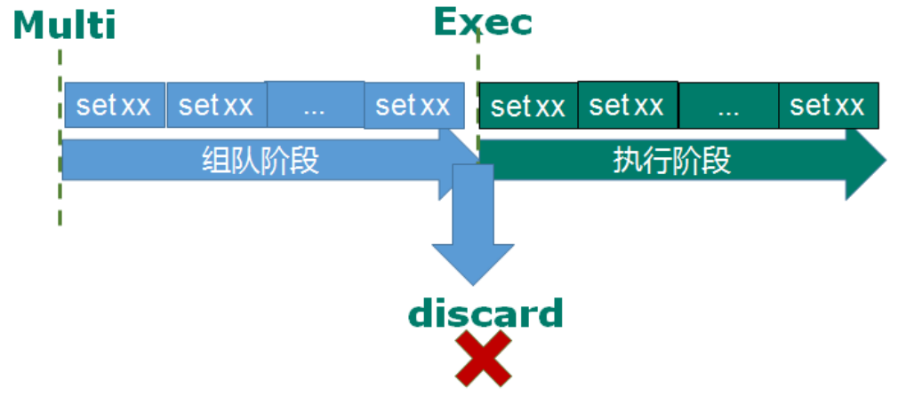
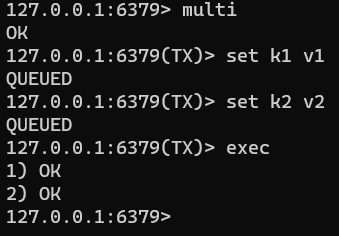
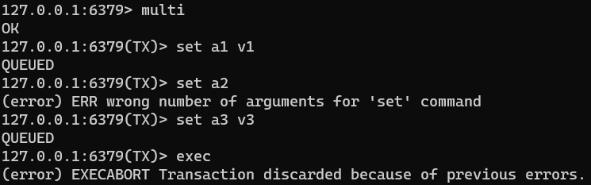
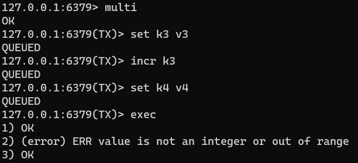
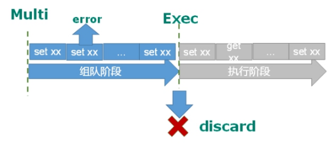
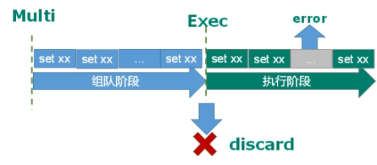

Redis事务是一个单独的隔离操作：事务中的所有命令都会序列化、按顺序地执行。事务在执行的过程中，不会被其他客户端发送来的命令请求所打断。

**Redis事务的主要作用就是串联多个命令防止别的命令插队。**

## Multi、Exec、discard

从输入Multi命令开始，输入的命令都会依次进入命令队列中，但不会执行，直到输入Exec后，Redis会将之前的命令队列中的命令依次执行。

组队的过程中可以通过discard来放弃组队。  

案例：

1. 组队成功，提交成功：

2. 组队阶段报错，提交失败

3. 组队成功，提交有成功有失败情况

## 事务的错误处理

组队中某个命令出现了报告错误，执行时整个的所有队列都会被取消。

---

如果执行阶段某个命令报出了错误，则只有报错的命令不会被执行，而其他的命令都会执行，不会回滚。

## Redis事务三特性

**单独的隔离操作**

* 事务中的所有命令都会序列化、按顺序地执行。事务在执行的过程中，不会被其他客户端发送来的命令请求所打断。 

**没有隔离级别的概念**

* 队列中的命令没有提交之前都不会实际被执行，因为事务提交前任何指令都不会被实际执行。

**不保证原子性**

* 事务中如果有一条命令执行失败，其后的命令仍然会被执行，没有回滚。