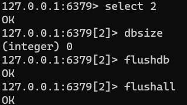

## Redis库

默认16个数据库，类似数组下标从0开始，初始默认使用0号库。

统一密码管理，所有库同样密码。

* `select <dbid>` ：切换数据库
* `dbsize` ：查看当前数据库的key的数量
* `flushdb` ：清空当前库
* `flushall` ：通杀全部库

## Redis键

* `keys *` ：查看当前库所有key
* `keys *1` ：匹配key
* `exists key` ：判断某个key是否存在
* `type key` ：查看key的类型
* `del key` ：删除指定的key数据
* `unlink key` ：根据value选择非阻塞删除，仅将keys从keyspace元数据中删除，真正的删除会在后续异步操作

* `expire key 10` ：为key设置过期时间(单位 秒)
* `ttl key` ：查看还有多少秒过期（-1表示永不过期，-2表示已过期）

## Redis常用五大数据类型

Redis存储的是：`key,value`格式的数据，其中key都是字符串，value有5种不同的数据结构

**value的数据结构：**

* `string`：字符串类型   。
* `hash`：哈希类型，map格式    。
* `list`：列表类型，LinkedList格式，支持重复元素  。
* `set`：集合类型，不允许重复元素  。
* `sortedset`：有序集合类型，不允许重复元素，且元素有顺序。

### 字符串类型 string

### 列表类型 list

### 集合类型 set

### 哈希类型 hash

### 有序集合类型 sortedset

## 新数据类型

### Bitmaps

### HyperLogLog

### Geospatial

