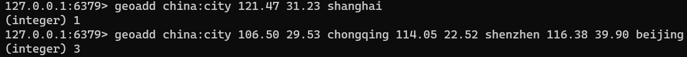
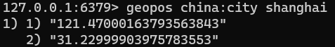
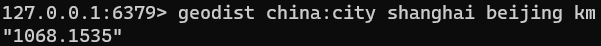
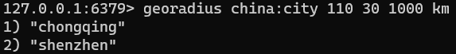

Redis 3.2中增加了对GEO类型的支持。GEO，Geographic，地理信息的缩写。该类型，就是元素的2维坐标，在地图上就是经纬度。redis基于该类型，提供了经纬度设置，查询，范围查询，距离查询，经纬度Hash等常见操作。

#### geoadd

* `geoadd <key> <longitude> <latitude> <member> [longitude latitude member...]` ： 添加地理位置（经度，纬度，名称）

两极无法直接添加，一般会下载城市数据，直接通过 Java 程序一次性导入。

有效的经度从 -180 度到 180 度。有效的纬度从 -85.05112878 度到 85.05112878 度。

当坐标位置超出指定范围时，该命令将会返回一个错误。

已经添加的数据，是无法再次往里面添加的。


实例：

```bash
geoadd china:city 121.47 31.23 shanghai
geoadd china:city 106.50 29.53 chongqing 114.05 22.52 shenzhen 116.38 39.90 beijing
```




#### geopos

* `geopos <key> <member> [member...]` ：获得指定地区的坐标值


实例：




#### geodist

* `geodist <key> <member1> <member2> [m|km|ft|mi ]` ：获取两个位置之间的直线距离

单位：

* m 表示单位为米\[默认值\]。
* km 表示单位为千米。
* mi 表示单位为英里。
* ft 表示单位为英尺。

如果用户没有显式地指定单位参数， 那么 GEODIST 默认使用米作为单位


实例：




#### georadius

* `georadius <key> < longitude> <latitude> radius m|km|ft|mi` ：以给定的经纬度为中心，找出某一半径内的元素
  * 经度 纬度 距离 单位


实例：




